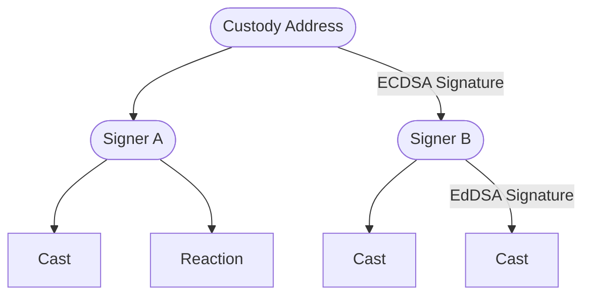
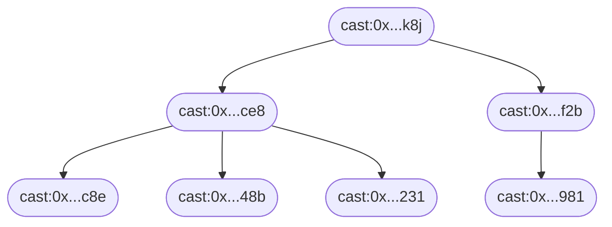
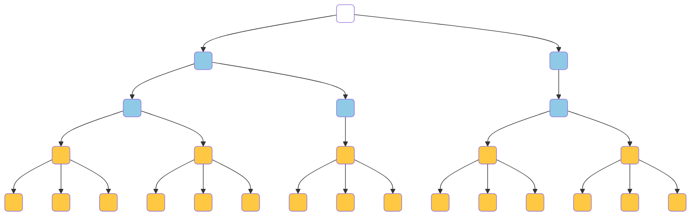
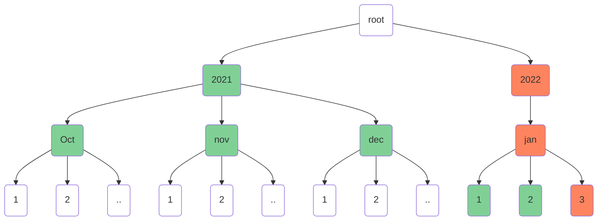
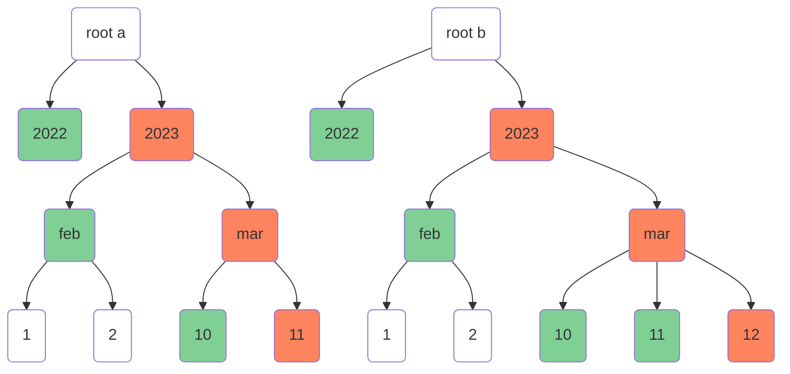
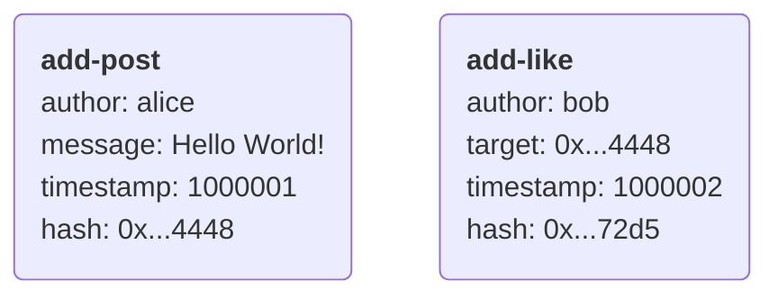
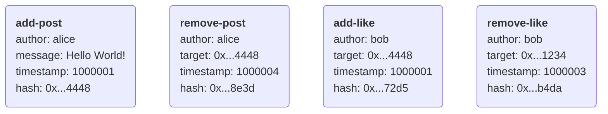
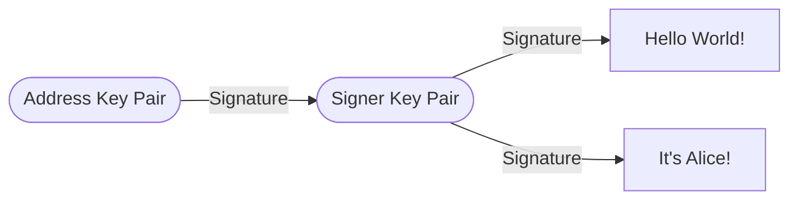
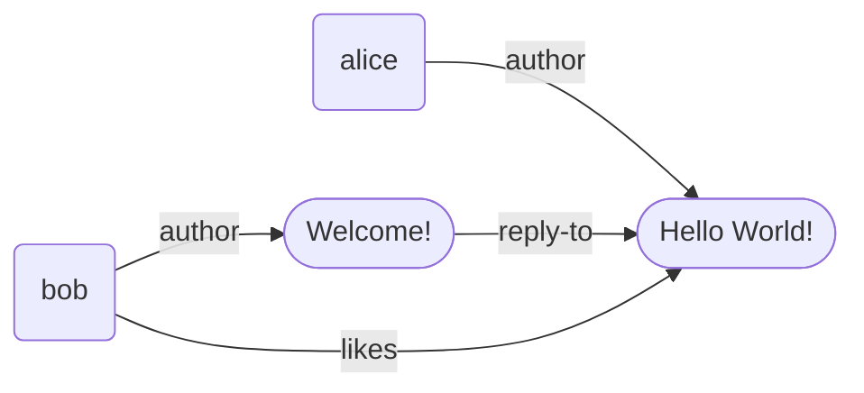
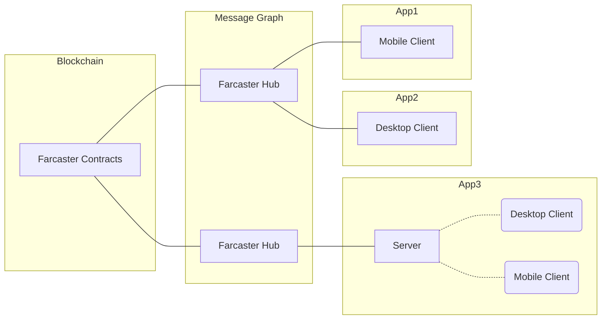

# Get account profile

::: info Pre-requisites

- Read only access to a hubble instance

:::

To fetch profile details, use the

```bash
$ curl http://localhost:2281/v1/userDataByFid\?fid\=1 | jq ".messages[].data.userDataBody"
{
  "type": "USER_DATA_TYPE_PFP",
  "value": "https://i.imgur.com/I2rEbPF.png"
}
{
  "type": "USER_DATA_TYPE_BIO",
  "value": "A sufficiently decentralized social network. farcaster.xyz"
}
{
  "type": "USER_DATA_TYPE_DISPLAY",
  "value": "Farcaster"
}
{
  "type": "USER_DATA_TYPE_USERNAME",
  "value": "farcaster"
}
```

See the [http api reference](/reference/hubble/httpapi/userdata) for more details.

If you have the hubble installed from source, you can use the built in `console`. This will use the grpc APIs

```bash
# Ensure you are in the hubble sub directory
$ cd apps/hubble
# Remove `--insecure` if the host is using TLS
$ yarn console --insecure -s localhost:2283
> res = await rpcClient.getUserDataByFid({fid: 1})
Ok {
  value: {
    messages: [ [Object], [Object], [Object], [Object] ],
    nextPageToken: <Buffer >
  }
}
> res.value.messages.map(m => m.data.userDataBody)
[
  { type: 1, value: 'https://i.imgur.com/I2rEbPF.png' },
  {
    type: 3,
    value: 'A sufficiently decentralized social network. farcaster.xyz'
  },
  { type: 2, value: 'Farcaster' },
  { type: 6, value: 'farcaster' }
]
```

For more details on the GRPC API, see the [grpc api reference](/reference/hubble/grpcapi/grpcapi).


# Submit data to the hub

::: info Pre-requisites

- Write access to a hubble instance
- Private key of an account key registered to an fid
- Local typescript development environment

:::

To see a full example of how to submit different kinds of messages to the hub,
see [here](https://github.com/farcasterxyz/hub-monorepo/tree/main/packages/hub-nodejs/examples/write-data)


# UserData API

The UserData API will accept the following values for the `user_data_type` field.

| String                  | Numerical value | Description                  |
| ----------------------- | --------------- | ---------------------------- |
| USER_DATA_TYPE_PFP      | 1               | Profile Picture for the user |
| USER_DATA_TYPE_DISPLAY  | 2               | Display Name for the user    |
| USER_DATA_TYPE_BIO      | 3               | Bio for the user             |
| USER_DATA_TYPE_URL      | 5               | URL of the user              |
| USER_DATA_TYPE_USERNAME | 6               | Preferred Name for the user  |

## userDataByFid

Get UserData for a FID.

**Query Parameters**
| Parameter | Description | Example |
| --------- | ----------- | ------- |
| fid | The FID that's being requested | `fid=6833` |
| user_data_type | The type of user data, either as a numerical value or type string. If this is ommited, all user data for the FID is returned| `user_data_type=1` OR `user_data_type=USER_DATA_TYPE_DISPLAY` |

**Example**

```bash
curl http://127.0.0.1:2281/v1/userDataByFid?fid=6833&user_data_type=1
```

**Response**

```json
{
  "data": {
    "type": "MESSAGE_TYPE_USER_DATA_ADD",
    "fid": 6833,
    "timestamp": 83433831,
    "network": "FARCASTER_NETWORK_MAINNET",
    "userDataBody": {
      "type": "USER_DATA_TYPE_PFP",
      "value": "https://i.imgur.com/HG54Hq6.png"
    }
  },
  "hash": "0x327b8f47218c369ae01cc453cc23efc79f10181f",
  "hashScheme": "HASH_SCHEME_BLAKE3",
  "signature": "XITQZD7q...LdAlJ9Cg==",
  "signatureScheme": "SIGNATURE_SCHEME_ED25519",
  "signer": "0x0852...6e999cdd"
}
```


# Farcaster Specifications

Requirements to implement a functional version of the Farcaster protocol.

Version: `2023.11.15`

## Table of Contents

1. [Contracts](#1-contracts)
2. [Message Specifications](#1-message-specifications)
3. [CRDT Specifications](#2-message-graph-specifications)
4. [Hub Specifications](#3-hub-specifications)
5. [Fname Specifications](#4-fname-specifications)
6. [Versioning](#5-versioning)

# 1. Smart Contracts

There are a set of 3 contracts that keep track of account ids (fids), keys for the fids and the storage allocated to the fids.

## 1.1 Id Registry

The Id registry contract keeps track of the fids and their custody addresses. It is a simple mapping of fid to custody address. An fid is only valid if it is present in the Id registry.

The [canonical Id registry contract](https://optimistic.etherscan.io/address/0x00000000fc6c5f01fc30151999387bb99a9f489b) is deployed at `0x00000000Fc6c5F01Fc30151999387Bb99A9f489b` on Optimism.

## 1.2 Key Registry

The Key registry contract keeps track of valid signing keys for the fids. A signer for an fid is only valid if it is present in the Key registry for that particular fid. Only the custody address of the fid may add or remove signers for that fid.

The [canonical Key registry contract](https://optimistic.etherscan.io/address/0x00000000Fc1237824fb747aBDE0FF18990E59b7e) is deployed at `0x00000000Fc1237824fb747aBDE0FF18990E59b7e` on Optimism.

## 1.3 Storage Registry

The Storage registry contract keeps track of the storage allocated to each fid. The storage for an fid is denominated in integer units. Each CRDT specifies the number of messages it can store per unit.

The [canonical Storage registry contract](https://optimistic.etherscan.io/address/0x00000000fcce7f938e7ae6d3c335bd6a1a7c593d) is deployed at `0x00000000fcce7f938e7ae6d3c335bd6a1a7c593d` on Optimism.

For a message to be accepted, the fid must be registered in the Id registry, and signed with a valid signer present the Key registry, and the fid must have enough storage allocated in the Storage registry.

# 2. Message Specifications

A Message is a cryptographically signed binary data object that represents a delta-operation on the Farcaster network.

Messages are specified and serialized into binary form using [proto3 protobufs](https://protobuf.dev/). Specifically, serialization of messages must be performed using [ts-proto@v1.146.0](https://github.com/stephenh/ts-proto) since serialization into bytes is not consistent across all implementations. A `Message` object contains the data payload and information required to verify the message's authenticity.

```protobuf
message Message {
  MessageData data = 1;                  // Contents of the message
  bytes hash = 2;                        // Hash digest of data
  HashScheme hash_scheme = 3;            // Hash scheme that produced the hash digest
  bytes signature = 4;                   // Signature of the hash digest
  SignatureScheme signature_scheme = 5;  // Signature scheme that produced the signature
  bytes signer = 6;                      // Public key or address of the key pair that produced the signature
  optional bytes data_bytes = 7;         // MessageData serialized to bytes if using protobuf serialization other than ts-proto
}
```

A Message `m` is considered valid only if:

1. `data` is a valid MessageData object
2. `hash` is the serialized and hashed digest of `data` and `hash_scheme`
3. `hash_scheme` is a currently valid hashing scheme
4. `signature` is the signed output of `hash` using the `signature_scheme` and the `signer`
5. `signature_scheme` is a valid scheme permitted by the MessageType
6. `signer` is a valid public key or Ethereum address used to produce the signature
7. `data_bytes` is a valid serialized MessageData object, to be set in case the ts-proto serialization of `data` does not produce the `hash`. This field is mutually exclusive with `data`.

### Hashing

Messages must be hashed by serializing the `data` protobuf into bytes using ts-proto and passing the bytes through a hashing function to obtain a digest. The valid hashing schemes are:

- `BLAKE3`: A 160-bit [Blake3](https://github.com/BLAKE3-team/BLAKE3-specs) hash digest.

```protobuf
enum HashScheme {
  HASH_SCHEME_NONE = 0;
  HASH_SCHEME_BLAKE3 = 1;
}
```

Since the protobuf serialization byte stream is not consistent across implementations, the `data_bytes` field is provided to allow for serialization using other protobuf implementations. If `data_bytes` is present, the hub will use it to verify the `hash` digest instead of serializing the `data` using ts-proto.

### Signing

Messages must be signed by taking the `hash` and signing it using one of the valid signing schemes. The type of signature scheme that can be used is determined by the `MessageType`. The valid schemes are:

- `ED25519`: A 512-bit [EdDSA signature](https://www.rfc-editor.org/rfc/rfc8032) for the edwards 25519 curve.
- `EIP712`: A 512-bit [EIP-712](https://eips.ethereum.org/EIPS/eip-712) typed data with a Farcaster domain separator.

```protobuf
enum SignatureScheme {
  SIGNATURE_SCHEME_NONE = 0;
  SIGNATURE_SCHEME_ED25519 = 1;
  SIGNATURE_SCHEME_EIP712 = 2;
}
```

#### Farcaster Domain Separator

```json
{
  "name": "Farcaster Verify Ethereum Address",
  "version": "2.0.0",
  "salt": "0xf2d857f4a3edcb9b78b4d503bfe733db1e3f6cdc2b7971ee739626c97e86a558"
}
```

### Timestamp-Hash Ordering

Messages are totally ordered by timestamp and hash. Assume two messages $m$ and $n$ with timestamps $m_t$ and $n_t$ hashes $m_h$ and $n_h$ of equal length. Ordering is determined by the following rules:

1. If $m_t$ and $n_t$ are distinct, the larger value has the highest order.
2. If $m_t$ and $n_t$ are not distinct, and $m_h$ and $n_h$ are distinct, perform a pairwise character comparison.
3. If $m_t$ and $n_t$ are not distinct, and $m_h$ and $n_h$ are not distinct, $m$ and $n$ must be the same message.

A pariwise comparison of two distinct hashes $x$ and $y$ is performed by comparing the ASCII values of the characters in $x$ and $y$ in order. The hash which has a higher ASCII character value for a distinct pair has the highest order.

## 2.1 Message Data

A MessageData contains the payload of the Message, which is hashed and signed to produce the message.

A `MessageData` object contains generic properties like the `fid`, `network` `timestamp` and `type` along with a `body`, which varies based on the `type`.

```protobuf
message MessageData {
  MessageType type = 1;
  uint64 fid = 2;
  uint32 timestamp = 3;
  FarcasterNetwork network = 4;
  oneof body {
    CastAddBody cast_add_body = 5;
    CastRemoveBody cast_remove_body = 6;
    ReactionBody reaction_body = 7;
    UserNameProofBody proof_body = 8;
    VerificationAddEthAddressBody verification_add_eth_address_body = 9;
    VerificationRemoveBody verification_remove_body = 10;
    UserDataBody user_data_body = 12;
    LinkBody link_body = 14;
    UserNameProof username_proof_body = 15;
  }
}
```

A MessageData `data` in a Message `m` must pass the following validations:

1. `m.data.type` must be a valid MessageType.
2. `m.data.fid` must be an integer >= 0.
3. `m.data.timestamp` must be a valid Farcaster epoch timestamp not more than 600 seconds ahead of the current time.
4. `m.data.network` must be a valid Network.
5. `m.data.body` must be a valid body.

#### Types

A MessageType defines the intent of a message and the expected payload in the body of the message. Each MessageType can have only one valid body, but a body can be associated with multiple message types.

```protobuf
enum MessageType {
  MESSAGE_TYPE_NONE = 0;
  MESSAGE_TYPE_CAST_ADD = 1;                     // Add a new Cast
  MESSAGE_TYPE_CAST_REMOVE = 2;                  // Remove a previously added Cast
  MESSAGE_TYPE_REACTION_ADD = 3;                 // Add a Reaction to a Cast
  MESSAGE_TYPE_REACTION_REMOVE = 4;              // Remove a Reaction previously added to a Cast
  MESSAGE_TYPE_LINK_ADD = 5;                     // Add a new Link
  MESSAGE_TYPE_LINK_REMOVE = 6;                  // Remove an existing Link
  MESSAGE_TYPE_VERIFICATION_ADD_ETH_ADDRESS = 7; // Add an Ethereum Address Verification
  MESSAGE_TYPE_VERIFICATION_REMOVE = 8;          // Remove a previously added Verification
  MESSAGE_TYPE_USER_DATA_ADD = 11;               // Add metadata about a user
  MESSAGE_TYPE_USERNAME_PROOF = 12;              // Prove ownership of a username
}
```

#### Timestamps

Timestamps must be seconds since the Farcaster epoch, which began on Jan 1, 2021 00:00:00 UTC.

#### Networks

Message identifiers ensure that messages cannot be replayed across different networks.

```protobuf
enum FarcasterNetwork {
  FARCASTER_NETWORK_NONE = 0;
  FARCASTER_NETWORK_MAINNET = 1; // Public, stable primary network
  FARCASTER_NETWORK_TESTNET = 2; // Public, stable test network
  FARCASTER_NETWORK_DEVNET = 3;  // Public, unstable test network
}
```

## 2.2 Signers

A _Signer_ is an Ed25519[^ed25519] key pair that applications can use to authorize messages.

A user authorizes an application's Signer with a signature from their custody address currently holding their fid. The application can use the Signer to authorize Casts, Reactions and Verifications for that user. Users can revoke a Signer at any time with a signature from their custody address.



A Signer is added or removed by registering the public key of the signer to an fid with a smart contract at a well known address. Signers can only be added for the fid owned by the caller of the contract.

## 2.3 User Data

A UserData message contains metadata about a user like their display name or profile picture.

A UserData message can be added with a `UserDataAdd` message. It cannot be removed, but it can be set to a null value.

```protobuf
message UserDataBody {
  UserDataType type = 1;
  string value = 2;
}

enum UserDataType {
  USER_DATA_TYPE_NONE = 0;
  USER_DATA_TYPE_PFP = 1;      // Profile Picture URL
  USER_DATA_TYPE_DISPLAY = 2;  // Display Name
  USER_DATA_TYPE_BIO = 3;      // Bio
  USER_DATA_TYPE_URL = 5;      // Homepage URL
  USER_DATA_TYPE_USERNAME = 6; // Preferred username
}
```

A UserDataAddBody in a Message `m` is valid only if it passes these validations:

1. `m.signature_scheme` must be `SIGNATURE_SCHEME_ED25519`.
2. `m.data.type` must be `MESSAGE_TYPE_USER_DATA_ADD`
3. `m.data.body.type` must be a valid `UserDataType`
4. If `m.data.body.type` is `USER_DATA_TYPE_PFP`, value must be <= 256 bytes
5. If `m.data.body.type` is `USER_DATA_TYPE_DISPLAY`, value must be <= 32 bytes
6. If `m.data.body.type` is `USER_DATA_TYPE_BIO`, value must be <= 256 bytes
7. If `m.data.body.type` is `USER_DATA_TYPE_URL`, value must be <= 256 bytes
8. If `m.data.body.type` is `USER_DATA_TYPE_USERNAME`, value must map to a valid fname.
9. `m.data.body.value` must be a valid utf-8 string

A username is considered valid only if the most recent event for the fid `Transfer` event with the custody address in the `to` property. If a valid username for a given fid becomes invalid, and there is a UserDataAdd message for that fid with the fname as its value, it must be revoked. The underlying username proofs are checked once per day to determine if they are still valid.

## 2.4 Casts

A Cast is a public message created by a user that contains text or URIs to other resources.

Casts may specify another cast as their parent, creating a threaded conversation. A thread has a root cast with no parent and reply casts whose parents are the root or its descendants. Each thread is an acyclic tree since a reply can only be created after its parent is hashed and signed.



A cast may mention users, but mentions are stored separately from the text property. A mention is created by adding the user's fid to the `mentions` array and its position in bytes in the text field into the `mentions_positions` array. Casts may have up to 10 mentions. The cast "🤓 @farcaster says hello" would be represented as:

```ts
{
  text: '🤓  says hello',
  mentions: [1],
  mentionsPositions: [5],
}
```

Casts are added with a `CastAdd` message and removed with a tombstone `CastRemove` message, which ensures the message cannot be re-added while obscuring the original message's contents.

```protobuf
message CastAddBody {
  repeated string embeds_deprecated = 1;  // Deprecated embeds field
  repeated uint64 mentions = 2;           // User fids mentioned in the text
  oneof parent {                          // Optional parent of the cast
    CastId parent_cast_id = 3;
    string parent_url = 7; // Parent URL
  };
  string text = 4;                        // Text of the cast
  repeated uint32 mentions_positions = 5; // Byte positions of the mentions in the text
  repeated Embed embeds = 6;              // URIs or CastIds to embedded in the cast
}


message CastRemoveBody {
  bytes target_hash = 1;                    // Message.hash value of the cast being removed
}

message CastId {
  uint64 fid = 1;                           // Fid of the cast's author
  bytes hash = 2;                           // Message.hash value of the cast
}

message Embed {
  oneof embed {
    string url = 1;
    CastId cast_id = 2;
  }
}
```

A CastAddBody in a message `m` is valid only if it passes these validations:

1. `m.signature_scheme` must be `SIGNATURE_SCHEME_ED25519`.
2. `m.data.type` must be `MESSAGE_TYPE_CAST_ADD`.
3. `m.data.body.type` must be `CastAddBody`.
4. `m.data.body.embeds_deprecated` can contain up to 2 valid UTF8 strings whose lengths are >=1 byte and <= 256 bytes if the timestamp is <= 73612800 (5/3/23 00:00 UTC).
5. `m.data.body.mentions` must contain between 0 and 10 256-bit integer values.
6. `m.data.body.parent`, if present, must be a valid CastId or a UTF8 string whose length is >= 1 byte and <= 256 bytes.
7. `m.data.body.text` must contain <= 320 bytes and be a valid UTF8 string.
8. `m.data.body.mentions_positions` must have unique integers between 0 and length of `text` inclusive.
9. `m.data.body.mentions_positions` integers must be in ascending order and must have as many elements as `mentions`.
10. `m.data.body.embeds` can contain up to 2 embeds, each of which is a CastId or valid UTF8 string whose length is >=1 byte and <= 256bytes.

A CastRemoveBody in a message `m` is valid only if it passes these validations:

1. `m.signature_scheme` must be `SIGNATURE_SCHEME_ED25519`.
2. `m.data.type` must be `MESSAGE_TYPE_CAST_REMOVE`.
3. `m.data.body.type` must be `CastRemoveBody`.
4. `m.data.body.target_hash` must be exactly 20 bytes.

A CastId `c` is valid only if it passes these validations:

1. `c.fid` is an integer > 0
2. `c.hash` is exactly 20 bytes.

## 1.4 Reactions

A Reaction is a relationship between a user and a cast which can be one of several types.

Reactions are added with a `ReactionAdd` message and removed with a `ReactionRemove` message which shares a common body structure.

```protobuf
message ReactionBody {
  ReactionType type = 1; // Type of reaction
  oneof target {
    CastId target_cast_id = 2; // CastId being reacted to
    string target_url = 3;     // URL being reacted to
  }
}

/** Type of Reaction */
enum ReactionType {
  REACTION_TYPE_NONE = 0;
  REACTION_TYPE_LIKE = 1; // Like the target cast
  REACTION_TYPE_RECAST = 2; // Share target cast to the user's audience
}
```

A Reaction message `m` must pass these validations and the validations for ReactionAdd or ReactionRemove:

1. `m.signature_scheme` must be `SIGNATURE_SCHEME_ED25519`.
2. `m.data.body` must be `ReactionBody`.
3. `m.data.body.type` must be a valid, non-zero ReactionType
4. `m.data.body.target` must be a valid CastId or a UTF8 string between 1 and 256 bytes inclusive.

A ReactionAdd message `m` is valid only if it passes these validations:

1. `m.data.type` must be `MESSAGE_TYPE_REACTION_ADD`

A ReactionRemove in a message `m` is valid only if it passes these validations:

1. `m.data.type` must be `MESSAGE_TYPE_REACTION_REMOVE`

## 2.5 Verifications

A Verification is a cryptographic proof of ownership of an Ethereum address.

A Verification requires a signed VerificationClaim produced by the Ethereum Address. The claim must be constructed with the following properties:

```ts
struct VerificationClaim {
  BigInt fid;         // Fid of the user making the claim
  string address;     // Ethereum address signing the claim
  string network;     // Farcaster network that the claim is meant for
  string blockHash;   // Blockhash at which the claim was made
}
```

An [EIP-712](https://eips.ethereum.org/EIPS/eip-712) signature is requested from the Ethereum address using the Farcaster domain separator. Smart contract signatures must include `chainId` in the domain separator. A Verification is then added by constructing a `VerificationAdd` message which includes the signature and can be removed with a `VerificationRemove` message.

```protobuf
message VerificationAddEthAddressBody {
  bytes address = 1;            // Ethereum address being verified
  bytes eth_signature = 2;      // Signature produced by the user's Ethereum address
  bytes block_hash = 3;         // Hash of the latest Ethereum block when the signature was produced
  uint32 verification_type = 4; // Verification type ID, EOA or contract
  uint32 chain_id = 5;          // Chain ID of the verification claim, for contract verifications
}

message VerificationRemoveBody {
  bytes address = 1;        // Address of the Verification to remove
}
```

A VerificationAddEthAddressBody or VerificationRemoveBody in a message `m` is valid only if it passes these validations:

1. `m.signature_scheme` must be `SIGNATURE_SCHEME_ED25519`.
2. `m.data.type` must be `MESSAGE_TYPE_VERIFICATION_ADD_ETH_ADDRESS` or `MESSAGE_TYPE_VERIFICATION_REMOVE`
3. `m.data.body` must be `VerificationAddEthAddressBody` if `m.data.type` was `MESSAGE_TYPE_VERIFICATION_ADD_ETH_ADDRESS`.
4. `m.data.body` must be `VerificationRemoveBody` if `m.data.type` was `MESSAGE_TYPE_VERIFICATION_REMOVE`.
5. `m.data.body.address` must be exactly 20 bytes long.
6. `m.data.body.eth_signature` must be <= 256 bytes.
7. `m.data.body.eth_signature` must be a valid EIP-712 signature of the VerificationClaim (VerificationAdd only)
8. `m.data.body.block_hash` must be exactly 32 bytes long (VerificationAdd only)
9. `m.data.body.verification_type` must be `0` or `1`.
10. If `m.data.body.verification_type` is `0`:
    a. `m.data.body.chain_id` must be `0`.
11. If `m.data.body.verification_type` is `1`:
    a. `m.data.body.chain_id` must be `1` or `10`.

## 2.6 Links

A Link is a relationship between two users which can be one of several types. Links are added with a `LinkAdd` message and removed with a `LinkRemove` message which shares a common body structure.

```protobuf
message LinkBody {
  string type = 1;
  optional uint32 displayTimestamp = 2; // If set, clients should use this as the follow create time
  oneof target {
    uint64 fid = 3;
  }
}
```

A Link message `m` must pass these validations and the validations for LinkAdd or LinkRemove:

1.  `m.signature_scheme` must be `SIGNATURE_SCHEME_ED25519`.
2.  `m.data.body` must be `LinkBody`.
3.  `m.data.body.type` must be ≤ 8 bytes.
4.  `m.data.body.target` must be a known fid.
5.  `m.data.body.displayTimestamp` must be ≤ `m.data.timestamp`

A LinkAdd message `m` is valid only if it passes these validations:

1.  `m.data.type` must be `MESSAGE_TYPE_LINK_ADD`

A LinkRemove in a message `m` is valid only if it passes these validations:

1.  `m.data.type` must be `MESSAGE_TYPE_LINK_REMOVE`

## 1.7 Username Proof

```protobuf
enum UserNameType {
  USERNAME_TYPE_NONE = 0;
  USERNAME_TYPE_ENS_FNAME = 1;
  USERNAME_TYPE_ENS_L1 = 2;
}

message UserNameProofBody {
  uint64 timestamp = 1;
  bytes name = 2;
  bytes owner = 3;
  bytes signature = 4;
  uint64 fid = 5;
  UserNameType type = 6;
}
```

A UsernameProof message `m` must pass these validations:

1. `m.signature_scheme` must be `SIGNATURE_SCHEME_ED25519`.
2. `m.data.body` must be `UserNameProofBody`.
3. `m.data.body.timestamp` must be ≤ 10 mins ahead of current timestamp.
4. `m.data.body.fid` must be a known fid.

A UsernameProof message `m` of type `USERNAME_TYPE_ENS_FNAME` must also pass these validations:

1. `m.data.body.name` name must match the regular expression `/^[a-z0-9][a-z0-9-]{0,15}$/`.
2. `m.data.body.owner` must be the custody address of the fid.
3. `m.data.body.signature` must be a valid ECDSA signature on the EIP-712 Username Proof message from the owner or the public key of the fname server.

A UsernameProof message `m` of type `USERNAME_TYPE_ENS_L1` must also pass these validations:

1. `m.data.body.name` name must:
   1. be a valid, unexpired ENS name
   2. match the regular expression `/^[a-z0-9][a-z0-9-]{0,15}\.eth$/`
2. `m.data.body.owner` must:
   1. be the custody address or an address that the fid has a valid VerificationMessage for.
   2. be the address that the ENS names resolves to.
3. `m.data.body.signature` must be a valid ECDSA signature on the EIP-712 Username Proof message from the owner of the ENS name.

# 3. Message-Graph Specifications

A message-graph is a data structure that allows state to be updated concurrently without requiring a central authority to resolve conflicts. It consists of a series of anonymous Δ-state CRDT's, each of which govern a data type and how it can be updated. The message-graph is idempotent but because of its dependency on state, it is not commutative or associative.

## 3.1 CRDTs

A CRDT must accept a message only if it passes the message validation rules described above. CRDTs may also implement additional validation rules that depend on the state of other CRDTs or the blockchain. CRDTs must also specify their own rules to detect conflicts between valid messages and have a mechanism to resolve conflicts. All CRDTs implement a form of last-write-wins using the total message ordering, and some CRDTs also add remove-wins rules.

CRDTs also prune messages when they reach a certain size per user to prevent them from growing indefinitely. The sizes are measured in units per user. The number of units of storage a user has is determined by the Storage registry. When adding a message crosses the size limit, the message in the CRDT with the lowest timestamp-hash order is pruned. Pruning should be performed once every hour on the hour in UTC to minimize sync thrash between Hubs. If all storage units expire for a user, there is a 30 day grace period before hubs will prune all messages for the user.

### 3.1.1 General Rules

All CRDTs must implement the following rules for validating messages:

1. Messages with an EIP-712 signature scheme are only valid if the signing Ethereum address is the owner of the fid.
2. Messages with an ED25519 signature scheme are only valid if the signing key pair is a Signer is present in the Key registry for the fid and has never been removed.
3. Messages are only valid if the fid is owned by the custody address that signed the message, or the signer of the message, which is specified by the Id Registry.

External actions on blockchains or in other CRDTs can cause messages to become invalid. Such actions must cause an immediate revocation of messages which are discarded from CRDTs, according to the following rules:

1. When a Signer is removed for an fid from the Key registry, all messages signed by the signer in other CRDTs should be revoked.

### 3.1.2 UserData CRDT

The UserData CRDT validates and accepts UserDataAdd messages. The CRDT also ensures that a UserDataAdd message `m` passes these validations:

1. `m.signer` must be a valid Signer in the add-set of the Signer CRDT for `message.fid`

A conflict occurs if two messages have the same values for `m.data.fid` and `m.data.body.type`. Conflicts are resolved with the following rules:

1. If `m.data.timestamp` values are distinct, discard the message with the lower timestamp.
2. If `m.data.timestamp` values are identical, discard the message with the lower lexicographical order.

The UserData CRDT has a per-unit size limit of 50, even though this is practically unreachable with the current schema.

### 3.1.3 Cast CRDT

The Cast CRDT validates and accepts CastAdd and CastRemove messages. The CRDT also ensures that the message `m` passes these validations:

1. `m.signer` must be a valid Signer in the add-set of the Signer CRDT for `message.fid`

A conflict occurs if there exists a CastAdd Message and a CastRemove message whose `m.hash` and `m.data.body.target_hash` are identical, or if there are two CastRemove messages whose `m.data.body.target_hash` are identical. Conflicts are resolved with the following rules:

2. If `m.data.type` is distinct, discard the CastAdd message.
1. If `m.data.type` is identical and `m.data.timestamp` values are distinct, discard the message with the lower timestamp.
1. If `m.data.timestamp` and `m.data.type` values are identical, discard the message with the lower lexicographical order.

The Cast CRDT has a per-unit size limit of 5,000.

### 3.1.4 Reaction CRDT

The Reaction CRDT validates and accepts ReactionAdd and ReactionRemove messages. The CRDT also ensures that the message `m` passes these validations:

1. `m.signer` must be a valid Signer in the add-set of the Signer CRDT for `message.fid`

A conflict occurs if two messages have the same values for `m.data.fid`, `m.data.body.target` and `m.data.body.type`. Conflicts are resolved with the following rules:

1. If `m.data.timestamp` is distinct, discard the message with the lower timestamp.
2. If `m.data.timestamp` is identical and `m.data.type` is distinct, discard the ReactionAdd message.
3. If `m.data.timestamp` and `m.data.type` are identical, discard the message with the lowest lexicographical order.

The Reaction CRDT has a per-unit size limit of 2,500.

### 3.1.5 Verification CRDT

The Verification CRDT validates and accepts VerificationAddEthereumAddress and VerificationRemove messages. The CRDT also ensures that the message `m` passes these validations:

1. `m.signer` must be a valid Signer in the add-set of the Signer CRDT for `message.fid`

A conflict occurs if there are two messages with the same value for `m.data.body.address`. Conflicts are resolved with the following rules:

1. If `m.data.timestamp` is distinct, discard the message with the lower timestamp.
2. If `m.data.timestamp` is identical and `m.data.type` is distinct, discard the VerificationAdd message.
3. If `m.data.timestamp` and `m.data.type` are identical, discard the message with the lowest lexicographical order.

The Verification CRDT has a per-unit size limit of 25.

### 3.1.6 Link CRDT

The Link CRDT validates and accepts LinkAdd and LinkRemove messages. The CRDT also ensures that the message `m` passes these validations:

1. `m.signer` must be a valid Signer in the add-set of the Signer CRDT for `message.fid`

A conflict occurs if there are two messages with the same values for `m.data.fid`, `m.data.body.type`, `m.data.body.target`. Conflicts are resolved with the following rules:

1. If `m.data.timestamp` is distinct, discard the message with the lower timestamp.
2. If `m.data.timestamp` is identical and `m.data.type` is distinct, discard the LinkAdd message.
3. If `m.data.timestamp` and `m.data.type` are identical, discard the message with the lowest lexicographical order.

The Link CRDT has a per-unit size limit of 2,500.

### 3.1.7 UsernameProof CRDT

The UsernameProof CRDT validates and accepts UsernameProof messages. It must also continuously re-validate ownership of the username by running a job at 2am UTC to verify ownership of all fnames and ENS Proofs. The CRDT also ensures that a UsernameProof message m passes these validations:

1 `m.signer` must be a valid Signer in the add-set of the Signer CRDT for `message.fid`

A conflict occurs if two messages that have the same value for `m.name`. Conflicts are resolved with the following rules:

1. If m.data.timestamp values are distinct, discard the message with the lower timestamp.
2. If m.data.timestamp values are identical, discard the message with the lower fid

The UsernameProof CRDT has a per-unit size limit of 5.

# 4. Hub Specifications

A Hub is a node in the Farcaster network that provides an eventually consistent view of network state.

Hubs monitor Farcaster contracts on Ethereum to track the state of identities on the network. Hubs also maintain and synchronize CRDTs with other Hub by exchanging messages. Hubs communicate using a gossip protocol as the primary delivery mechanism with an out-of-band sync process to handle edge cases.

## 4.1 Gossip Specifications

Hubs communicate using [gossipsub](https://github.com/libp2p/specs/blob/master/pubsub/gossipsub/gossipsub-v1.1.md) implemented with [libp2p@0.42.2](https://libp2p.io/).

A hub must join the network by using libp2p to connect to a bootstrap hub, which introduces it to other peers. The gossipsub network has a simple [floodsub](https://github.com/libp2p/js-libp2p-floodsub)-like configuration with a single mesh. Hubs must subscribe to two topics: primary, which is used to broadcast messages and contact info, which is used to exchange contact information to dial hubs. The topics are specific to each network and the topics for mainnet (id: 1) are:

```
f_network_1_primary
f_network_1_contact_info
```

Gossip messages are protobufs that adhere to the following schema:

```protobuf
message GossipAddressInfo {
  string address = 1;
  uint32 family = 2;
  uint32 port = 3;
  string dns_name = 4;
}

message ContactInfoContent {
  GossipAddressInfo gossip_address = 1;
  GossipAddressInfo rpc_address = 2;
  repeated string excluded_hashes = 3;
  uint32 count = 4;
  string hub_version = 5;
  FarcasterNetwork network = 6;
}

message GossipMessage {
  oneof content {
    Message message = 1;
    ContactInfoContent contact_info_content = 3;
  }
  repeated string topics = 4;
  bytes peer_id = 5;
  GossipVersion version = 6;
}
```

Hubs must ingest all messages received on the messages topic and attempt to merge them, and then rebroadcast them to other hubs. Hubs must also send out its contact information every 60 seconds on the contact_info topic.

## 4.2 Sync Specifications

Hubs can download all missing messages from another hub using an expensive, out-of-band process known as diff sync.

Hubs must perform a diff sync when they connect to the network to ensure that they catch up to the current state. Hubs must also periodically select a random peer and perform diff sync to ensure strong eventual consistency. Gossip alone cannot guarantee this since messages can be dropped or arrive out of order. Ordering affects consistency since non-signer deltas depend on associated signer deltas being merged before them.

### 4.2.1 Trie

Hubs must maintain a [Merkle Patricia Trie](https://ethereum.org/en/developers/docs/data-structures-and-encoding/patricia-merkle-trie/), which contains a Sync ID for each message in a CRDT. A Message's Sync ID is a 36-byte value that is constructed using information in the message:

```
10 bytes: timestamp
1 byte:   message type
4 bytes:  fid
1 byte:   crdt / set type
20 bytes: hash
```

Using timestamp-prefixed ids makes the sync trie chronologically-ordered with the rightmost branch containing the sync id of the newest message. A simplified 4-byte version of the trie with 2-byte timestamps and keys is shown below.



### 4.2.2 Algorithm

Hubs can discover missing messages between sync tries by comparing _exclusion sets_, which leverages the fact that tries are chronologically ordered, with new messages usually added on the right-hand side. An exclusion node (green) is one that shares a parent with a node in the latest branch (red). Exclusion nodes at each level are combined and hashed to produce a unique exclusion value for each trie level. The set of exclusion values for all levels is the exclusion set, which is the array `[hash(2021), hash(oct, nov, dec), hash (1, 2)]` in the human-readable example trie below.

<br/>



<br/>

The point at which two tries diverge is determined in constant time by comparing exclusion sets from left to right. In the example below, the first level `hash(2022)` and the second level `hash(feb)` are identical, but the third level is not: `hash(10)` vs `hash(10, 11)`. The parent node `mar` is the divergence point of the two tries.

<br/>



<br/>
Hubs must then request the full trie under the divergent node, which must be compared to find missing branches. The branches are then converted into Sync IDs, requested from the other Hub and merged into the CRDTs.

### 4.2.3 RPC Endpoints

Hubs must implement the following [gRPC](https://grpc.io/) endpoints to enable diff sync.

```protobuf
service HubService {
  rpc GetInfo(HubInfoRequest) returns (HubInfoResponse);
  rpc GetAllSyncIdsByPrefix(TrieNodePrefix) returns (SyncIds);
  rpc GetAllMessagesBySyncIds(SyncIds) returns (MessagesResponse);
  rpc GetSyncMetadataByPrefix(TrieNodePrefix) returns (TrieNodeMetadataResponse);
  rpc GetSyncSnapshotByPrefix(TrieNodePrefix) returns (TrieNodeSnapshotResponse);
}

message HubInfoRequest {
   bool db_stats = 1;
}

message HubInfoResponse {
  string version = 1;
  bool is_synced = 2;
  string nickname = 3;
  string root_hash = 4;
}

message SyncIds {
  repeated bytes sync_ids = 1;
}

message TrieNodeMetadataResponse {
  bytes prefix = 1;
  uint64 num_messages = 2;
  string hash = 3;
  repeated TrieNodeMetadataResponse children = 4;
}

message TrieNodeSnapshotResponse {
  bytes prefix = 1;
  repeated string excluded_hashes = 2;
  uint64 num_messages = 3;
  string root_hash = 4;
}

message TrieNodePrefix {
  bytes prefix = 1;
}
```

Hubs must also implement the following methods for client RPCs:

```protobuf
service HubService {
  // Submit Methods
  rpc SubmitMessage(Message) returns (Message);

  // Event Methods
  rpc Subscribe(SubscribeRequest) returns (stream HubEvent);
  rpc GetEvent(EventRequest) returns (HubEvent);

  // Casts
  rpc GetCast(CastId) returns (Message);
  rpc GetCastsByFid(FidRequest) returns (MessagesResponse);
  rpc GetCastsByParent(CastsByParentRequest) returns (MessagesResponse);
  rpc GetCastsByMention(FidRequest) returns (MessagesResponse);

  // Reactions
  rpc GetReaction(ReactionRequest) returns (Message);
  rpc GetReactionsByFid(ReactionsByFidRequest) returns (MessagesResponse);
  rpc GetReactionsByCast(ReactionsByTargetRequest) returns (MessagesResponse); // To be deprecated
  rpc GetReactionsByTarget(ReactionsByTargetRequest) returns (MessagesResponse);

  //Links
  rpc GetLink(LinkRequest) returns (Message);
  rpc GetLinksByFid(LinksByFidRequest) returns (MessagesResponse);
  rpc GetLinksByTarget(LinksByTargetRequest) returns (MessagesResponse);
  rpc GetAllLinkMessagesByFid(FidRequest) returns (MessagesResponse);

  // User Data
  rpc GetUserData(UserDataRequest) returns (Message);
  rpc GetUserDataByFid(FidRequest) returns (MessagesResponse);

  // Verifications
  rpc GetVerification(VerificationRequest) returns (Message);
  rpc GetVerificationsByFid(FidRequest) returns (MessagesResponse);

   // OnChain Events
   rpc GetOnChainSigner(SignerRequest) returns (OnChainEvent);
   rpc GetOnChainSignersByFid(FidRequest) returns (OnChainEventResponse);
   rpc GetOnChainEvents(OnChainEventRequest) returns (OnChainEventResponse);
   rpc GetIdRegistryOnChainEvent(FidRequest) returns (OnChainEvent);
   rpc GetIdRegistryOnChainEventByAddress(IdRegistryEventByAddressRequest) returns (OnChainEvent);
   rpc GetCurrentStorageLimitsByFid(FidRequest) returns (StorageLimitsResponse);  rpc GetFids(FidsRequest) returns (FidsResponse);
   rpc GetFids(FidsRequest) returns (FidsResponse);

  // Username Proofs
  rpc GetUserNameProof(UserNameProofRequest) returns (UserNameProof);
  rpc GetUserNameProofsByFid(FidRequest) returns (UserNameProofsResponse);

  // Bulk Methods
  rpc GetAllCastMessagesByFid(FidRequest) returns (MessagesResponse);
  rpc GetAllReactionMessagesByFid(FidRequest) returns (MessagesResponse);
  rpc GetAllVerificationMessagesByFid(FidRequest) returns (MessagesResponse);
  rpc GetAllSignerMessagesByFid(FidRequest) returns (MessagesResponse);
  rpc GetAllUserDataMessagesByFid(FidRequest) returns (MessagesResponse);
}

message SubscribeRequest {
  repeated HubEventType event_types = 1;
  optional uint64 from_id = 2;
}

message EventRequest {
  uint64 id = 1;
}

message FidRequest {
  uint64 fid = 1;
  optional uint32 page_size = 2;
  optional bytes page_token = 3;
  optional bool reverse = 4;
}

message FidsRequest {
  optional uint32 page_size = 1;
  optional bytes page_token = 2;
  optional bool reverse = 3;
}

message FidsResponse {
  repeated uint64 fids = 1;
  optional bytes next_page_token = 2;
}

message MessagesResponse {
  repeated Message messages = 1;
  optional bytes next_page_token = 2;
}

message CastsByParentRequest {
  oneof parent {
    CastId parent_cast_id = 1;
    string parent_url = 5;
  }
  optional uint32 page_size = 2;
  optional bytes page_token = 3;
  optional bool reverse = 4;
}

message ReactionRequest {
  uint64 fid = 1;
  ReactionType reaction_type = 2;
  oneof target {
    CastId target_cast_id = 3;
    string target_url = 4;
  }
}

message ReactionsByFidRequest {
  uint64 fid = 1;
  optional ReactionType reaction_type = 2;
  optional uint32 page_size = 3;
  optional bytes page_token = 4;
  optional bool reverse = 5;
}

message ReactionsByTargetRequest {
  oneof target {
    CastId target_cast_id = 1;
    string target_url = 6;
  }
  optional ReactionType reaction_type = 2;
  optional uint32 page_size = 3;
  optional bytes page_token = 4;
  optional bool reverse = 5;
}

message LinkRequest {
  uint64 fid = 1;
  string link_type = 2;
  oneof target {
    uint64 target_fid = 3;
  }
}

message LinksByFidRequest {
  uint64 fid = 1;
  optional string link_type = 2;
  optional uint32 page_size = 3;
  optional bytes page_token = 4;
  optional bool reverse = 5;
}

message LinksByTargetRequest {
  oneof target {
    uint64 target_fid = 1;
  }
  optional string link_type = 2;
  optional uint32 page_size = 3;
  optional bytes page_token = 4;
  optional bool reverse = 5;
}

message UserNameProofRequest {
  bytes name = 1;
}

message UserNameProofsResponse {
  repeated UserNameProofBody usernameProofs = 1;
}

message UserDataRequest {
  uint64 fid = 1;
  UserDataType user_data_type = 2;
}

message VerificationRequest {
  uint64 fid = 1;
  bytes address = 2;
}

message SignerRequest {
  uint64 fid = 1;
  bytes signer = 2;
}

enum OnChainEventType {
   EVENT_TYPE_NONE = 0;
   EVENT_TYPE_SIGNER = 1;
   EVENT_TYPE_SIGNER_MIGRATED = 2;
   EVENT_TYPE_ID_REGISTER = 3;
   EVENT_TYPE_STORAGE_RENT = 4;
}

message OnChainEvent {
   OnChainEventType type = 1;
   uint32 chain_id = 2;
   uint32 block_number = 3;
   bytes block_hash = 4;
   uint64 block_timestamp = 5;
   bytes transaction_hash = 6;
   uint32 log_index = 7;
   uint64 fid = 8;
   oneof body {
      SignerEventBody signer_event_body = 9;
      SignerMigratedEventBody signer_migrated_event_body = 10;
      IdRegisterEventBody id_register_event_body = 11;
      StorageRentEventBody storage_rent_event_body = 12;
   }
   uint32 tx_index = 13;
}

enum SignerEventType {
   SIGNER_EVENT_TYPE_NONE = 0;
   SIGNER_EVENT_TYPE_ADD = 1;
   SIGNER_EVENT_TYPE_REMOVE = 2;
   SIGNER_EVENT_TYPE_ADMIN_RESET = 3;
}

message SignerEventBody {
   bytes key = 1;
   uint32 key_type = 2;
   SignerEventType event_type = 3;
   bytes metadata = 4;
   uint32 metadata_type = 5;
}

message SignerMigratedEventBody {
   uint32 migratedAt = 1;
}

enum IdRegisterEventType {
   ID_REGISTER_EVENT_TYPE_NONE = 0;
   ID_REGISTER_EVENT_TYPE_REGISTER = 1;
   ID_REGISTER_EVENT_TYPE_TRANSFER = 2;
   ID_REGISTER_EVENT_TYPE_CHANGE_RECOVERY = 3;
}

message IdRegisterEventBody {
   bytes to = 1;
   IdRegisterEventType event_type = 2;
   bytes from = 3;
   bytes recovery_address = 4;
}

message StorageRentEventBody {
   bytes payer = 1;
   uint32 units = 2;
   uint32 expiry = 3;
}

message OnChainEventRequest {
   uint64 fid = 1;
   OnChainEventType event_type = 2;
   optional uint32 page_size = 3;
   optional bytes page_token = 4;
   optional bool reverse = 5;
}

message OnChainEventResponse {
   repeated OnChainEvent events = 1;
   optional bytes next_page_token = 2;
}

message StorageLimitsResponse {
   repeated StorageLimit limits = 1;
}

enum StoreType {
   STORE_TYPE_NONE = 0;
   STORE_TYPE_CASTS = 1;
   STORE_TYPE_LINKS = 2;
   STORE_TYPE_REACTIONS = 3;
   STORE_TYPE_USER_DATA = 4;
   STORE_TYPE_VERIFICATIONS = 5;
   STORE_TYPE_USERNAME_PROOFS = 6;
}

message StorageLimit {
   StoreType store_type = 1;
   uint64 limit = 2;
}
```

# 5. Fname Specifications

### ENS CCIP Contract

A CCIP [ENSIP-10](https://docs.ens.domains/ens-improvement-proposals/ensip-10-wildcard-resolution) contract will be deployed on L1 which resolves \*.fcast.id names to owner addresses. It stores the URL of the nameserver and validates signatures provided by the nameserver. This resolver will support addr record lookups only. The address of the contract is **\_\_** (to be filled on deployment).

### **Name Server**

The server which resolves `*.fcast.id` names lives at `fnames.facaster.xyz`. Fnames can be claimed by submitting an EIP-712 signed message that proves ownership of an fid that does not yet have an fname. The server also provides a method to transfer fnames to other fids by proving ownership of the fname.

Usernames are also valid subdomains (e.g. [foo.fcast.id](http://foo.fcast.id) ) though they do not currently resolve to anything. A future upgrade to the nameserver may allow the owner to set a redirect record here. The following usernames are not available for registration, since they collide with existing subdomains — `www`, `fnames`

**Managing Fname Ownership**

A POST request to the `/transfers` endpoint can be made register, move or deregister a username. The request body must contain :

```jsx
{
  "from": <fid>"                   // 0 for registering a new fname
  "to": <fid>                      // 0 for unregistering an existing fname
  "name": "<username>",            // fname
  "timestamp": <current_timestamp> // Second resolution
  "owner": "<address>"             // ETH custody address of the non-zero "from"/"to" fid as of timestamp
  "signature": ""                  // hex EIP-712 signature signed by the "owner" address
}
```

The request is rejected unless it meets the following criteria:

1. The fname is owned by the “from” fid or is not owned by anyone.
2. The “to” fid does not currently own a username.
3. The name matches the regular expression `/^[a-z0-9][a-z0-9-]{0,15}$/`.
4. The timestamp is ≤ current time + 1 minute (for clock skew).
5. The owner must be
   1. the address that owns the “from” fid, if the “from” fid is not 0.
   2. the address that owns the “to” fid, if the “from” fid is 0.
   3. a privileged admin address
6. The signature is a valid EIP-712 message from the “owner” which contains the name, timestamp and owner properties.
7. If there exists an existing proof for the fid, the timestamp of this message must be `2419200` seconds (28 days) ahead of that timestamp to prevent abuse. i.e. an fid can only change their name once every 28 days

The domain and types for the EIP-712 signature are described below:

```jsx
const domain = {
  name: 'Farcaster name verification',
  version: '1',
  chainId: 1,
  verifyingContract: '0xe3be01d99baa8db9905b33a3ca391238234b79d1', // name registry contract, will be the farcaster ENS CCIP contract later
};

const types = {
  UserNameProof: [
    { name: 'name', type: 'string' },
    { name: 'timestamp', type: 'uint256' },
    { name: 'owner', type: 'address' },
  ],
};
```

**Verifying Fname Ownership**

Anyone can verify that a user requested verification of a name by making a call to the server. users can make a GET request to `/transfers` which returns a paginated list of events with the following schema:

```jsx
{
	"transfers": [
		{
			"id": 1,
			"from": 0,
			"to": 1,
		         "username": "test",
		         "timestamp": 1686680932,
		         "owner": "0xf39Fd6e51aad88F6F4ce6aB8827279cffFb92266",
			 // EIP-712 signature signed by the server's key
			 "server_signature": "0x68a1a565f603b9966f228a38d918c12f166650749359fe41e2755fabe016026b361dd7d5f917c6f8a09241b29085fbaefffb75e443a3851be85c8b53b",
			 // Original user provided signature
			 "user_signature": "0xf603b9966f228a38d918c12f166650749359fe41e2755fabe016026b361dd7d5f917c6f8a09241b29085fbaefffb75e443a3851be85c8b53b691536d1c",
		},
		// ...
	]
}
```

Results can be filtered with these query string parameters:

```jsx
from_id=<id>        // minimum id
from_ts=<timestamp> // minumum timestamp
fid=<fid>           // filter events by a particular fid
name=<username>     // filter events for a particular name
```

**Nameserver Keypair**

The nameserver maintains its own ECDSA keypair to counter-sign messages or perform administrative actions. The `server_signature` will be signed by this key. The public key used to perform these signers can be fetched by performing a GET on `/signer` which returns:

```jsx
{
	"address": "<addr>" // Public address for the server's signer
}
```

# 6. Versioning

Farcaster is a long-lived protocol built on the idea of [stability without stagnation](https://doc.rust-lang.org/1.30.0/book/second-edition/appendix-07-nightly-rust.html). Upgrades are designed to be regular and painless, bringing continual improvements for users and developers.

The protocol specification is date versioned with a non-zero leading `YYYY.MM.DD` format like `2021.3.1`. A new version of the protocol specification must be released every 6 weeks. Hot-fix releases are permitted in-between regular if necessary.

## 6.1 Upgrade Process

Hubs implement a specific version of the protocol, which is advertised in their `HubInfoResponse`.

A new version of the Hub must be released every 12 weeks that supports the latest protocol specification. The release will advertise the new version and peer with other Hubs that support the same version. It must also peer with older hubs up to 4 weeks after the version release date to ensure a transition period. Hubs must ship with a cutoff date which is set to 16 weeks after the specification release date. When the cutoff date is reached, the Hub will shut down immediately and refuse to start up.

Backwards incompatible Hub changes can be introduced safely with feature flags in the release train system. The feature can be programmed to turn on after the 4 week point, when older hubs are guaranteed to be disconnected from the network. Hubs may use the Ethereum block timestamp to coordinate their clocks and synchronize the cutover.

[^ed25519]: Bernstein, D.J., Duif, N., Lange, T. et al. High-speed high-security signatures. J Cryptogr Eng 2, 77–89 (2012). https://doi.org/10.1007/s13389-012-0027-1


# Examples

## Client Side

A frontend-only app which lets users Sign in with Farcaster and shows them their profile picture and username.

<iframe src="https://farcaster-auth-kit-vite-demo.replit.app/" width="700" height="500" />

[Try Demo](https://farcaster-auth-kit-vite-demo.replit.app/) | [View Source](https://github.com/farcasterxyz/connect-monorepo/tree/main/examples/frontend-only)

## Server Side

A Next.js app which lets users Sign in with Farcaster and handles sessions server-side.

<iframe src="https://farcaster-auth-kit-next-auth-demo.replit.app/" width="700" height="500" />

[Try Demo](https://farcaster-auth-kit-next-auth-demo.replit.app/) | [View Source](https://github.com/farcasterxyz/connect-monorepo/tree/main/examples/with-next-auth)


The Warpcast **active badge** is a dynamic badge that helps identify Farcaster accounts that are both _active_ and _engaging_ with a glance.

A user can qualify for an active badge by satisfying **all** of these conditions:

-   **Complete profile** — display name, bio, profile picture are all set
-   **A connected Ethereum address**
-   At least **400 followers**
-   Account created **at least 7 days ago**
-   **At least one inbound reply** — in the last 30 days
-   **At least one inbound reaction** — in the last 30 days
-   **Engaging casts** — in the last 30 days:

$$
\frac{{\text{{Inbound total reactions}} + \text{{inbound replies}}}}{{\text{{Total casts}}}} \geq 1.2
$$

## 💡 Active badges are updated 1x per day at 12am Pacific.


# Hide

<aside>
💡 This feature is an experiment on Warpcast and not yet part of the protocol.

</aside>

-   Hide is a tool for channel leads to hide a cast from a channel feed.
-   The user whose cast is hidden will still see the cast in the channel feed, as well as anyone following them. The cast will also still appear in home feeds.
-   This only applies to Warpcast.

## Who can hide a cast?

-   A channel lead can hide a cast only in their channel.

## How do I hide a cast?

-   If you’re a channel lead, on the cast click / tap the kebab menu (`…`) and select `Hide`

## Other questions

---

**Can casts created in other Farcaster apps be hidden?**

Yes, but only on Warpcast.

**Is there a place to see hidden casts?**

Not on Warpcast. Since hidden casts only apply to Warpcast, you can find hidden casts on other clients. And remember, if you are following a person and their cast is hidden by a channel lead, you’ll still see it in both the channel and home feed.

**Why isn’t this part of the protocol?**

This is an experiment and we want to be sure they are useful before committing them into the protocol.

_Last updated November 15, 2023_


# GRPC API

Hubble serves a gRPC API on port 2283 by default.

## Using the API

We recommend using a library
like [hub-nodejs](https://github.com/farcasterxyz/hub-monorepo/tree/main/packages/hub-nodejs) to interact with Hubble's
gRPC APIs. Please refer
to its [documentation](https://github.com/farcasterxyz/hub-monorepo/tree/main/packages/hub-nodejs/docs) for how to use
it.

## Other languages

The protobufs for the gRPC API are available within
the [hub-monorepo](https://github.com/farcasterxyz/hub-monorepo/tree/main/protobufs). They can be used to generate
bindings for other clients built using other languages. Note that by default, hubs rely on the
javascript [ts-proto](https://www.npmjs.com/package/ts-proto) library's serialization byte order to verify messages
hashes. If you are using a different client, you may need to use the `data_bytes` field with the raw serialized bytes
when calling `SubmitMessage` in order for the message to be considered valid. Refer to
the [SubmitMessage HTTP API docs](/reference/hubble/httpapi/message#using-with-rust-go-or-other-programing-languages)
for more details.


# Deployments

## Addresses

All Farcaster contracts are deployed on Optimism mainnet. There is no testnet deployment.

| Contract         | Optimism Address                             | Etherscan Link                                                                             |
| ---------------- | -------------------------------------------- | ------------------------------------------------------------------------------------------ |
| Id Registry      | `0x00000000fc6c5f01fc30151999387bb99a9f489b` | [link](https://optimistic.etherscan.io/address/0x00000000fc6c5f01fc30151999387bb99a9f489b) |
| Key Registry     | `0x00000000Fc1237824fb747aBDE0FF18990E59b7e` | [link](https://optimistic.etherscan.io/address/0x00000000Fc1237824fb747aBDE0FF18990E59b7e) |
| Storage Registry | `0x00000000fcCe7f938e7aE6D3c335bD6a1a7c593D` | [link](https://optimistic.etherscan.io/address/0x00000000fcCe7f938e7aE6D3c335bD6a1a7c593D) |
| IdGateway        | `0x00000000fc25870c6ed6b6c7e41fb078b7656f69` | [link](https://optimistic.etherscan.io/address/0x00000000fc25870c6ed6b6c7e41fb078b7656f69) |
| KeyGateway       | `0x00000000fc56947c7e7183f8ca4b62398caadf0b` | [link](https://optimistic.etherscan.io/address/0x00000000fc56947c7e7183f8ca4b62398caadf0b) |
| Bundler          | `0x00000000fc04c910a0b5fea33b03e0447ad0b0aa` | [link](https://optimistic.etherscan.io/address/0x00000000fc04c910a0b5fea33b03e0447ad0b0aa) |

## ABIs

The ABIs for the contracts are available via etherscan links above, or from the
the [`@farcaster/core`](https://github.com/farcasterxyz/hub-monorepo/tree/main/packages/core/src/eth/contracts/abis) package.


---
outline: [2, 3]
---

# ID Gateway

The ID Gateway registers new Farcaster IDs and adds them to the [Id Registry](/reference/contracts/reference/id-registry.md).

If you want to create a new Farcaster ID, use the ID Gateway.

## Read

### price

Get the price in wei to register an fid. This includes the price of 1 storage unit. Use the `extraStorage` parameter to include extra storage units in the total price.

| Parameter    | type                 | Description                            |
| ------------ | -------------------- | -------------------------------------- |
| extraStorage | `uint256` (optional) | The number of additional storage units |

### nonces

Get the next unused nonce for an address. Used for generating an EIP-712 [`Register`](#register-signature) signature for [registerFor](#registerfor).

| Parameter | type      | Description                  |
| --------- | --------- | ---------------------------- |
| owner     | `address` | Address to get the nonce for |

## Write

### register

Register a new fid to the caller and pay for storage. The caller must not already own an fid.

| Parameter    | type                 | Description                                |
| ------------ | -------------------- | ------------------------------------------ |
| `msg.value`  | `wei`                | Amount to pay for registration             |
| recovery     | `address`            | Recovery address for the new fid           |
| extraStorage | `uint256` (optional) | Number of additional storage units to rent |

### registerFor

Register a new fid to a specific address and pay for storage. The receiving
address must sign an EIP-712 [`Register`](#register-signature) message approving the registration. The receiver must not already own an fid.

| Parameter    | type                 | Description                                        |
| ------------ | -------------------- | -------------------------------------------------- |
| `msg.value`  | `wei`                | Amount to pay for registration                     |
| to           | `address`            | The address to register the fid to                 |
| recovery     | `address`            | Recovery address for the new fid                   |
| deadline     | `uint256`            | Signature expiration timestamp                     |
| sig          | `bytes`              | EIP-712 `Register` signature from the `to` address |
| extraStorage | `uint256` (optional) | Additional storage units                           |

#### Register signature

To register an fid on behalf of another account, you must provide an EIP-712 typed signature from the receiving address in the following format:

`Register(address to,address recovery,uint256 nonce,uint256 deadline)`

| Parameter | type      | Description                                                                       |
| --------- | --------- | --------------------------------------------------------------------------------- |
| to        | `address` | Address to register the fid to. The typed message must be signed by this address. |
| recovery  | `address` | Recovery address for the new fid                                                  |
| nonce     | `uint256` | Current nonce of the `to` address                                                 |
| deadline  | `uint256` | Signature expiration timestamp                                                    |

::: code-group

```ts [@farcaster/hub-web]
import { ViemWalletEip712Signer } from '@farcaster/hub-web';
import { walletClient, account } from './clients.ts';
import { readNonce, getDeadline } from './helpers.ts';

const nonce = await readNonce();
const deadline = getDeadline();

const eip712Signer = new ViemWalletEip712Signer(walletClient);
const signature = await eip712signer.signRegister({
  to: account,
  recovery: '0x00000000FcB080a4D6c39a9354dA9EB9bC104cd7',
  nonce,
  deadline,
});
```

```ts [Viem]
import { ID_GATEWAY_EIP_712_TYPES } from '@farcaster/hub-web';
import { walletClient, account } from './clients.ts';
import { readNonce, getDeadline } from './helpers.ts';

const nonce = await readNonce();
const deadline = getDeadline();

const signature = await walletClient.signTypedData({
  account,
  ...ID_GATEWAY_EIP_712_TYPES,
  primaryType: 'Register',
  message: {
    to: account,
    recovery: '0x00000000FcB080a4D6c39a9354dA9EB9bC104cd7',
    nonce,
    deadline,
  },
});
```

```ts [helpers.ts]
import { ID_GATEWAY_ADDRESS, idGatewayABI } from '@farcaster/hub-web';
import { publicClient, account } from './clients.ts';

export const getDeadline = () => {
  const now = Math.floor(Date.now() / 1000);
  const oneHour = 60 * 60;
  return now + oneHour;
};

export const readNonce = async () => {
  return await publicClient.readContract({
    address: ID_GATEWAY_ADDRESS,
    abi: idGatewayABI,
    functionName: 'nonces',
    args: [account],
  });
};
```

<<< @/examples/contracts/clients.ts

:::

## Errors

| Error            | Selector   | Description                                                                                                  |
| ---------------- | ---------- | ------------------------------------------------------------------------------------------------------------ |
| InvalidSignature | `8baa579f` | The provided signature is invalid. It may be incorrectly formatted, or signed by the wrong address.          |
| SignatureExpired | `0819bdcd` | The provided signature has expired. Collect a new signature from the signer with a later deadline timestamp. |

## Source

[`IdGateway.sol`](https://github.com/farcasterxyz/contracts/blob/1aceebe916de446f69b98ba1745a42f071785730/src/IdGateway.sol)


# Hello World

Create your Farcaster account programatically and publish your first "Hello World" message.

The example shows you how to:

- Make onchain transactions to create an account
- Rent a storage unit so you can publish messages
- Add an account key to sign messages
- Acquire an fname for your account
- Create, sign and publish messages

This example can be checked out as a fully functional
repository [here](https://github.com/farcasterxyz/hub-monorepo/tree/main/packages/hub-nodejs/examples/hello-world).

### Requirements

- Write access to a hub (either your own, or a 3rd party hub)
- An ETH wallet with about ~10$ USD of ETH bridged to [Optimism](https://www.optimism.io/)
- An ETH RPC URL for OP Mainnet (e.g.via [Alchemy](https://www.alchemy.com/)
  or [Infura](https://www.infura.io/)).

## 1. Set up constants

```typescript
import {
  ID_GATEWAY_ADDRESS,
  idGatewayABI,
  KEY_GATEWAY_ADDRESS,
  keyGatewayABI,
  ID_REGISTRY_ADDRESS,
  idRegistryABI,
} from '@farcaster/hub-web';

/**
 * Populate the following constants with your own values
 */
const MNEMONIC = '<REQUIRED>';
const OP_PROVIDER_URL = '<REQUIRED>'; // Alchemy or Infura url
const RECOVERY_ADDRESS = zeroAddress; // Optional, using the default value means the account will not be recoverable later if the mnemonic is lost
const ACCOUNT_KEY_PRIVATE_KEY: Hex = zeroAddress; // Optional, using the default means a new account key will be created each time

// Note: nemes is the Farcaster team's mainnet hub, which is password protected to prevent abuse. Use a 3rd party hub
// provider like https://neynar.com/ Or, run your own mainnet hub and broadcast to it permissionlessly.
const HUB_URL = 'nemes.farcaster.xyz:2283'; // URL + Port of the Hub
const HUB_USERNAME = ''; // Username for auth, leave blank if not using TLS
const HUB_PASS = ''; // Password for auth, leave blank if not using TLS
const USE_SSL = false; // set to true if talking to a hub that uses SSL (3rd party hosted hubs or hubs that require auth)
const FC_NETWORK = FarcasterNetwork.MAINNET; // Network of the Hub

const CHAIN = optimism;

const IdGateway = {
  abi: idGatewayABI,
  address: ID_GATEWAY_ADDRESS,
  chain: CHAIN,
};
const IdContract = {
  abi: idRegistryABI,
  address: ID_REGISTRY_ADDRESS,
  chain: CHAIN,
};
const KeyContract = {
  abi: keyGatewayABI,
  address: KEY_GATEWAY_ADDRESS,
  chain: CHAIN,
};
```

## 2. Register and pay for storage

Create a function to register an FID and pay for storage. This function will check if the account already has an FID
and return early if so.

```typescript
const getOrRegisterFid = async (): Promise<number> => {
  const balance = await walletClient.getBalance({ address: account.address });
  // Check if we already have an fid
  const existingFid = (await walletClient.readContract({
    ...IdContract,
    functionName: 'idOf',
    args: [account.address],
  })) as bigint;

  if (existingFid > 0n) {
    return parseInt(existingFid.toString());
  }

  const price = await walletClient.readContract({
    ...IdGateway,
    functionName: 'price',
  });
  if (balance < price) {
    throw new Error(
      `Insufficient balance to rent storage, required: ${price}, balance: ${balance}`
    );
  }
  const { request: registerRequest } = await walletClient.simulateContract({
    ...IdGateway,
    functionName: 'register',
    args: [RECOVERY_ADDRESS],
    value: price,
  });
  const registerTxHash = await walletClient.writeContract(registerRequest);
  const registerTxReceipt = await walletClient.waitForTransactionReceipt({
    hash: registerTxHash,
  });
  // Now extract the FID from the logs
  const registerLog = decodeEventLog({
    abi: idRegistryABI,
    data: registerTxReceipt.logs[0].data,
    topics: registerTxReceipt.logs[0].topics,
  });
  const fid = parseInt(registerLog.args['id']);
  return fid;
};

const fid = await getOrRegisterFid();
```

## 3. Add an account key

Now, we will add an account key to the key registry. Every account key must have a signed metadata field from the fid of the app requesting it.
In our case, we will use our own fid. Note, this requires you to sign a message with the private key of the address
holding the fid. If this is not possible, register a separate fid for the app fist and use that.

```typescript
const getOrRegisterAccountKey = async (fid: number) => {
  if (ACCOUNT_KEY_PRIVATE_KEY !== zeroAddress) {
    // If a private key is provided, we assume the account key is already in the key registry
    const privateKeyBytes = fromHex(ACCOUNT_KEY_PRIVATE_KEY, 'bytes');
    const publicKeyBytes = ed25519.getPublicKey(privateKeyBytes);
    return privateKeyBytes;
  }

  const privateKey = ed25519.utils.randomPrivateKey();
  const publicKey = toHex(ed25519.getPublicKey(privateKey));

  const eip712signer = new ViemLocalEip712Signer(appAccount);
  // To add a key, we need to sign the metadata with the fid of the app we're adding the key on behalf of
  // Use your personal fid, or register a separate fid for the app
  const metadata = await eip712signer.getSignedKeyRequestMetadata({
    requestFid: APP_FID,
    key: APP_PRIVATE_KEY,
    deadline: Math.floor(Date.now() / 1000) + 60 * 60, // 1 hour from now
  });

  const { request: signerAddRequest } = await walletClient.simulateContract({
    ...KeyContract,
    functionName: 'add',
    args: [1, publicKey, 1, metadata], // keyType, publicKey, metadataType, metadata
  });

  const accountKeyAddTxHash = await walletClient.writeContract(
    signerAddRequest
  );
  await walletClient.waitForTransactionReceipt({ hash: accountKeyAddTxHash });
  // Sleeping 30 seconds to allow hubs to pick up the accountKey tx
  await new Promise((resolve) => setTimeout(resolve, 30000));
  return privateKey;
};

const accountPrivateKey = await getOrRegisterAccountKey(fid);
```

## 4. Register an fname

Now that the on-chain actions are complete, let's register an fname using the farcater off-chain fname registry.
Registering an fname requires a signature from the custody address of the fid.

```typescript
const registerFname = async (fid: number) => {
  try {
    // First check if this fid already has an fname
    const response = await axios.get(
      `https://fnames.farcaster.xyz/transfers/current?fid=${fid}`
    );
    const fname = response.data.transfer.username;
    return fname;
  } catch (e) {
    // No username, ignore and continue with registering
  }

  const fname = `fid-${fid}`;
  const timestamp = Math.floor(Date.now() / 1000);
  const userNameProofSignature = await walletClient.signTypedData({
    domain: USERNAME_PROOF_DOMAIN,
    types: USERNAME_PROOF_TYPE,
    primaryType: 'UserNameProof',
    message: {
      name: fname,
      timestamp: BigInt(timestamp),
      owner: account.address,
    },
  });

  const response = await axios.post('https://fnames.farcaster.xyz/transfers', {
    name: fname, // Name to register
    from: 0, // Fid to transfer from (0 for a new registration)
    to: fid, // Fid to transfer to (0 to unregister)
    fid: fid, // Fid making the request (must match from or to)
    owner: account.address, // Custody address of fid making the request
    timestamp: timestamp, // Current timestamp in seconds
    signature: userNameProofSignature, // EIP-712 signature signed by the current custody address of the fid
  });
  return fname;
};

const fname = await registerFname(fid);
```

Note that this only associated the name to our fid, we still need to set it as our username.

## 5. Write to the hub

Finally, we're now ready to submit messages to the hub. First, we shall set the fname as our username. And then post a
cast.

```typescript
const submitMessage = async (resultPromise: HubAsyncResult<Message>) => {
  const result = await resultPromise;
  if (result.isErr()) {
    throw new Error(`Error creating message: ${result.error}`);
  }
  await hubClient.submitMessage(result.value);
};

const accountKey = new NobleEd25519Signer(accountPrivateKey);
const dataOptions = {
  fid: fid,
  network: FC_NETWORK,
};
const userDataUsernameBody = {
  type: UserDataType.USERNAME,
  value: fname,
};
// Set the username
await submitMessage(
  makeUserDataAdd(userDataUsernameBody, dataOptions, accountKey)
);

// Post a cast
await submitMessage(
  makeCastAdd(
    {
      text: 'Hello World!',
    },
    dataOptions,
    accountKey
  )
);
```

Now, you can view your profile on any farcaster client. To see it on Warpcast, visit `https://warpcast.com/@<fname>`


# Contracts

A Farcaster account is managed and secured onchain using the Farcaster contracts. This section provides a high level overview and avoids some implementation details. For the full picture, see the [contracts repository](https://github.com/farcasterxyz/contracts/).

<br>

There are three main contracts deployed on OP Mainnet:

- **Id Registry** - creates new accounts
- **Storage Registry** - rents storage to accounts
- **Key Registry** - adds and removes app keys from accounts

<br>


The contracts are deployed at the following addresses:

| Contract        | Address                                                                                                                          |
| --------------- | -------------------------------------------------------------------------------------------------------------------------------- |
| IdRegistry      | [0x00000000fc6c5f01fc30151999387bb99a9f489b](https://optimistic.etherscan.io/address/0x00000000fc6c5f01fc30151999387bb99a9f489b) |
| StorageRegistry | [0x00000000fcce7f938e7ae6d3c335bd6a1a7c593d](https://optimistic.etherscan.io/address/0x00000000fcce7f938e7ae6d3c335bd6a1a7c593d) |
| KeyRegistry     | [0x00000000fc1237824fb747abde0ff18990e59b7e](https://optimistic.etherscan.io/address/0x00000000fc1237824fb747abde0ff18990e59b7e) |

### Id Registry

The IdRegistry lets users register, transfer and recover Farcaster accounts. An account is identified by a unique number (the fid) which is assigned to an Ethereum address on registration. An Ethereum address may only own one account at a time, though it may transfer it freely to other accounts. It may also specify a recovery address which can transfer the account at any time.

### Storage Registry

The Storage Registry lets accounts rent [storage](../what-is-farcaster/messages.md#storage) by making a payment in Ethereum. The storage prices are set by admins in USD and converted to ETH using a Chainlink oracle. The price increases or decreases based on supply and demand.

### Key Registry

They Key Registry lets accounts issue keys to apps, so that they can publish messages on their behalf. Keys can be added or removed at any time. To add a key, an account must submit the public key of an EdDSA key pair along with a requestor signature. The requestor can be the account itself or an app that wants to operate on its behalf.


# Architecture

A Hub is a single-process daemon that receives data from clients, other hubs and farcaster contracts. It has four main
components:

- Storage Engine - checks message validity, persists them to disk and emits events.
- P2P Engine - establishes a gossipsub network to exchange messages with hubs.
- Sync Engine - handles edge cases when gossip fails to deliver messages.
- RPC Servers - provides APIs to read and write data to the hub

### Storage Engine

Messages received by Hubble are forwarded to the Storage engine which forwards them to the appropriate CRDT Set. Once
validated by the CRDT Set, messages are persisted to [RocksDB](https://github.com/facebook/rocksdb) and events are
emitted to listeners.

CRDT sets are implemented to meet the specification in the Farcaster protocol. The engine also tracks state of the
Farcaster contracts, which are necessary for validating the Signer CRDT Set.

### P2P Engine

Hubble connects to other peers over a GossipSub network established using [LibP2P](https://github.com/libp2p/libp2p).
Messages merged into the Storage Engine are immediately gossiped to all of is peers.

Hubble will only peer with trusted peers and employs a simple network topology during beta. It peers only with known
instances which must be configured at startup. In later releases, the network topology will be modified to operate
closer to a trustless mesh.

### Sync Engine

Hubble periodically performs a [diff sync](https://github.com/farcasterxyz/protocol#41-synchronization) with other peers
to discover messages that may have been dropped during gossip. This is performed using gRPC APIs exposed by each Hub
instance.

### RPC Servers

Hubble exposes a gRPC and HTTP API for reading and writing data to the hub. The primary way to write data to the
farcaster network is to call `submitMessage` on a hub. The hub will validate the message, and if it conforms to the
protocol, will store the message in the appropriate CRDT set and gossip it to other peers. The hub also exposes other
APIs to read the state of its sets.


# Create messages

A message represents an action taken by a user (e.g. alice says "hello world")

There are many types of messages, and this tutorial will walk you through the most common ones. Other tutorials will cover the more advanced message types.

## Setup

You will need:

- Write access to a hubble instance
- Private key of a signer registered to an fid
- `hub-nodejs` and helper functions imported and shown below

```ts
import {
  makeCastAdd,
  makeCastRemove,
  makeLinkAdd,
  makeLinkRemove,
  makeReactionAdd,
  makeReactionRemove,
  makeUserDataAdd,
  NobleEd25519Signer,
  FarcasterNetwork,
} from '@farcaster/hub-nodejs';

const ACCOUNT_PRIVATE_KEY: Hex = '0x...'; // Your account key's private key
const FID = -1; // Your fid
const ed25519Signer = new NobleEd25519Signer(ACCOUNT_PRIVATE_KEY);
const dataOptions = {
  fid: FID,
  network: FC_NETWORK,
};
const FC_NETWORK = FarcasterNetwork.MAINNET;
```

## Casts

Casts are public messages created by a user.

A cast is created by issuing a CastAdd message with the text of the cast and optional embeds, mentions, and emoji. The example below shows the creation of a simple cast.

```typescript
const cast = await makeCastAdd(
  {
    text: 'This is a cast!', // Text can be up to 320 bytes long
    embeds: [],
    embedsDeprecated: [],
    mentions: [],
    mentionsPositions: [],
  },
  dataOptions,
  ed25519Signer
);
```

A cast can be removed by issuing a CastRemove message with the hash of the CastAdd message and a later timestamp.

```typescript
const castRemove = await makeCastRemove(
  {
    targetHash: castReplyingToAUrl._unsafeUnwrap().hash,
  },
  dataOptions,
  ed25519Signer
);
```

To create casts with embeds, mentions, channels emoji, see the [casts](../writing/casts.md) tutorial.

## Reactions

Reactions are strongly typed relationships between a user and a cast (e.g. a like).

A user "likes" a cast by producing a ReactionAdd message with type set to `like` and the target set to the hash of the cast and the fid of it's author.

```typescript
const reactionAdd = await makeReactionAdd(
  {
    type: ReactionType.LIKE,
    targetCastId: { fid: createdCast.data.fid, hash: createdCast.hash },
  },
  dataOptions,
  ed25519Signer
);
```

The like can be negated by broadcasting a ReactionRemove message with the information and a later timestamp.

```typescript
const reactionRemove = await makeReactionRemove(
  {
    type: ReactionType.LIKE,
    targetCastId: { fid: createdCast.data.fid, hash: createdCast.hash },
  },
  dataOptions, // Timestamp provided must be higher
  ed25519Signer
);
```

A user can "recast" with a very similar process.

```typescript
const recastAdd = await makeReactionAdd(
  {
    type: ReactionType.RECAST,
    targetCastId: { fid: createdCast.data.fid, hash: createdCast.hash },
  },
  dataOptions,
  ed25519Signer
);

const recastRemove = await makeReactionRemove(
  {
    type: ReactionType.RECAST,
    targetCastId: { fid: createdCast.data.fid, hash: createdCast.hash },
  },
  dataOptions,
  ed25519Signer
);
```

## User Data

UserData is a strongly typed set of messages that represent metadata about a user (e.g. bio, profile picture).

A `UserData` message has a type and a string value which can be set. The example below shows a user updating their bio.

```typescript
// Update user bio. Other fields are similar, just change the type. Value is always a string.
const bioUpdate = await makeUserDataAdd(
  {
    type: UserDataType.BIO,
    value: 'new bio',
  },
  dataOptions,
  ed25519Signer
);
```

## Links

Links are loosely typed relationships between users (e.g. alice follows bob).

A user creates a Link by issuing a LinkAdd message with a string type and the target user's fid. The most commonly supported link on all clients is 'follow'.

```typescript
const follow = await makeLinkAdd(
  {
    type: 'follow',
    targetFid: 1,
  },
  dataOptions,
  ed25519Signer
);

const unfollow = await makeLinkRemove(
  {
    type: 'unfollow',
    targetFid: 1,
  },
  dataOptions,
  ed25519Signer
);
```


# Architecture

Farcaster has a hybrid architecture that stores identity onchain and data offchain.


## Onchain

Farcaster's onchain systems are implemented as [contracts on OP Mainnet](./contracts.md). Actions are performed onchain only when security and consistency are critical. Use of onchain actions is kept at a minimum to reduce costs and improve performance.

Only a handful of actions are performed onchain, including:

- Creating an [account](../what-is-farcaster/accounts.md).
- Paying rent to [store data](../what-is-farcaster/messages.md#storage).
- Adding account keys for [connected apps](../what-is-farcaster/apps.md#connected-apps).

## Offchain

Farcaster's offchain system is a peer-to-peer network of servers called [Hubs](./hubs.md) which store user data. The majority of user actions are performed offchain. These include:

- Posting a new public message.
- Following another user.
- Reacting to a post.
- Updating your profile picture.

Actions are performed offchain when performance and cost are critical. Use of offchain actions is typically preferred when consistency isn't a strict requirement. Offchain systems achieve security by relying on signatures from onchain systems.


# Networks

A Farcaster account must choose which network it posts its messages to. Any account registered in the [contracts](../learn/architecture/contracts.md) can post to any network. But messages posted in one network are not visible in any other network.

There are two main networks:

- **Mainnet** - the stable version that everyone uses
- **Testnet**- the latest beta release intended for developers

When [installing your hub](./install.md), you'll need to choose a network to connect to.

## Testnet

Testnet is a sandbox environment for developers to test new features. Dummy messages are broadcast every 10 seconds to simulate activity.

Set the following variables in your .env file in `apps/hubble`:

```sh

FC_NETWORK_ID=2
BOOTSTRAP_NODE=/dns/testnet1.farcaster.xyz/tcp/2282
```

## Mainnet

Mainnet is the production environment that everyone uses.

Set the following variables in your .env file in `apps/hubble`:

```sh
FC_NETWORK_ID=1
BOOTSTRAP_NODE=/dns/nemes.farcaster.xyz/tcp/2282
```


## How does Warpcast use contacts?

-   Warpcast uses contacts to help you find your friends on the network
-   Contacts are stored on Warpcast servers, never shared with 3rd parties, and deleted when you revoke permissions

## How to delete contacts from Warpcast

-   Go to system settings on your mobile device and turn off the contacts permissions under Warpcast settings
-   Contacts will be deleted from Warpcast servers the next time you open the app


# Warpcast API Reference

### Get All Channels

Warpcast has the concept of channels which build upon FIP-2 (setting parentUrl to casts).
You can read more about channels in the [documentation](https://www.notion.so/warpcast/Channels-4f249d22575348a5a0488b5d86f0dd1c?pvs=4).

This endpoint provides metadata around all the channels in Warpcast. The endpoint requires no authentication,
does not use any parameters and does not pagination.

```bash
curl https://api.warpcast.com/v2/all-channels | jq
```

The return object is a JSON array where each channel has the following shape:

```json
{
  "id": "lifehacks",
  "url": "https://warpcast.com/~/channel/lifehacks",
  "name": "lifehacks",
  "description": "Tips & tricks for a smoother life journey 🌟",
  "imageUrl": "https://i.imgur.com/Fe0Q1ZJ.png",
  "leadFid": 17672,
  "createdAt": 1702759296
},
```

Properties:

- `id` - The unique channel id that cannot be changed (called 'Name' when creating a channel)
- `url` - The FIP-2 `parentUrl` used for main casts in the channel
- `name` - The friendly name displayed to users (called 'Display name' when editing a channel)
- `description` - The description of the channel, if present
- `imageUrl` - URL to the channel avatar
- `loadFid` - The fid of the user who created the channel, if present (called 'Host' in Warpcast)
- `createdAt` - UNIX time when channel was created, in seconds


---
outline: [2, 3]
---

# Id Registry

The Id Registry records which fid is associated with which Ethereum address, and manages fid transfers and recoveries.

If you want to read information about an fid, transfer or recover an fid, or manage an fid's recovery address, use the
Id Registry.

If you want to register a new fid, use the [ID Gateway](/reference/contracts/reference/id-gateway.md) instead.

## Read

### idOf

Returns the fid (`uint256`) owned by an address, or returns zero if the address does not own an fid.

| Parameter | type      | Description                     |
| --------- | --------- | ------------------------------- |
| owner     | `address` | The address to check for an fid |

### custodyOf

Returns the custody address (`address`) that owns a specific fid. Returns the zero address if the fid does not exist.

| Parameter | type      | Description                   |
| --------- | --------- | ----------------------------- |
| fid       | `uint256` | The fid to find the owner for |

### recoveryOf

Returns the recovery address (`address`) of an fid. Returns the zero address if the fid does not exist.

| Parameter | type      | Description                              |
| --------- | --------- | ---------------------------------------- |
| fid       | `uint256` | The fid to find the recovery address for |

### idCounter

Returns the highest registered fid (`uint256`) so far.

### verifyFidSignature

Checks that a message was signed by the current custody address of an fid. Returns a `bool`.

| Parameter      | type      | Description                           |
| -------------- | --------- | ------------------------------------- |
| custodyAddress | `address` | The address to check the signature of |
| fid            | `uint256` | The fid associated with the signature |
| digest         | `bytes32` | Hashed signed data                    |
| sig            | `bytes`   | Signature to check                    |

### nonces

Returns the next unused nonce (`uint256`) for an address. Used for generating EIP-712 signatures.

| Parameter | type      | Description                      |
| --------- | --------- | -------------------------------- |
| owner     | `address` | The address to get the nonce for |

## Write

### register

Will revert if called directly. Must be called via the [ID Gateway](/reference/contracts/reference/id-gateway.md).

### changeRecoveryAddress

Change the recovery address for the caller's fid.

| Parameter | type      | Description              |
| --------- | --------- | ------------------------ |
| recovery  | `address` | The new recovery address |

### transfer

Transfer the caller's fid to a new address. The `to` address must sign an EIP-712 [`Transfer`](#transfer-signature)
message accepting the transfer. The `to` address must not already own an fid.

| Parameter | type      | Description                                                               |
| --------- | --------- | ------------------------------------------------------------------------- |
| to        | `address` | Address to transfer the fid to                                            |
| deadline  | `uint256` | Signature deadline                                                        |
| sig       | `bytes`   | EIP-712 [`Transfer`](#transfer-signature) signature from the `to` address |

::: warning
Transferring an fid does not reset its recovery address. To transfer an fid and update its recovery address,
call [`transferAndChangeRecovery`](#transferandchangerecovery). If you are receiving an fid from an untrusted sender,
ensure its recovery address is cleared or changed on transfer.
:::

#### Transfer signature

To transfer an fid to another account, the caller must provide an EIP-712 typed signature from the receiving address in
the following format:

`Transfer(uint256 fid,address to,uint256 nonce,uint256 deadline)`

| Parameter | type      | Description                         |
| --------- | --------- | ----------------------------------- |
| fid       | `uint256` | The fid being transferred           |
| to        | `address` | The address receiving the fid.      |
| nonce     | `uint256` | Current nonce of the signer address |
| deadline  | `uint256` | Signature expiration timestamp      |

::: code-group

```ts [@farcaster/hub-web]
import { ViemWalletEip712Signer } from '@farcaster/hub-web';
import { walletClient, account } from './clients.ts';
import { readNonce, getDeadline } from './helpers.ts';

const nonce = await readNonce();
const deadline = getDeadline();

const eip712Signer = new ViemWalletEip712Signer(walletClient);
const signature = await eip712signer.signTransfer({
  fid: 1n,
  to: account,
  nonce,
  deadline,
});
```

```ts [Viem]
import { ID_REGISTRY_EIP_712_TYPES } from '@farcaster/hub-web';
import { walletClient, account } from './clients.ts';
import { readNonce, getDeadline } from './helpers.ts';

const nonce = await readNonce();
const deadline = getDeadline();

const signature = await walletClient.signTypedData({
  account,
  ...ID_REGISTRY_EIP_712_TYPES,
  primaryType: 'Transfer',
  message: {
    fid: 1n,
    to: account,
    nonce,
    deadline,
  },
});
```

```ts [helpers.ts]
import { ID_REGISTRY_ADDRESS, idRegistryABI } from '@farcaster/hub-web';
import { publicClient, account } from './clients.ts';

export const getDeadline = () => {
  const now = Math.floor(Date.now() / 1000);
  const oneHour = 60 * 60;
  return now + oneHour;
};

export const readNonce = async () => {
  return await publicClient.readContract({
    address: ID_REGISTRY_ADDRESS,
    abi: idRegistryABI,
    functionName: 'nonce',
    args: [account],
  });
};
```

<<< @/examples/contracts/clients.ts

:::

### transferAndChangeRecovery

Transfer the fid of the caller to a new address _and_ change the fid's recovery address. This can be used to safely
receive an fid transfer from an untrusted address.

The receiving address must sign an EIP-712 [`TransferAndChangeRecovery`](#transferandchangerecovery-signature) message
accepting the transfer. The `to` address must not already own an fid.

| Parameter | type      | Description                                                                                       |
| --------- | --------- | ------------------------------------------------------------------------------------------------- |
| to        | `address` | The address to transfer the fid to                                                                |
| recovery  | `address` | The new recovery address                                                                          |
| deadline  | `uint256` | Signature deadline                                                                                |
| sig       | `bytes`   | EIP-712 [`TransferAndChangeRecovery`](#transferandchangerecovery) signature from the `to` address |

#### TransferAndChangeRecovery signature

To transfer an fid to another account and change recovery, you must provide an EIP-712 typed signature from the `to`
address in the following format:

`TransferAndChangeRecovery(uint256 fid,address to,address recovery,uint256 nonce,uint256 deadline)`

| Parameter | type      | Description                         |
| --------- | --------- | ----------------------------------- |
| fid       | `uint256` | The fid being transferred           |
| to        | `address` | The address receiving the fid       |
| recovery  | `address` | The new recovery address            |
| nonce     | `uint256` | Current nonce of the signer address |
| deadline  | `uint256` | Signature expiration timestamp      |

::: code-group

```ts [@farcaster/hub-web]
import { ViemWalletEip712Signer } from '@farcaster/hub-web';
import { walletClient, account } from './clients.ts';
import { readNonce, getDeadline } from './helpers.ts';

const nonce = await readNonce();
const deadline = getDeadline();

const eip712Signer = new ViemWalletEip712Signer(walletClient);
const signature = await eip712signer.signTransferAndChangeRecovery({
  fid: 1n,
  to: account,
  recovery: '0x00000000FcB080a4D6c39a9354dA9EB9bC104cd7',
  nonce,
  deadline,
});
```

```ts [Viem]
import { ID_REGISTRY_EIP_712_TYPES } from '@farcaster/hub-web';
import { walletClient, account } from './clients.ts';
import { readNonce, getDeadline } from './helpers.ts';

const nonce = await readNonce();
const deadline = getDeadline();

const signature = await walletClient.signTypedData({
  account,
  ...ID_REGISTRY_EIP_712_TYPES,
  primaryType: 'TransferAndChangeRecovery',
  message: {
    fid: 1n,
    to: account,
    recovery: '0x00000000FcB080a4D6c39a9354dA9EB9bC104cd7',
    nonce,
    deadline,
  },
});
```

```ts [helpers.ts]
import { ID_REGISTRY_ADDRESS, idGatewayABI } from '@farcaster/hub-web';
import { publicClient, account } from './clients.ts';

export const getDeadline = () => {
  const now = Math.floor(Date.now() / 1000);
  const oneHour = 60 * 60;
  return now + oneHour;
};

export const readNonce = async () => {
  return await publicClient.readContract({
    address: ID_REGISTRY_ADDRESS,
    abi: idRegistryABI,
    functionName: 'nonce',
    args: [account],
  });
};
```

<<< @/examples/contracts/clients.ts

:::

### recover

Transfer an fid to a new address if caller is the recovery address. The `to` address must sign an
EIP-712 [`Transfer`](#transfer-signature) message accepting the transfer.

The `to` address must not already own an fid.

| Parameter | type      | Description                                                               |
| --------- | --------- | ------------------------------------------------------------------------- |
| from      | `address` | The address to transfer the fid from                                      |
| to        | `address` | The address to transfer the fid to                                        |
| deadline  | `uint256` | Signature deadline                                                        |
| sig       | `bytes`   | EIP-712 [`Transfer`](#transfer-signature) signature from the `to` address |

### changeRecoveryAddressFor

Change the recovery address of an fid on behalf of the owner by providing a signature. The owner must sign an
EIP-712 `ChangeRecoveryAddress` signature approving the change.

| Parameter | type      | Description                                                                            |
| --------- | --------- | -------------------------------------------------------------------------------------- |
| owner     | `address` | Address of the fid owner                                                               |
| recovery  | `address` | The new recovery address                                                               |
| deadline  | `uint256` | Signature deadline                                                                     |
| sig       | `bytes`   | EIP-712 [`ChangeRecoveryAddress`](#transfer-signature) signature from the `to` address |

### ChangeRecoveryAddress signature

To change a recovery address on behalf of an fid owner, the caller must provide an EIP-712 typed signature from
the `owner` address in the following format:

`ChangeRecoveryAddress(uint256 fid,address from,address to,uint256 nonce,uint256 deadline)`

| Parameter | type      | Description                         |
| --------- | --------- | ----------------------------------- |
| fid       | `uint256` | The owner's fid                     |
| from      | `address` | The previous recovery address       |
| to        | `address` | The new recovery address            |
| nonce     | `uint256` | Current nonce of the signer address |
| deadline  | `uint256` | Signature expiraiton timestamp      |

::: code-group

```ts [@farcaster/hub-web]
import { ViemWalletEip712Signer } from '@farcaster/hub-web';
import { walletClient, account } from './clients.ts';
import { readNonce, getDeadline } from './helpers.ts';

const nonce = await readNonce();
const deadline = getDeadline();

const eip712Signer = new ViemWalletEip712Signer(walletClient);
const signature = await eip712signer.signChangeRecoveryAddress({
  fid: 1n,
  from: '0x00000000FcB080a4D6c39a9354dA9EB9bC104cd7',
  to: '0xD7029BDEa1c17493893AAfE29AAD69EF892B8ff2',
  nonce,
  deadline,
});
```

```ts [Viem]
import { ID_REGISTRY_EIP_712_TYPES } from '@farcaster/hub-web';
import { walletClient, account } from './clients.ts';
import { readNonce, getDeadline } from './helpers.ts';

const nonce = await readNonce();
const deadline = getDeadline();

const signature = await walletClient.signTypedData({
  account,
  ...ID_REGISTRY_EIP_712_TYPES,
  primaryType: 'ChangeRecoveryAddress',
  message: {
    fid: 1n,
    from: '0x00000000FcB080a4D6c39a9354dA9EB9bC104cd7',
    to: '0xD7029BDEa1c17493893AAfE29AAD69EF892B8ff2',
    nonce,
    deadline,
  },
});
```

```ts [helpers.ts]
import { ID_REGISTRY_ADDRESS, idGatewayABI } from '@farcaster/hub-web';
import { publicClient, account } from './clients.ts';

export const getDeadline = () => {
  const now = Math.floor(Date.now() / 1000);
  const oneHour = 60 * 60;
  return now + oneHour;
};

export const readNonce = async () => {
  return await publicClient.readContract({
    address: ID_REGISTRY_ADDRESS,
    abi: idRegistryABI,
    functionName: 'nonces',
    args: [account],
  });
};
```

<<< @/examples/contracts/clients.ts

:::

### transferFor

Transfer the fid owned by the `from` address to the `to` address. The caller must provide two
EIP-712 [`Transfer`](#transfer-signature) signatures: one from the `from` address authorizing the transfer out and one
from the `to` address accepting the transfer in. These messages have the [same format](#transfer-signature). The `to`
address must not already own an fid.

| Parameter    | type      | Description                                                                 |
| ------------ | --------- | --------------------------------------------------------------------------- |
| from         | `address` | The address to transfer the fid from                                        |
| to           | `address` | The address to transfer the fid to                                          |
| fromDeadline | `uint256` | Signature deadline                                                          |
| fromSig      | `bytes`   | EIP-712 [`Transfer`](#transfer-signature) signature from the `from` address |
| toDeadline   | `uint256` | Signature deadline                                                          |
| toSig        | `bytes`   | EIP-712 [`Transfer`](#transfer-signature) signature from the `to` address   |

### transferAndChangeRecoveryFor

Transfer the fid owned by the `from` address to the `to` address, and change the fid's recovery address. This can be
used to safely receive an fid transfer from an untrusted address.

The caller must provide two EIP-712 [`TransferAndChangeRecovery`](#transferandchangerecovery-signature) signatures: one
from the `from` address authorizing the transfer out and one from the `to` address accepting the transfer in. These
messages have the [same format](#transferandchangerecovery-signature). The `to` address must not already own an fid.

| Parameter    | type      | Description                                                                                                   |
| ------------ | --------- | ------------------------------------------------------------------------------------------------------------- |
| from         | `address` | The address to transfer the fid from                                                                          |
| to           | `address` | The address to transfer the fid to                                                                            |
| recovery     | `address` | The new recovery address                                                                                      |
| fromDeadline | `uint256` | Signature deadline                                                                                            |
| fromSig      | `bytes`   | EIP-712 [`TransferAndChangeRecovery`](#transferandchangerecovery-signature) signature from the `from` address |
| toDeadline   | `uint256` | Signature deadline                                                                                            |
| toSig        | `bytes`   | EIP-712 [`TransferAndChangeRecovery`](#transferandchangerecovery-signature) signature from the `to` address   |

### recoverFor

Transfer an fid to a new address with a signature from the fid's recovery address. The caller must provide two
EIP-712 [`Transfer`](#transfer-signature) signatures: one from the recovery address authorizing the transfer out and one
from the `to` address accepting the transfer in. These messages have the [same format](#transfer-signature).

The `to` address must not already own an fid.

| Parameter        | type      | Description                                                                   |
| ---------------- | --------- | ----------------------------------------------------------------------------- |
| from             | `address` | The address to transfer the fid from                                          |
| to               | `address` | The address to transfer the fid to                                            |
| recoveryDeadline | `uint256` | The deadline for the recovery signature                                       |
| recoverySig      | `bytes`   | EIP-712 [`Transfer`](#transfer-signature) signature from the recovery address |
| toDeadline       | `uint256` | The deadline for the receiver signature                                       |
| toSig            | `bytes`   | EIP-712 [`Transfer`](#transfer-signature) signature from the `to` address     |

## Errors

| Error            | Selector   | Description                                                                                                  |
| ---------------- | ---------- | ------------------------------------------------------------------------------------------------------------ |
| HasId            | `f90230a9` | The `to` address already owns an fid.                                                                        |
| HasNoId          | `210b4b26` | The `from` address does not own an fid.                                                                      |
| InvalidSignature | `8baa579f` | The provided signature is invalid. It may be incorrectly formatted, or signed by the wrong address.          |
| SignatureExpired | `0819bdcd` | The provided signature has expired. Collect a new signature from the signer with a later deadline timestamp. |

## Source

[`IdRegistry.sol`](https://github.com/farcasterxyz/contracts/blob/1aceebe916de446f69b98ba1745a42f071785730/src/IdRegistry.sol)


# Change custody address

Accounts are owned by custody address which is an Ethereum address on OP Mainnet.

A user may want to change this address for security reasons or to transfer ownership of the entire account.

### Requirements

- An ETH wallet that owns the account on OP mainnet, with some ETH
- An ethereum provider URL for OP Mainnet (e.g. via [Alchemy](https://www.alchemy.com/)
  or [Infura](https://www.infura.io/)).

### Change Custody Address

Call the `transfer` function on the Id Registry contract. The receiving address must provide an EIP-712 signature accepting the transfer.

::: code-group

```ts [@farcaster/hub-web]
import { ViemWalletEip712Signer } from '@farcaster/hub-web';
import { walletClient, account } from './clients.ts';
import { readNonce, getDeadline } from './helpers.ts';

const nonce = await readNonce();
const deadline = getDeadline();

const eip712Signer = new ViemWalletEip712Signer(walletClient);
const signature = await eip712signer.signTransfer({
  fid: 1n,
  to: account,
  nonce,
  deadline,
});

const { request: transferRequest } = await walletClient.simulateContract({
  ...IdContract,
  functionName: 'transfer',
  args: [account, deadline, signature], // to, deadline, signature
});

await walletClient.writeContract(transferRequest);
```

```ts [Viem]
import {
  ID_REGISTRY_EIP_712_TYPES,
  idRegistryABI,
  ID_GATEWAY_ADDRESS,
} from '@farcaster/hub-web';
import { walletClient, account } from './clients.ts';
import { readNonce, getDeadline } from './helpers.ts';

const nonce = await readNonce();
const deadline = getDeadline();
const IdContract = {
  abi: idRegistryABI,
  address: ID_GATEWAY_ADDRESS,
  chain: optimism,
};

const signature = await walletClient.signTypedData({
  account,
  ...ID_REGISTRY_EIP_712_TYPES,
  primaryType: 'Transfer',
  message: {
    fid: 1n,
    to: account,
    nonce,
    deadline,
  },
});
```

```ts [helpers.ts]
import { ID_REGISTRY_ADDRESS, idRegistryABI } from '@farcaster/hub-web';
import { publicClient, account } from './clients.ts';

export const getDeadline = () => {
  const now = Math.floor(Date.now() / 1000);
  const oneHour = 60 * 60;
  return now + oneHour;
};

export const readNonce = async () => {
  return await publicClient.readContract({
    address: ID_REGISTRY_ADDRESS,
    abi: idRegistryABI,
    functionName: 'nonce',
    args: [account],
  });
};
```

<<< @/examples/contracts/clients.ts

:::

::: warning
Transferring an fid does not reset its recovery address. To transfer an fid and update its recovery address,
call [`transferAndChangeRecovery`](/reference/contracts/reference/id-registry#transferandchangerecovery).
:::

See the [Id Registry](/reference/contracts/reference/id-registry#transfer) section for more
details.


# Frames

A Frame lets you turn any cast into an interactive app.

It’s a standard for creating interactive and authenticated experiences on Farcaster. Create polls, live feeds or interactive galleries inside Warpcast or any other FC client.

Frames extend the OpenGraph standard and turn static embeds into interactive experiences. The diagram below shows the difference between a standard OG and a Frame OG inside Warpcast.


Creating a frame is simple — choose an image to show and add buttons the user can click on. If a button is clicked, you get a callback and can send another image with more buttons.

### Learn More

- Build a frame with a [tutorial](../../developers/guides/frames/poll.md).
- Read the [Frame specification](../../reference/frames/spec.md).


# Hubble troubleshooting

## Fetch Hubble logs

Using the hubble script, you can fetch the hub logs with the following command:

```bash
$ ./hubble logs
```

Or you can use docker-compose directly:

```bash
# sudo is required if you used the hubble script to install the hub
# You may need to use `docker-compose` instead of `docker compose` depending on your docker setup
$ sudo docker compose logs -f hubble
```

## Restart Hubble

```bash
$ ./hubble down
$ ./hubble up
```

## Reset the db

The best way to reset the db is to delete the `.rocks` directory entirely, which is force the hub to fetch the latest
snapshot and re-sync from there.

```bash
$ ./hubble down # Ensure the hub is not running
$ rm -rf .rocks # make sure you are in the hub directory
```

## No peers or incoming gossip connections

If you're not seeing any peers or incoming gossip connections, it's likely that network issues are preventing the hub
with communicating with other hubs.

Check your firewall and NAT settings to ensure that ports 2282 (gossip) and 2283 (rpc, for sync) are accessible.

You could also try bootstrapping the hub with a non-default peer by adding the following line to your `.env` file:

```dotenv
BOOTSTRAP_NODE=/dns/hoyt.farcaster.xyz/tcp/2282
```

## Is my hub in sync?

Use the [grafana dashboard](/hubble/monitoring) to monitor your hub. The Status tab will show the message sync
percent of your hub compared to it's peers. If this is less than 100%, try restarting the hub and waiting a while. If
this
persists, reach out on the [Developer Chat](https://t.me/farcasterdevchat) or file an issue on
the [hub repo](https://github.com/farcasterxyz/hub-monorepo/issues/new?assignees=&labels=&projects=&template=bug_report.md&title=bug%20%28hubble%29%3A).

## Managing your Peer ID

Hubble has a key pair that it uses to sign peer-to-peer messages, which is stored in the `.hub` directory as a `...._id.protobuf` file. The name of the file contains the public key or Peer ID, while the contents contain the private key.


# Create an account

::: info Pre-requisites

- An Ethereum wallet on Optimism mainnet, with sufficient ETH for gas costs
- An ethereum provider URL for OP Mainnet (e.g. via [Alchemy](https://www.alchemy.com/)
  or [Infura](https://www.infura.io/)).

:::

You can register a new user using the Bundler contract. To do so, you'll need to:

1. Set up [Viem](https://viem.sh/) clients and [`@farcaster/hub-web`](https://www.npmjs.com/package/@farcaster/hub-web) account keys.
2. Register an [app fid](/reference/contracts/faq#what-is-an-app-fid-how-do-i-get-one) if your app does not already have one.
3. Collect a [`Register`](/reference/contracts/reference/id-gateway#register-signature) signature from the user.
4. Create a new account key pair for the user.
5. Use your app account to create a [Signed Key Request](/reference/contracts/reference/signed-key-request-validator).
6. Collect an [`Add`](/reference/contracts/reference/key-gateway#add-signature) signature from the user.
7. Call the [Bundler](https://docs.farcaster.xyz/reference/contracts/reference/bundler#register) contract to register onchain.

### 1. Set up clients and account keys

First, set up Viem clients and `@farcaster/hub-web` account keys. In this example, we'll use Viem local accounts and account keys, but
you can also use `ViemWalletEip712Signer` to connect to a user's wallet rather than a local account.

```ts
import * as ed from '@noble/ed25519';
import {
  ID_GATEWAY_ADDRESS,
  ID_REGISTRY_ADDRESS,
  ViemLocalEip712Signer,
  ViemEip712Signer,
  idGatewayABI,
  idRegistryABI,
  NobleEd25519Signer,
  BUNDLER_ADDRESS,
  bundlerABI,
} from '@farcaster/hub-nodejs';
import { bytesToHex, createPublicClient, createWalletClient, http } from 'viem';
import { privateKeyToAccount } from 'viem/accounts';
import { optimism } from 'viem/chains';

const APP_PRIVATE_KEY = '0x00';
const ALICE_PRIVATE_KEY = '0x00';

const publicClient = createPublicClient({
  chain: optimism,
  transport: http(),
});

const walletClient = createWalletClient({
  chain: optimism,
  transport: http(),
});

const app = privateKeyToAccount(APP_PK);
const accountKey = new ViemLocalEip712Signer(app);

const alice = privateKeyToAccount(ALICE_PK);
const aliceAccountKey = new ViemLocalEip712Signer(alice);

const getDeadline = () => {
  const now = Math.floor(Date.now() / 1000);
  const oneHour = 60 * 60;
  return BigInt(now + oneHour);
};

const WARPCAST_RECOVERY_PROXY = '0x00000000FcB080a4D6c39a9354dA9EB9bC104cd7';
```

### 2. Register an app fid

Register an app fid if you don't already have one. To register an fid, you'll need to read the price from the ID Gateway, then call the ID Gateway and pay the registration price. You can read back your new FID from the Id Registry contract, or parse it from a `Register` event. Here, we'll read it from the registry contract.

```ts
const price = await publicClient.readContract({
  address: ID_GATEWAY_ADDRESS,
  abi: idGatewayABI,
  functionName: 'price',
  args: [0n],
});

const { request } = await publicClient.simulateContract({
  account: app,
  address: ID_GATEWAY_ADDRESS,
  abi: idGatewayABI,
  functionName: 'register',
  args: [WARPCAST_RECOVERY_PROXY, 0n],
  value: price,
});
await walletClient.writeContract(request);

const APP_FID = await publicClient.readContract({
  address: ID_REGISTRY_ADDRESS,
  abi: idRegistryABI,
  functionName: 'idOf',
  args: [app.address],
});
```

### 3. Collect a `Register` signature from the user.

Collect an EIP-712 `Register` signature from the user. In a real world app, you'll likely collect this signature on your frontend, from the user's wallet. In a frontend context, you can us a `ViemEip712WalletSigner` to connect to a browser wallet rather than a local signer.

```ts
let nonce = await publicClient.readContract({
  address: KEY_GATEWAY_ADDRESS,
  abi: keyGatewayABI,
  functionName: 'nonces',
  args: [alice.address],
});

const registerSignature = await aliceAccountKey.signRegister({
  to: alice.address,
  recovery: WARPCAST_RECOVERY_PROXY,
  nonce,
  deadline,
});
```

### 4. Create a new account keypair

Create a new Ed25519 account keypair for the user. In a real app, ensure you keep the user's private key secret.

```ts
const privateKeyBytes = ed.utils.randomPrivateKey();
const accountKey = new NobleEd25519Signer(privateKeyBytes);

let accountPubKey = new Uint8Array();
const accountKeyResult = await accountKey.getSignerKey();
```

### 5. Use your app account to create a Signed Key Request

Create a Signed Key Request, signed by your app account. To do so, you can use the `getSignedKeyRequestMetadata` helper,
which generates and signs the Signed Key Request.

```ts
if (accountKeyResult.isOk()) {
  accountPubKey = accountKeyResult.value;

  const signedKeyRequestMetadata = await accountKey.getSignedKeyRequestMetadata(
    {
      requestFid: APP_FID,
      key: accountPubKey,
      deadline,
    }
  );
}
```

### 6. Collect an `Add` signature from the user.

Collect an EIP-712 `Add` signature from the user to authorize adding an account key to their fid.

```ts
if (signedKeyRequestMetadata.isOk()) {
  const metadata = bytesToHex(signedKeyRequestMetadata.value);

  nonce = await publicClient.readContract({
    address: KEY_GATEWAY_ADDRESS,
    abi: keyGatewayABI,
    functionName: 'nonces',
    args: [alice.address],
  });

  const addSignature = await aliceAccountKey.signAdd({
    owner: alice.address,
    keyType: 1,
    key: accountPubKey,
    metadataType: 1,
    metadata,
    nonce,
    deadline,
  });
}
```

### 7. Call the Bundler contract to register onchain.

Call the Key Gateway contract and provide the user's signature to add the key onchain.

```ts
if (aliceSignature.isOk()) {
  const price = await publicClient.readContract({
    address: BUNDLER_ADDRESS,
    abi: bundlerABI,
    functionName: 'price',
    args: [0n],
  });

  const { request } = await publicClient.simulateContract({
    account: app,
    address: BUNDLER_ADDRESS,
    abi: bundlerABI,
    functionName: 'register',
    args: [
      {
        to: alice.address,
        recovery: WARPCAST_RECOVERY_PROXY,
        sig: bytesTohex(registerSignature),
        deadline,
      },
      [
        {
          keyType: 1,
          key: bytesToHex(accountPubKey),
          metadataType: 1,
          metadata: metadata,
          sig: bytesToHex(addSignature),
          deadline,
        },
      ],
      0n,
    ],
    value: price,
  });
  await walletClient.writeContract(request);
}
```

### Full code example

See the full code example below for all the steps above.

::: code-group

```ts [@farcaster/hub-web]
import * as ed from '@noble/ed25519';
import {
  ID_GATEWAY_ADDRESS,
  ID_REGISTRY_ADDRESS,
  ViemLocalEip712Signer,
  ViemEip712Signer,
  idGatewayABI,
  idRegistryABI,
  NobleEd25519Signer,
  BUNDLER_ADDRESS,
  bundlerABI,
} from '@farcaster/hub-nodejs';
import { bytesToHex, createPublicClient, createWalletClient, http } from 'viem';
import { privateKeyToAccount } from 'viem/accounts';
import { optimism } from 'viem/chains';

const APP_PRIVATE_KEY = '0x00';
const ALICE_PRIVATE_KEY = '0x00';

const publicClient = createPublicClient({
  chain: optimism,
  transport: http(),
});

const walletClient = createWalletClient({
  chain: optimism,
  transport: http(),
});

const app = privateKeyToAccount(APP_PK);
const accountKey = new ViemLocalEip712Signer(app);

const alice = privateKeyToAccount(ALICE_PK);
const aliceAccountKey = new ViemLocalEip712Signer(alice);

const getDeadline = () => {
  const now = Math.floor(Date.now() / 1000);
  const oneHour = 60 * 60;
  return BigInt(now + oneHour);
};

/*******************************************************************************
 * IdGateway - register - Register an app FID.
 *******************************************************************************/

/**
 *  Get the current price to register. We're not going to register any
 *  extra storage, so we pass 0n as the only argument.
 */
const price = await publicClient.readContract({
  address: ID_GATEWAY_ADDRESS,
  abi: idGatewayABI,
  functionName: 'price',
  args: [0n],
});

/**
 *  Call `register` to register an FID to the app account.
 */
const { request } = await publicClient.simulateContract({
  account: app,
  address: ID_GATEWAY_ADDRESS,
  abi: idGatewayABI,
  functionName: 'register',
  args: [WARPCAST_RECOVERY_PROXY, 0n],
  value: price,
});
await walletClient.writeContract(request);

/**
 *  Read the app fid from the Id Registry contract.
 */
const APP_FID = await publicClient.readContract({
  address: ID_REGISTRY_ADDRESS,
  abi: idRegistryABI,
  functionName: 'idOf',
  args: [app.address],
});

/*******************************************************************************
 * Collect Register signature from Alice
 *******************************************************************************/

let nonce = await publicClient.readContract({
  address: KEY_GATEWAY_ADDRESS,
  abi: keyGatewayABI,
  functionName: 'nonces',
  args: [alice.address],
});

const registerSignature = await aliceAccountKey.signRegister({
  to: alice.address,
  recovery: WARPCAST_RECOVERY_PROXY,
  nonce,
  deadline,
});

/*******************************************************************************
 * Collect Add signature from alice.
 *******************************************************************************/

/**
 *  1. Create an Ed25519 account keypair for Alice and get the public key.
 */
const privateKeyBytes = ed.utils.randomPrivateKey();
const accountKey = new NobleEd25519Signer(privateKeyBytes);

let accountPubKey = new Uint8Array();
const accountKeyResult = await accountKey.getSignerKey();
if (accountKeyResult.isOk()) {
  accountPubKey = accountKeyResult.value;

  /**
   *  2. Generate a Signed Key Request from the app account.
   */
  const signedKeyRequestMetadata = await accountKey.getSignedKeyRequestMetadata(
    {
      requestFid: APP_FID,
      key: accountPubKey,
      deadline,
    }
  );

  if (signedKeyRequestMetadata.isOk()) {
    const metadata = bytesToHex(signedKeyRequestMetadata.value);
    /**
     *  3. Read Alice's nonce from the Key Gateway.
     */
    nonce = await publicClient.readContract({
      address: KEY_GATEWAY_ADDRESS,
      abi: keyGatewayABI,
      functionName: 'nonces',
      args: [alice.address],
    });

    /**
     *  Then, collect her `Add` signature.
     */
    const addSignature = await aliceAccountKey.signAdd({
      owner: alice.address,
      keyType: 1,
      key: accountPubKey,
      metadataType: 1,
      metadata,
      nonce,
      deadline,
    });

    if (aliceSignature.isOk()) {
      /**
       *  Read the current registration price.
       */
      const price = await publicClient.readContract({
        address: BUNDLER_ADDRESS,
        abi: bundlerABI,
        functionName: 'price',
        args: [0n],
      });

      /**
       *  Call `register` with Alice's signatures, registration, and key parameters.
       */
      const { request } = await publicClient.simulateContract({
        account: app,
        address: BUNDLER_ADDRESS,
        abi: bundlerABI,
        functionName: 'register',
        args: [
          {
            to: alice.address,
            recovery: WARPCAST_RECOVERY_PROXY,
            sig: bytesTohex(registerSignature),
            deadline,
          },
          [
            {
              keyType: 1,
              key: bytesToHex(accountPubKey),
              metadataType: 1,
              metadata: metadata,
              sig: bytesToHex(addSignature),
              deadline,
            },
          ],
          0n,
        ],
        value: price,
      });
      await walletClient.writeContract(request);
    }
  }
}
```

:::

See the [Bundler](/reference/contracts/reference/bundler#register) reference for more
details.


# Hubble

Hubble is an implementation of the [Farcaster Hub Protocol](https://github.com/farcasterxyz/protocol), written
in [TypeScript](https://www.typescriptlang.org/) and [Rust](https://www.rust-lang.org/).

Hubble creates a private instance of Farcaster on your machine. It peers with other instances and downloads a copy of
the entire network. Messages uploaded to your Hubble instance will be broadcast to the network.

We recommend running Hubble if you are building an app, need access to the latest data or want to help decentralize the
network.

## Hosted Instances

Hubble instances can also be hosted for you by other service providers.

- [Hubs x Neynar](https://hubs.neynar.com/)

## Public Instances

The Farcaster team runs an instance of Hubble for use by the public. This isn't guaranteed to be stable, and is
read-only for now.

```bash
url: nemes.farcaster.xyz
httpapi_port: 2281
gossipsub_port: 2282
grpc_port: 2283
```


# `buildSignInMessage`

Build a Sign In With Farcaster message to present to the end user for signing.

Adds required Sign In With Farcaster message attributes to any provided parameters. You should parse most of these parameters from a provided protocol URI. Your wallet app must provide the user's custody address and fid.

Returns a `SiweMessage` object and the message as a string.

```ts
const { siweMessage, message } = authClient.buildSignInMessage({
  address: '0x63C378DDC446DFf1d831B9B96F7d338FE6bd4231',
  fid: 1,
  uri: 'https://example.com/login',
  domain: 'example.com',
  nonce: 'ESsxs6MaFio7OvqWb',
});
```

## Parameters

| Parameter        | Type     | Description                                                                                                                                                                                                 | Required |
| ---------------- | -------- | ----------------------------------------------------------------------------------------------------------------------------------------------------------------------------------------------------------- | -------- |
| `address`        | `Hex`    | Wallet user's custody address. This address must be the same account that signs the generated Sign In With Farcaster message. Your wallet app should provide the custody address of the authenticated user. | Yes      |
| `fid`            | `string` | Wallet user's fid. Your wallet app should provide the fid of the authenticated user.                                                                                                                        | Yes      |
| `uri`            | `string` | Login URL of the relying connected app. Parse this from the provided Sign In With Farcaster URI.                                                                                                            | Yes      |
| `domain`         | `string` | Domain of the relying connected app. Parse this from the provided Sign In With Farcaster URI.                                                                                                               | Yes      |
| `nonce`          | `string` | Random nonce to include in the Sign In With Farcaster message. Must be at least 8 alphanumeric characters. Parse this from the provided Sign In With Farcaster URI.                                         | Yes      |
| `notBefore`      | `string` | Start time at which the SIWE signature becomes valid. ISO 8601 datetime. Parse this from the provided Sign In With Farcaster URI.                                                                           | No       |
| `expirationTime` | `string` | Expiration time after which the SIWE signature becomes valid. ISO 8601 datetime. Parse this from the provided Sign In With Farcaster URI.                                                                   | No       |
| `requestId`      | `string` | A system specific ID provided by the relying app. Parse this from the provided Sign In With Farcaster URI.                                                                                                  | No       |

## Returns

```ts
{
  siweMessage: SiweMessage;
  message: string;
  isError: boolean;
  error: Error;
}
```

| Parameter     | Description                                       |
| ------------- | ------------------------------------------------- |
| `siweMessage` | Constructed Sign In With Ethereum message object. |
| `message`     | SIWE message serizalized as a string.             |
| `isError`     | True when an error has occurred.                  |
| `error`       | `Error` instance.                                 |


# Warpcast Cast Intents

Warpcast intents enable builders to direct authenticated users to a pre-filled cast composer.

#### Compose with cast text

```bash
https://warpcast.com/~/compose?text=Hello%20world!
```

#### Compose with cast text and one embed

```bash
https://warpcast.com/~/compose?text=Hello%20world!&embeds[]=https://farcaster.xyz
```

#### Compose with cast text with mentions and two embeds

```bash
https://warpcast.com/~/compose?text=Hello%20@farcaster!&embeds[]=https://farcaster.xyz&embeds[]=https://github.com/farcasterxyz/protocol
```

#### Additional details

- Embeds are any valid URLs
- URLs ending with `.png` `.jpg` or `.gif` will render as an image embed
- Embedding the URL to a Zora mint page will render the NFT with a mint link below it.
- You can check how embeds will be rendered in Warpcast at https://warpcast.com/~/developers/embeds


# Schema

The following tables are created in Postgres DB where data from the Hubs are stored:

## chain_events

All on-chain events received from the hub event stream are stored in this table. These events represent any on-chain
action including registrations, transfers, signer additions/removals, storage rents, etc. Events are never deleted (i.e.
this table is append-only).

| Column Name       | Data Type                  | Description                                                                                                  |
| ----------------- | -------------------------- | ------------------------------------------------------------------------------------------------------------ |
| id                | `uuid`                     | Generic identifier specific to this DB (a.k.a. [surrogate key](https://en.wikipedia.org/wiki/Surrogate_key)) |
| created_at        | `timestamp with time zone` | When the row was first created in this DB (not the same as the message timestamp!)                           |
| block_timestamp   | `timestamp with time zone` | Timestamp of the block this event was emitted in UTC.                                                        |
| fid               | `bigint`                   | FID of the user that signed the message.                                                                     |
| chain_id          | `bigint`                   | Chain ID.                                                                                                    |
| block_number      | `bigint`                   | Block number of the block this event was emitted.                                                            |
| transaction_index | `smallint`                 | Index of the transaction in the block.                                                                       |
| log_index         | `smallint`                 | Index of the log event in the block.                                                                         |
| type              | `smallint`                 | Type of chain event.                                                                                         |
| block_hash        | `bytea`                    | Hash of the block where this event was emitted.                                                              |
| transaction_hash  | `bytea`                    | Hash of the transaction triggering this event.                                                               |
| body              | `json`                     | JSON representation of the chain event body (changes shape based on `type`).                                 |
| raw               | `bytea`                    | Raw bytes representing the serialized `OnChainEvent` [protobuf](https://protobuf.dev/).                      |

## fids

Stores all registered FIDs on the Farcaster network.

| Column Name      | Data Type                  | Description                                                                                 |
| ---------------- | -------------------------- | ------------------------------------------------------------------------------------------- |
| fid              | `bigint`                   | FID of the user (primary key)                                                               |
| created_at       | `timestamp with time zone` | When the row was first created in this DB (not the same as registration date!)              |
| updated_at       | `timestamp with time zone` | When the row was last updated.                                                              |
| registered_at    | `timestamp with time zone` | Timestamp of the block in which the user was registered.                                    |
| chain_event_id   | `uuid`                     | ID of the row in the `chain_events` table corresponding to this FID's initial registration. |
| custody_address  | `bytea`                    | Address that owns the FID.                                                                  |
| recovery_address | `bytea`                    | Address that can initiate a recovery for this FID.                                          |

## signers

Stores all registered account keys (signers).

| Column Name           | Data Type                  | Description                                                                                                  |
| --------------------- | -------------------------- | ------------------------------------------------------------------------------------------------------------ |
| id                    | `uuid`                     | Generic identifier specific to this DB (a.k.a. [surrogate key](https://en.wikipedia.org/wiki/Surrogate_key)) |
| created_at            | `timestamp with time zone` | When the row was first created in this DB (not the same as when the key was created on the network!)         |
| updated_at            | `timestamp with time zone` | When the row was last updated.                                                                               |
| added_at              | `timestamp with time zone` | Timestamp of the block where this signer was added.                                                          |
| removed_at            | `timestamp with time zone` | Timestamp of the block where this signer was removed.                                                        |
| fid                   | `bigint`                   | FID of the user that authorized this signer.                                                                 |
| requester_fid         | `bigint`                   | FID of the user/app that requested this signer.                                                              |
| add_chain_event_id    | `uuid`                     | ID of the row in the `chain_events` table corresponding to the addition of this signer.                      |
| remove_chain_event_id | `uuid`                     | ID of the row in the `chain_events` table corresponding to the removal of this signer.                       |
| key_type              | `smallint`                 | Type of key.                                                                                                 |
| metadata_type         | `smallint`                 | Type of metadata.                                                                                            |
| key                   | `bytea`                    | Public key bytes.                                                                                            |
| metadata              | `bytea`                    | Metadata bytes as stored on the blockchain.                                                                  |

## username_proofs

Stores all username proofs that have been seen. This includes proofs that are no longer valid, which are soft-deleted
via the `deleted_at` column. When querying usernames, you probably want to query the `fnames` table directly, rather
than this table.

| Column Name | Data Type                  | Description                                                                                                  |
| ----------- | -------------------------- | ------------------------------------------------------------------------------------------------------------ |
| id          | `uuid`                     | Generic identifier specific to this DB (a.k.a. [surrogate key](https://en.wikipedia.org/wiki/Surrogate_key)) |
| created_at  | `timestamp with time zone` | When the row was first created in this DB (not the same as when the key was created on the network!)         |
| updated_at  | `timestamp with time zone` | When the row was last updated.                                                                               |
| timestamp   | `timestamp with time zone` | Timestamp of the proof message.                                                                              |
| deleted_at  | `timestamp with time zone` | When this proof was revoked or otherwise invalidated.                                                        |
| fid         | `bigint`                   | FID that the username in the proof belongs to.                                                               |
| type        | `smallint`                 | Type of proof (either fname or ENS).                                                                         |
| username    | `text`                     | Username, e.g. `dwr` if an fname, or `dwr.eth` if an ENS name.                                               |
| signature   | `bytea`                    | Proof signature.                                                                                             |
| owner       | `bytea`                    | Address of the wallet that owns the ENS name, or the wallet that provided the proof signature.               |

## fnames

Stores all usernames that are currently registered. Note that in the case a username is deregistered, the row is
soft-deleted
via the `deleted_at` column until a new username is registered for the given FID.

| Column Name   | Data Type                  | Description                                                                                                  |
| ------------- | -------------------------- | ------------------------------------------------------------------------------------------------------------ |
| id            | `uuid`                     | Generic identifier specific to this DB (a.k.a. [surrogate key](https://en.wikipedia.org/wiki/Surrogate_key)) |
| created_at    | `timestamp with time zone` | When the row was first created in this DB (not the same as when the key was created on the network!)         |
| updated_at    | `timestamp with time zone` | When the row was last updated.                                                                               |
| registered_at | `timestamp with time zone` | Timestamp of the username proof message.                                                                     |
| deleted_at    | `timestamp with time zone` | When the proof was revoked or the fname was otherwise deregistered from this user.                           |
| fid           | `bigint`                   | FID the username belongs to.                                                                                 |
| type          | `smallint`                 | Type of username (either fname or ENS).                                                                      |
| username      | `text`                     | Username, e.g. `dwr` if an fname, or `dwr.eth` if an ENS name.                                               |

## messages

All Farcaster messages retrieved from the hub are stored in this table. Messages are never deleted, only soft-deleted (
i.e. marked as deleted but not actually removed from the DB).

| Column Name      | Data Type                  | Description                                                                                                  |
| ---------------- | -------------------------- | ------------------------------------------------------------------------------------------------------------ |
| id               | `uuid`                     | Generic identifier specific to this DB (a.k.a. [surrogate key](https://en.wikipedia.org/wiki/Surrogate_key)) |
| created_at       | `timestamp with time zone` | When the row was first created in this DB (not the same as the message timestamp!)                           |
| updated_at       | `timestamp with time zone` | When the row was last updated.                                                                               |
| timestamp        | `timestamp with time zone` | Message timestamp in UTC.                                                                                    |
| deleted_at       | `timestamp with time zone` | When the message was deleted by the hub (e.g. in response to a `CastRemove` message, etc.)                   |
| pruned_at        | `timestamp with time zone` | When the message was pruned by the hub.                                                                      |
| revoked_at       | `timestamp with time zone` | When the message was revoked by the hub due to revocation of the signer that signed the message.             |
| fid              | `bigint`                   | FID of the user that signed the message.                                                                     |
| type             | `smallint`                 | Message type.                                                                                                |
| hash_scheme      | `smallint`                 | Message hash scheme.                                                                                         |
| signature_scheme | `smallint`                 | Message hash scheme.                                                                                         |
| hash             | `bytea`                    | Message hash.                                                                                                |
| signature        | `bytea`                    | Message signature.                                                                                           |
| signer           | `bytea`                    | Signer used to sign this message.                                                                            |
| body             | `json`                     | JSON representation of the body of the message.                                                              |
| raw              | `bytea`                    | Raw bytes representing the serialized message [protobuf](https://protobuf.dev/).                             |

## casts

Represents a cast authored by a user.

| Column Name        | Data Type                  | Description                                                                                                       |
| ------------------ | -------------------------- | ----------------------------------------------------------------------------------------------------------------- |
| id                 | `uuid`                     | Generic identifier specific to this DB (a.k.a. [surrogate key](https://en.wikipedia.org/wiki/Surrogate_key))      |
| created_at         | `timestamp with time zone` | When the row was first created in this DB (not the same as the message timestamp!)                                |
| updated_at         | `timestamp with time zone` | When the row was last updated.                                                                                    |
| timestamp          | `timestamp with time zone` | Message timestamp in UTC.                                                                                         |
| deleted_at         | `timestamp with time zone` | When the cast was considered deleted/revoked/pruned by the hub (e.g. in response to a `CastRemove` message, etc.) |
| fid                | `bigint`                   | FID of the user that signed the message.                                                                          |
| parent_fid         | `bigint`                   | If this cast was a reply, the FID of the author of the parent cast. `null` otherwise.                             |
| hash               | `bytea`                    | Message hash.                                                                                                     |
| root_parent_hash   | `bytea`                    | If this cast was a reply, the hash of the original cast in the reply chain. `null` otherwise.                     |
| parent_hash        | `bytea`                    | If this cast was a reply, the hash of the parent cast. `null` otherwise.                                          |
| root_parent_url    | `text`                     | If this cast was a reply, then the URL that the original cast in the reply chain was replying to.                 |
| parent_url         | `text`                     | If this cast was a reply to a URL (e.g. an NFT, a web URL, etc.), the URL. `null` otherwise.                      |
| text               | `text`                     | The raw text of the cast with mentions removed.                                                                   |
| embeds             | `json`                     | Array of URLs or cast IDs that were embedded with this cast.                                                      |
| mentions           | `json`                     | Array of FIDs mentioned in the cast.                                                                              |
| mentions_positions | `json`                     | UTF8 byte offsets of the mentioned FIDs in the cast.                                                              |

## reactions

Represents a user reacting (liking or recasting) content.

| Column Name      | Data Type                  | Description                                                                                                  |
| ---------------- | -------------------------- | ------------------------------------------------------------------------------------------------------------ |
| id               | `uuid`                     | Generic identifier specific to this DB (a.k.a. [surrogate key](https://en.wikipedia.org/wiki/Surrogate_key)) |
| created_at       | `timestamp with time zone` | When the row was first created in this DB (not the same as the message timestamp!)                           |
| updated_at       | `timestamp with time zone` | When the row was last updated.                                                                               |
| timestamp        | `timestamp with time zone` | Message timestamp in UTC.                                                                                    |
| deleted_at       | `timestamp with time zone` | When the reaction was considered deleted by the hub (e.g. in response to a `ReactionRemove` message, etc.)   |
| fid              | `bigint`                   | FID of the user that signed the message.                                                                     |
| target_cast_fid  | `bigint`                   | If target was a cast, the FID of the author of the cast. `null` otherwise.                                   |
| type             | `smallint`                 | Type of reaction.                                                                                            |
| hash             | `bytea`                    | Message hash.                                                                                                |
| target_cast_hash | `bytea`                    | If target was a cast, the hash of the cast. `null` otherwise.                                                |
| target_url       | `text`                     | If target was a URL (e.g. NFT, a web URL, etc.), the URL. `null` otherwise.                                  |

## links

Represents a link between two FIDs (e.g. a follow, subscription, etc.)

| Column Name       | Data Type                  | Description                                                                                                  |
| ----------------- | -------------------------- | ------------------------------------------------------------------------------------------------------------ |
| id                | `uuid`                     | Generic identifier specific to this DB (a.k.a. [surrogate key](https://en.wikipedia.org/wiki/Surrogate_key)) |
| created_at        | `timestamp with time zone` | When the row was first created in this DB (not when the link itself was created on the network!)             |
| updated_at        | `timestamp with time zone` | When the row was last updated                                                                                |
| timestamp         | `timestamp with time zone` | Message timestamp in UTC.                                                                                    |
| deleted_at        | `timestamp with time zone` | When the link was considered deleted by the hub (e.g. in response to a `LinkRemoveMessage` message, etc.)    |
| fid               | `bigint`                   | Farcaster ID (the user ID).                                                                                  |
| target_fid        | `bigint`                   | Farcaster ID of the target user.                                                                             |
| display_timestamp | `timestamp with time zone` | When the row was last updated.                                                                               |
| type              | `string`                   | Type of connection between users, e.g. `follow`.                                                             |
| hash              | `bytea`                    | Message hash.                                                                                                |

## verifications

Represents a user verifying something on the network. Currently, the only verification is proving ownership of an
Ethereum wallet address.

| Column Name    | Data Type                  | Description                                                                                                        |
| -------------- | -------------------------- | ------------------------------------------------------------------------------------------------------------------ |
| id             | `uuid`                     | Generic identifier specific to this DB (a.k.a. [surrogate key](https://en.wikipedia.org/wiki/Surrogate_key))       |
| created_at     | `timestamp with time zone` | When the row was first created in this DB (not the same as the message timestamp!)                                 |
| updated_at     | `timestamp with time zone` | When the row was last updated.                                                                                     |
| timestamp      | `timestamp with time zone` | Message timestamp in UTC.                                                                                          |
| deleted_at     | `timestamp with time zone` | When the verification was considered deleted by the hub (e.g. in response to a `VerificationRemove` message, etc.) |
| fid            | `bigint`                   | FID of the user that signed the message.                                                                           |
| hash           | `bytea`                    | Message hash.                                                                                                      |
| signer_address | `bytea`                    | Address of the wallet being verified.                                                                              |
| block_hash     | `bytea`                    | Block hash of the latest block at the time the ownership was verified.                                             |
| signature      | `bytea`                    | Ownership proof signature.                                                                                         |

## user_data

Represents data associated with a user (e.g. profile photo, bio, username, etc.)

| Column Name | Data Type                  | Description                                                                                                  |
| ----------- | -------------------------- | ------------------------------------------------------------------------------------------------------------ |
| id          | `uuid`                     | Generic identifier specific to this DB (a.k.a. [surrogate key](https://en.wikipedia.org/wiki/Surrogate_key)) |
| created_at  | `timestamp with time zone` | When the row was first created in this DB (not the same as the message timestamp!)                           |
| updated_at  | `timestamp with time zone` | When the row was last updated.                                                                               |
| timestamp   | `timestamp with time zone` | Message timestamp in UTC.                                                                                    |
| deleted_at  | `timestamp with time zone` | When the data was considered deleted by the hub                                                              |
| fid         | `bigint`                   | FID of the user that signed the message.                                                                     |
| type        | `smallint`                 | The type of user data (PFP, bio, username, etc.)                                                             |
| hash        | `bytea`                    | Message hash.                                                                                                |
| value       | `text`                     | The string value of the field.                                                                               |

## storage_allocations

Stores how many units of storage each FID has purchased, and when it expires.

| Column Name    | Data Type                  | Description                                                                                                  |
| -------------- | -------------------------- | ------------------------------------------------------------------------------------------------------------ |
| id             | `uuid`                     | Generic identifier specific to this DB (a.k.a. [surrogate key](https://en.wikipedia.org/wiki/Surrogate_key)) |
| created_at     | `timestamp with time zone` | When the row was first created in this DB                                                                    |
| updated_at     | `timestamp with time zone` | When the row was last updated.                                                                               |
| rented_at      | `timestamp with time zone` | Message timestamp in UTC.                                                                                    |
| expires_at     | `timestamp with time zone` | When this storage allocation will expire.                                                                    |
| chain_event_id | `uuid`                     | ID of the row in the `chain_events` table representing the on-chain event where storage was allocated.       |
| fid            | `bigint`                   | FID that owns the storage.                                                                                   |
| units          | `smallint`                 | Number of storage units allocated.                                                                           |
| payer          | `bytea`                    | Wallet address that paid for the storage.                                                                    |


---
outline: [2, 3]
---

# Storage Registry

The Storage Registry allows Farcaster accounts to rent one or more "units" of storage on the network.

If you want to rent storage for a Farcaster account, use the Storage Registry.

## Read

### unitPrice

Get the price in wei (`uint256`) to register 1 unit of storage.

### price

Get the price in wei (`uint256`) to register a specific number of storage units.

| Param Name | type      | Description                         |
| ---------- | --------- | ----------------------------------- |
| units      | `uint256` | The number of storage units to rent |

## Write

### rent

Rent a specific number of storage units for a given fid. Excess ether will be returned to the caller. Rented units are valid for 1 year from the time of registration.

| Param Name  | type      | Description                            |
| ----------- | --------- | -------------------------------------- |
| `msg.value` | `wei`     | Payment amount                         |
| fid         | `uint256` | The fid to credit the storage units to |
| units       | `uint256` | The number of units of storage to rent |

### batchRent

Rent storage for multiple fids in one transaction. The caller must send enough ether to cover the total cost of all units. Like single-unit rental, extra ether is returned and units are valid for 1 year.

| Param Name  | type        | Description                                                             |
| ----------- | ----------- | ----------------------------------------------------------------------- |
| `msg.value` | `wei`       | Total payment amount                                                    |
| fids        | `uint256[]` | Array of fids                                                           |
| units       | `uint256[]` | Array of unit quantities, corresponding to each fid in the `fids` array |

## Errors

| Error             | Selector   | Description                                                                              |
| ----------------- | ---------- | ---------------------------------------------------------------------------------------- |
| InvalidPayment    | `3c6b4b28` | The caller didn't provide enough ether to pay for the number of storage units requested. |
| InvalidBatchInput | `0a514b99` | The caller provided mismatched arrays of `fids` and `units`.                             |

## Source

[`StorageRegistry.sol`](https://github.com/farcasterxyz/contracts/blob/1aceebe916de446f69b98ba1745a42f071785730/src/validators/StorageRegistry.sol)


# Governance

Farcaster embraces [rough consensus and running code](https://en.wikipedia.org/wiki/Rough_consensus) as its governance model. Changes happen when someone makes a proposal, gets buy-in and ships running code. Depending on the change, different groups need to be convinced:

1. **Protocol devs**, who choose to merge changes into hubs and contracts.
2. **Hub runners**, who choose to deploy those changes to their hubs.
3. **App devs**, who choose the hubs they read from.
4. **Users**, who choose the apps they want to use.

Consensus emerges from people accepting new code or rejecting it. Farcaster will not have a binding voting process,
official roles or veto power for anyone. Having too much structure ossifies systems, encourages politicking and slows
progress. Rough consensus biases to action, encourages diversity of viewpoints, and maximizes decentralization, which is
essential for a long-lived protocol. Most changes happen through the [FIP](./fips.md) process.


# `status`

Get current status of a Farcaster Auth request.

Returns the current state of the request, either `'pending'` if the user's Farcaster wallet app has not yet sent back a signature, or `'completed'` once the wallet app has returned a response.

In `'completed'` state, the response includes the generated Sign in With Farcaster message, a signature from the user's custody address, the user's verified fid, and user profile information.

```ts
const status = await appClient.status({
  channelToken: '210f1718-427e-46a4-99e3-2207f21f83ec',
});
```

## Parameters

| Parameter      | Type     | Description                   | Required | Example                                |
| -------------- | -------- | ----------------------------- | -------- | -------------------------------------- |
| `channelToken` | `string` | Farcaster Auth channel token. | Yes      | `8d0494d9-e0cf-402b-ab0a-394ac7fe07a0` |

## Returns

```ts
{
    response: Response
    data: {
        state: 'pending' | 'completed'
        nonce: string
        message?: string
        signature?: Hex
        fid?: number
        username?: string
        bio?: string
        displayName?: string
        pfpUrl?: string
        custody?: Hex;
        verifications?: Hex[];
    }
    isError: boolean
    error: Error
}
```

| Parameter            | Description                                                                                                                        |
| -------------------- | ---------------------------------------------------------------------------------------------------------------------------------- |
| `response`           | HTTP response from the Connect relay server.                                                                                       |
| `data.state`         | Status of the sign in request, either `"pending"` or `"complete"`                                                                  |
| `data.nonce`         | Random nonce used in the SIWE message. If you don't provide a custom nonce as an argument to the hook, you should read this value. |
| `data.message`       | The generated SIWE message.                                                                                                        |
| `data.signature`     | Hex signature produced by the user's Warpcast wallet.                                                                              |
| `data.fid`           | User's Farcaster ID.                                                                                                               |
| `data.username`      | User's Farcaster username.                                                                                                         |
| `data.bio`           | User's Farcaster bio.                                                                                                              |
| `data.displayName`   | User's Farcaster display name.                                                                                                     |
| `data.pfpUrl`        | User's Farcaster profile picture URL.                                                                                              |
| `data.custody`       | User's FID custody address.                                                                                                        |
| `data.verifications` | List of user's verified addresses.                                                                                                 |
| `isError`            | True when an error has occurred.                                                                                                   |
| `error`              | `Error` instance.                                                                                                                  |


---
outline: [2, 3]
---

# Key Gateway

The Key Gateway adds new keys to the [Key Registry](/reference/contracts/reference/key-registry.md).

If you want to add a new public key to a Farcaster account, use the Key Gateway.

## Read

### nonces

Returns the next available nonce for an address. Used for generating EIP-712 signatures in [addFor](#addFor).

| Parameter | type      | Description                        |
| --------- | --------- | ---------------------------------- |
| owner     | `address` | The address to query the nonce for |

## Write

### add

Add a new key for the caller's fid and set its state to `Added`. Revert if the key is already registered.

| Parameter    | type     | Description                                                                                                                       |
| ------------ | -------- | --------------------------------------------------------------------------------------------------------------------------------- |
| keyType      | `uint32` | Must be set to `1`. This is currently the only supported `keyType`.                                                               |
| key          | `bytes`  | The public key to add                                                                                                             |
| metadataType | `uint8`  | Must be set to `1`. This is currenlty the only supported `metadataType`.                                                          |
| metadata     | `bytes`  | Encoded [`SignedKeyRequestMetadata`](/reference/contracts/reference/signed-key-request-validator#signedkeyrequestmetadata-struct) |

### addFor

Add a key on behalf of another fid by providing a signature. The owner must sign an EIP-712 `Add` message approving the key. Reverts if the key is already registered.

| Parameter    | type      | Description                                                                                                                       |
| ------------ | --------- | --------------------------------------------------------------------------------------------------------------------------------- |
| fidOwner     | `address` | Address of the fid owner                                                                                                          |
| keyType      | `uint32`  | Must be set to `1`. This is currently the only supported `keyType`.                                                               |
| key          | `bytes`   | The public key to add                                                                                                             |
| metadataType | `uint8`   | Must be set to `1`. This is currenlty the only supported `metadataType`.                                                          |
| metadata     | `bytes`   | Encoded [`SignedKeyRequestMetadata`](/reference/contracts/reference/signed-key-request-validator#signedkeyrequestmetadata-struct) |
| deadline     | `uint256` | Signature expiration timestamp                                                                                                    |
| sig          | `bytes`   | EIP-712 [`Add`](/reference/contracts/reference/key-gateway#add-signature) signature from `fidOwner`                               |

#### Add signature

To add a key on behalf of another account, you must provide an EIP-712 typed signature from the account in the following format:

`Add(address owner,uint32 keyType,bytes key,uint8 metadataType,bytes metadata,uint256 nonce,uint256 deadline)`

| Parameter    | type      | Description                                                                                                                       |
| ------------ | --------- | --------------------------------------------------------------------------------------------------------------------------------- |
| owner        | `address` | Address that owns the fid. The typed message must be signed by this address.                                                      |
| keyType      | `uint32`  | Must be set to `1`. This is currently the only supported `keyType`.                                                               |
| key          | `bytes`   | The public key to add                                                                                                             |
| metadataType | `uint8`   | Must be set to `1`. This is currenlty the only supported `metadataType`.                                                          |
| metadata     | `bytes`   | Encoded [`SignedKeyRequestMetadata`](/reference/contracts/reference/signed-key-request-validator#signedkeyrequestmetadata-struct) |
| nonce        | `uint256` | Current nonce of the `owner` address                                                                                              |
| deadline     | `uint256` | Signature expiration timestamp                                                                                                    |

::: code-group

```ts [@farcaster/hub-web]
import { ViemWalletEip712Signer } from '@farcaster/hub-web';
import { walletClient, account } from './clients.ts';
import { getPublicKey } from './signer.ts';
import { readNonce, getDeadline } from './helpers.ts';

const publicKey = await getPublicKey();
const metadata = await getMetadata();
const nonce = await readNonce();
const deadline = getDeadline();

const eip712Signer = new ViemWalletEip712Signer(walletClient);
const signature = await eip712signer.signAdd({
  owner: account,
  keyType: 1,
  key: publicKey,
  metadataType: 1,
  metadata,
  nonce,
  deadline,
});
```

```ts [Viem]
import { KEY_GATEWAY_EIP_712_TYPES } from '@farcaster/hub-web';
import { bytesToHex } from 'viem';
import { walletClient, account } from './clients.ts';
import { getPublicKey } from './signer.ts';
import { getMetadata } from './metadata.ts';
import { readNonce, getDeadline } from './helpers.ts';

const publicKey = await getPublicKey();
const metadata = await getMetadata();
const nonce = await readNonce();
const deadline = getDeadline();

const signature = await walletClient.signTypedData({
  account,
  ...KEY_GATEWAY_EIP_712_TYPES,
  primaryType: 'Add',
  message: {
    owner: account,
    keyType: 1,
    key: bytesToHex(publicKey),
    metadataType: 1,
    metadata,
    nonce,
    deadline,
  },
});
```

```ts [helpers.ts]
import { KEY_GATEWAY_ADDRESS, keyGatewayABI } from '@farcaster/hub-web';
import { publicClient, account } from './clients.ts';

export const getDeadline = () => {
  const now = Math.floor(Date.now() / 1000);
  const oneHour = 60 * 60;
  return now + oneHour;
};

export const readNonce = async () => {
  return await publicClient.readContract({
    address: KEY_GATEWAY_ADDRESS,
    abi: keyGatewayABI,
    functionName: 'nonces',
    args: [account],
  });
};
```

<<< @/examples/contracts/metadata.ts

<<< @/examples/contracts/signer.ts

<<< @/examples/contracts/clients.ts

:::

## Errors

| Error            | Selector   | Description                                                                                                  |
| ---------------- | ---------- | ------------------------------------------------------------------------------------------------------------ |
| InvalidMetadata  | `bcecb64a` | The signed metadata provided with the key is invalid.                                                        |
| InvalidSignature | `8baa579f` | The provided signature is invalid. It may be incorrectly formatted, or signed by the wrong address.          |
| SignatureExpired | `0819bdcd` | The provided signature has expired. Collect a new signature from the signer with a later deadline timestamp. |

## Source

[`KeyGateway.sol`](https://github.com/farcasterxyz/contracts/blob/1aceebe916de446f69b98ba1745a42f071785730/src/KeyGateway.sol)


# Creating a poll frame

Frames can be used to create a poll that renders in a Farcaster feed.


::: tip
A working example of a poll frame server can be found [here](https://github.com/farcasterxyz/fc-polls).
:::

### Creating the initial frame

A Frame is created with simple OpenGraph tags. To create the poll screen above, create a URL which returns the following metadata:

```html
<meta property="fc:frame" content="vNext" />
<meta property="fc:frame:image" content="http://...image-question.png" />
<meta property="fc:frame:button:1" content="Green" />
<meta property="fc:frame:button:2" content="Purple" />
<meta property="fc:frame:button:3" content="Red" />
<meta property="fc:frame:button:4" content="Blue" />
```

If you share the URL in a cast, it will show up as a frame. To test that the frame works without casting, try the Warpcast [Frame Tools](https://warpcast.com/~/developers/frames).

### Parsing button clicks

Warpcast sends a POST to the URL with the button id, user’s fid and other useful information when a button is clicked. The data is available in an unsigned form (untrustedData) and a signed form (trustedData).

Polls require data to be signed so that we know that the vote wasn’t spoofed. The trusted data must be unpacked using the `verifiedMessage` endpoint on a Hub, and only data returned from that endpoint must be used. The untrusted data should be discarded and never trusted. Some apps that do not care about signed data are free to skip verification and use untrusted data.

### Responding to button clicks with a new frame

After the response is verified and the vote is recorded, we need to send the poll results to the user. The server generates an image which shows the results of the poll with a tool like [satori](https://github.com/vercel/satori). It then responds to the POST with a 200 OK which includes a new frame with the results wrapped in a HTML object. Here’s how you would do this in a framework like Node.js

```javascript
res.status(200).send(`
    <!DOCTYPE html>
    <html>
      <head>
				<meta property="fc:frame" content="vNext" />
				<meta property="fc:frame:image" content="http://...image-result.png" />
      </head>
    </html>
`);
```


# FAQ

## Signatures

### How do I generate an EIP-712 signature?

See the contract reference docs for documentation on each EIP-712 signature, including Typescript [code examples](/reference/contracts/reference/id-gateway#register-signature).

If you're using Typescript/JS, the [`@farcaster/hub-web`](https://www.npmjs.com/package/@farcaster/hub-web) package includes tools for generating and working with EIP-712 signatures. To ensure you're using the correct addresses and typehashes, we recommend importing the ABIs and EIP-712 types from the [contracts module](https://github.com/farcasterxyz/hub-monorepo/tree/main/packages/core/src/eth/contracts) or using the provided [`Eip712Signer`](https://github.com/farcasterxyz/hub-monorepo/blob/main/packages/core/src/signers/eip712Signer.ts) helper.

See the "Working with EIP-712 signatures" [example app](https://github.com/farcasterxyz/hub-monorepo/tree/main/packages/hub-nodejs/examples/contract-signatures) in the hub monorepo for a reference that demonstrates each signature and contract call.

### How can I debug an invalid EIP-712 signature?

To help debug EIP-712 signing, every contract that uses EIP-712 signatures exposes its [domain separator](https://optimistic.etherscan.io/address/0x00000000fc25870c6ed6b6c7e41fb078b7656f69#readContract#F3) and typehashes as [constants](https://optimistic.etherscan.io/address/0x00000000fc25870c6ed6b6c7e41fb078b7656f69#readContract#F1) along with a [hashTypedDataV4](https://optimistic.etherscan.io/address/0x00000000fc25870c6ed6b6c7e41fb078b7656f69#readContract#F6) helper view. If you're constructing signatures in Solidity or another low level language, you can use these to help debug.

## Reference

### Where is the full contract source code?

The contracts repo is on Github [here](https://github.com/farcasterxyz/contracts).

### Where do I get contract ABIs?

Find contract ABIs and deployment addresses [here](/reference/contracts/deployments#abis).

### Where can I find audit reports?

Past audit reports are linked from the [contracts repo](https://github.com/farcasterxyz/contracts/blob/1aceebe916de446f69b98ba1745a42f071785730/README.md#audits).

### Are the Farcaster contracts deployed to a testnet?

No. Consider using [network forking](https://book.getfoundry.sh/tutorials/forking-mainnet-with-cast-anvil) to test or develop against the OP mainnet contracts.

## Data

### How do I find a user’s custody address?

Call the [`custodyOf`](https://optimistic.etherscan.io/address/0x00000000fc6c5f01fc30151999387bb99a9f489b#readContract#F5) function on the [IdRegistry](/reference/contracts/reference/id-registry.md).

### How do I find a user’s recovery address?

Call the [`recoveryOf`](https://optimistic.etherscan.io/address/0x00000000fc6c5f01fc30151999387bb99a9f489b#readContract#F23) function on the [IdRegistry](/reference/contracts/reference/id-registry.md).

### How do I find an account’s fid?

Call the [`idOf`](https://optimistic.etherscan.io/address/0x00000000fc6c5f01fc30151999387bb99a9f489b#readContract#F14) function on the [IdRegistry](/reference/contracts/reference/id-registry.md).

### How do I look up the account keys for my fid?

Call the [`keysOf`](https://optimistic.etherscan.io/address/0x00000000fc1237824fb747abde0ff18990e59b7e#readContract#F16) function on the [KeyRegistry](/reference/contracts/reference/key-registry.md).

## Other

### What is an app fid? How do I get one?

An "app fid" is no different than any other Farcaster ID: it just represents an application rather than an individual user. You can register an app fid directly through the [Bundler](/reference/contracts/reference/bundler.md) or [IdGateway](/reference/contracts/reference/id-gateway.md), or use a Farcaster client to register an account for your app. Since you'll need to sign [key request metadata](/reference/contracts/reference/signed-key-request-validator.md) from the wallet that owns your app fid, keep the private key secure.


# Warpcast Embeds Reference

Warpcast follows the [Open Graph protocol](https://ogp.me) when rendering rich previews for URL embeds.

Developers can reset existing embed caches on Warpcast at https://warpcast.com/~/developers/embeds.

#### Additional details

- Resetting an embed cache, does not reset Open Graph image caches. If you are experiencing a stale image on your Open Graph, change the image file path served as the `og:image`.
- Developers have to be logged in to Warpcast to access this page.
- Warpcast extends Open Graph protocol for special NFT rendering, spec can be found at [NFT Extended Open Graph (Warpcast Notion)](https://warpcast.notion.site/NFT-extended-Open-Graph-Spec-4e350bd8e4c34e3b86e77d58bf1f5575)


# Farcaster: A Decentralized Social Network

## 1. Introduction

Social networks are usually run by a company that controls its users, their data, and their relationships. This model has created many successful products but inevitably tends to the same problems over time. Users and developers have restricted freedoms and become subject to unwelcome moderation and privacy violations.

A [sufficiently decentralized](https://www.varunsrinivasan.com/2022/01/11/sufficient-decentralization-for-social-networks) protocol might offer a better alternative. Developers can invest in building apps without worrying about getting kicked off the network. Users can invest in their identities knowing that they own their data and can switch apps. While harder to build in the short term, aligning incentives will lead to better long-term outcomes.

Prior attempts at decentralization have taken different paths with some limited success. ActivityPub chose federation, SecureScuttlebutt went the peer-to-peer route, and peepeth was blockchain-based. Farcaster borrows from these ideas and proposes a new design that uses blockchains and [conflict-free replicated data types](https://en.wikipedia.org/wiki/Conflict-free_replicated_data_type) to achieve the following:

1. Decentralized, secure, and recoverable identities for users.
2. Concurrent, permissionless, and inexpensive access to data for developers.
3. Near real-time propagation of updates across the network.

## 2. Identity

A user identity is a numeric identifier like `8930123` controlled by a key pair. Farcaster uses a smart contract registry on a Turing-complete blockchain to map identifiers to key pairs. Users can generate a new key pair or address and register an identity with the contract. The registry allows key rotation in case of exposure, and smart contract wallets can protect against key loss.

Identifiers, known as **Farcaster IDs** or **fids**, are numeric values that are cheap, meaningless, and in unlimited supply. Users can associate human-readable names from namespaces with their fids when using apps. Separating the identity and namespace layers allows identity to remain very decentralized. Problems of trust, like squatting and impersonation, are the domain of the namespace layer. Users are free to choose the namespace they prefer or even use many at once.

## 3. Messages

A message is a user action like posting an update, liking something, or updating a profile. Messages are a few kilobytes in size, containing text and metadata, and are uniquely identified by the hash of their contents. Users must store content like images and videos elsewhere and include them by reference with URLs. Messages must include a timestamp for ordering, though these are user-reported and not secure.



Messages must contain implicit or explicit resource ids to handle conflicts. For example, a message updating user 123's display name can include the identifier`123.display_name`. If many messages have the same identifier, the network keeps the one with the highest order. Messages are ordered by comparing timestamps and, if they are equal, comparing hashes lexicographically.

Actions such as likes are reversible by adding a _remove message_ with a higher order than the _add message_. Privacy-preserving deletes are also possible for messages that add new content such as posts. A remove message is created with the hash of the _add message_, which is then dropped by the network.



## 4. Authentication

Users add their fid to each message and sign it with their key pair, making it tamper-proof and self-authenticating. Recipients can look up the key pair associated with the id in the contract and verify the message's authenticity. If the fid moves to a new key pair, all messages must be re-signed with the new key pair.

Users can also delegate the ability to sign messages to another key pair called a signer. Applications can generate new signers, and users approve them by signing a message with their public key. This gives applications the ability to create messages on behalf of users but does not give them the ability to control the user's identity.



## 5. Message-Graph

A social network is a graph of users, their content, and their relationships. The graph is initialized with the users registered in the onchain identity registry. Users can add and remove nodes and edges to the graph by creating signed messages. The data structure used to represent this network is called a message-graph, and the server that hosts it is known as a Hub.



Hubs need to synchronize message-graphs across thousands of instances to achieve decentralization. Fortunately, social actions tend to be independent of each other, and when conflicts occur, they are solvable with simple rules. If three different messages add and remove likes from a post, keeping the most recent one and discarding the rest is a reasonable solution.

Using CRDTs to encode these rules allows message-graphs to achieve consensus without coordination. Users can send updates to many hubs via different apps, and their state will eventually converge. Each message type has a CRDT, which compares incoming messages by resource id to catch conflicts. Last-write-wins rules combined with the timestamp-hash ordering allow for deterministic conflict resolution.

Message-graph CRDTs ensure that operations are commutative, associative, and idempotent while never moving causally backward. Each CRDT has a state $S$ and a merge function $merge(m, S)$ which accepts a message returns a new state $S' >= S$. Such CRDTs are called anonymous delta-state CRDTs[^delta-state] and can sync by comparing missing messages.

Users must only be able to add a limited amount of data to CRDTs. Otherwise, a Hub becomes impractical to operate affecting the network's decentralization. CRDT's solve this by imposing per-user size limits and evicting messages with the lowest order. Time limits can also be imposed to reduce network size by evicting messages with timestamps older than the cutoff.

The message-graph has weaker guarantees than its children. Messages in most CRDTs are valid only if their signer is in the signer CRDT. A message-graph must first sync signer messages before attempting to sync other kinds to ensure convergence. Under the condition of ordered sync, message-graphs can promise strong eventual consistency.

# 5. Applications

An _application_ is a program used to interact with the Farcaster network. It can be as simple as a mobile client that talks to a Hub. Apps can also have backends that interface with Hubs, doing the heavy lifting for feeds, suggestions, and notifications.

Users can choose the type of application that best suits their needs and even use many apps at once. Applications can be **self-hosted** by storing keys on the client, delegated by using a signer, or **hosted** by managing all keys server-side.



# 6. Conclusion

An astute reader will note that Farcaster lacks features common in social networks. Timestamps are unreliable, data isn't permanent and there are no mechanisms for private messaging. The eventually consistent nature of the network also means that developers are exposed to more complexity when building applications.

Farcaster makes these tradeoffs to achieve a level of decentralization that puts users and developers in control. It is far easier to add features to a decentralized network than it is to try and decentralize a feature-rich network. The protocol is robust enough to build simple, practical and public social networks that people will use.

# 7. Acknowledgements

The Farcaster protocol would not have been possible without significant contributions from [Varun Srinivasan](https://github.com/varunsrin), [Dan Romero](https://github.com/danromero), [Shane da Silva](https://github.com/sds), [Sean Yu](https://github.com/seansu4you87), [Gavi Galloway](https://github.com/gsgalloway), [Paul Fletcher-Hill](https://github.com/pfletcherhill), [Sanjay Prabhu](https://github.com/sanjayprabhu), Sagar Dhawan, [Cassandra Heart](https://github.com/CassOnMars), [Aditya Kulkarni](https://github.com/adityapk00) and [horsefacts](https://github.com/horsefacts).

[^delta-state]: van der Linde, A., Leitão, J., & Preguiça, N. (2016). Δ-CRDTs: Making δ-CRDTs delta-based. Proceedings of the 2nd Workshop on the Principles and Practice of Consistency for Distributed Data. https://doi.org/10.1145/2911151.2911163


# Installation

We recommend running Hubble on an always-on server that has [Docker](https://docs.docker.com/desktop/install/linux-install/) installed.

## Requirements

Hubble can be set up in less than 30 minutes. You'll need a machine that has:

- 8 GB of RAM
- 2 CPU cores or vCPUs
- 20 GB of free storage
- A public IP address with ports 2282 - 2285 exposed
- RPC endpoints for Ethereum and Optimism Mainnet. (use [Alchemy](https://www.alchemy.com/) or [Infura](https://www.infura.io/))

See [tutorials](./tutorials) for instructions on how to set up cloud providers to run Hubble.

## Install via Script

The install script is the simplest way to set up Hubble.

```bash
curl -sSL https://download.thehubble.xyz/bootstrap.sh | bash
```

_If you're using macOS, you'll need to have docker installed and running._

Hubble will be installed into `~/hubble` and will be run via Docker in the background, along with Grafana and Prometheus for [monitoring](monitoring.md). If you have trouble with the script, try [installing via docker](#install-via-docker).

### Upgrading Hubble

The Hubble script creates a crontab entry and will automatically upgrade the hub every week. To upgrade manually, run:

```bash
cd ~/hubble && ./hubble.sh upgrade
```

## Install via Docker

Hubble can also be set up by running the docker image directly. To do this:

1. Check out the [hub-monorepo](https://github.com/farcasterxyz/hub-monorepo) locally.
2. From the root of this folder navigate to `apps/hubble`
3. Generate your identity key pair with docker compose.

```bash
docker compose run hubble yarn identity create
```

4. Create a .env file in `apps/hubble` with your Ethereum RPC endpoints:

```bash
# Set this to your L1 Mainnet ETH RPC URL
ETH_MAINNET_RPC_URL=your-ETH-mainnet-RPC-URL

# Set this to your L2 Optimism Mainnet RPC URL
OPTIMISM_L2_RPC_URL=your-L2-optimism-RPC-URL

# Set this to your Farcaster FID
HUB_OPERATOR_FID=your-fid
```

5. Follow the instructions to set [connect to a network](./networks.md).

6. Start Hubble with docker compose in detached mode:

```bash
docker compose up hubble -d
```

Docker compose will start a Hubble container that exposes ports for networking and writes data to `.hub` and `.rocks` directories. Hubble will now sync with the contracts and other hubble instances to download all messages on the network.

7. To view the status of the sync and hubble, follow the logs

```bash
docker compose logs -f hubble
```

8. Follow the instructions in the [monitoring](monitoring.md) instructions to set up Grafana and view your Hub's status in real-time.

### Upgrading Hubble

Navigate to `apps/hubble` in hub-monorepo and run:

```bash
git checkout main && git pull
docker compose stop && docker compose up -d --force-recreate --pull always
```

## Installing from source

Hubble can also be built and run directly from source without Docker.

#### Installing Dependencies

First, ensure that the following are installed globally on your machine:

- [Node.js 18.7+](https://nodejs.org/en/download/releases)
- [Yarn](https://classic.yarnpkg.com/lang/en/docs/install)
- [Foundry](https://book.getfoundry.sh/getting-started/installation#using-foundryup)
- [Rust](https://www.rust-lang.org/tools/install)

#### Build

- `git clone https://github.com/farcasterxyz/hub-monorepo.git` to clone the repo
- `cd hub-monorepo` to enter the directory
- `yarn install` to install dependencies
- `yarn build` to build Hubble and its dependencies
- `yarn test` to ensure that the test suite runs correctly

#### Running Hubble

To run the Hubble commands, go to the Hubble app (`cd apps/hubble`) and run the `yarn` commands.

1. `yarn identity create` to create a ID
2. Follow the instructions to set [connect to a network](./networks.md)
3. `yarn start --eth-mainnet-rpc-url <your ETH-mainnet-RPC-URL> --l2-rpc-url <your Optimism-L2-RPC-URL> --hub-operator-fid <your FID>`

### Upgrading Hubble

To upgrade hubble, find the latest [release tag](https://github.com/farcasterxyz/hub-monorepo/releases) and checkout that version and build.

```bash
git fetch --tags # to fetch the latest tags
git checkout @farcaster/hubble@latest # Or use a specific version.
yarn install && yarn build # in the root folder
```

## Running commands

Check the logs to ensure your hub is running successfully:

```bash
docker compose logs -f hubble
```

Open up a shell inside the hubble container by running:

```bash
docker compose exec hubble /bin/sh
```

## Troubleshooting

- If upgrading from a non-docker deployment, make sure `.hub` and `.rocks` directories are writable for all users.

- If upgrading from 1.3.3 or below, please set `ETH_MAINNET_RPC_URL=your-ETH-mainnet-RPC-URL` (if using docker) or provide the `--eth-mainnet-rpc-url` flag (if not using docker)

- If you're changing your Hub from one network to another, you'll need to delete your database contents:

```bash
docker compose stop && docker compose run --rm hubble yarn dbreset
```

- To pull the image yourself, you can run:

```bash
# Get the latest image
docker pull farcasterxyz/hubble:latest

# Get a specific release (v1.4.0)
docker pull farcasterxyz/hubble@v1.4.0
```

- To set the Hub operator FID
  - If you are running via docker or the script, please set this in your `.env` file: `HUB_OPERATOR_FID=your-fid`
  - If you are running via source `yarn start --hub-operator-fid <your-fid>`


# Warpcast Channels


**What are channels?**

-   Channels are feeds of casts organized around a topic
-   Channels are global feeds\*

**How can I cast in a channel?**

-   Tap on the channel feed and then tap the new cast button. There should be a label on your draft cast indicating it will be a cast in a channel.
-   Reply to a cast already in a channel
-   Start composing a new cast and tap the channel selector dropdown menu

**Who can cast in a channel?**

-   Everyone is able to cast in a channel

**When I cast in a channel, who sees the casts?**

-   All casts in channels are **public**; anyone viewing the channel will see your cast
-   **Casts in a channel will automatically appear in your followers Home feeds if:**
    -   They follow the channel and follow you
    -   Recasting a cast in a channel will appear in your followers Home feed like a normal recast—even if they don’t follow the channel

_Example 1_

_Alice is following Bob and they both follow the Books channel. Charlie is following Bob but does not follow the Books channels (Charlie does not enjoy books). Bob casts a book recommendation in the Books channel, that cast will appear in Alice’s Home feed but not Charlie’s feed._

_Example 2_

_But Bob really wants everyone to know about the book recommendation, so he recasts his own cast. Now Charlie sees the cast in his home feed._

**How can I create my own channel?**

-   Today, new channels can’t be created in Warpcast
-   We would like to enable many more channels on Warpcast as soon as possible and make it 100% permissionless to create new channels within Warpcast. We’re hoping to have permissionlessly-created channels working on Warpcast in Q1 2024.
-   **You can [suggest a channel here](https://forms.gle/Mun4ZzJ9mJuXVFmk8)**

<aside>
🤓 **How are channels implemented?**

Any Farcaster app is free to implement non-FarCon and Purple channels _today_. Channels are just [FIP-2 compatible casts](https://github.com/farcasterxyz/protocol/discussions/71). Channels can be organized around either an Ethereum NFT collection or a URL

Casts in non-FarCon and Purple channels will appear on a user’s profile under **Casts + Replies** and can be recasted into Warpcast following feeds.

Additionally, other apps are free to offer different filters for channels, e.g. only show casts if a user has an NFT for a given channel in their connected address, i.e. token-gating (Note: Warpcast does not do this today)

</aside>

-   Casts from muted users (for you) and nerfed users (across Warpcast) will not appear in channels. However, they may appear in other apps.


# AuthKit

[](https://www.npmjs.com/package/@farcaster/auth-kit)

AuthKit is a React library that lets users log in to your app with a Farcaster account.

<iframe src="https://farcaster-auth-kit-vite-demo.replit.app/" width="700" height="500" />

Click "Sign in With Farcaster" above to try it out on web or click [here](https://sign-in-with-farcaster-demo.replit.app/) for mobile.

### How does it work?

It uses the [Sign In With Farcaster](#sign-in-with-farcaster-siwf) standard under the hood, which is conceptually like "Sign in with Google". When integrated, AuthKit will:

1. Show a "Sign in with Farcaster" button to the user.
2. Wait for the user to click, scan a QR code and approve the request in Warpcast.
3. Receive and verify a signature from Warpcast.
4. Show the logged in user's profile picture and username.


# `useProfile`

Hook for reading information about the authenticated user.

You can use this hook to read the authenticated user's profile information from other components inside your app.

```tsx
import { useProfile } from '@farcaster/auth-kit';

function App {
  const {
    isAuthenticated,
    profile: { username, fid, bio, displayName, pfpUrl },
  } = useProfile();

  return (
    <div>
      {isAuthenticated ? (
        <p>
          Hello, {username}! Your fid is: {fid}
        </p>
      ) : (
        <p>You're not signed in.</p>
      )}
    </div>
  );
};
```

## Returns

```ts
  {
    isAuthenticated: boolean;
    profile?: {
        fid?: number;
        username?: string;
        bio?: string;
        displayName?: string;
        pfpUrl?: string;
        custody?: Hex;
        verifications?: Hex[];
    },
  };
```

| Parameter               | Description                        |
| ----------------------- | ---------------------------------- |
| `isAuthenticated`       | True when the user is logged in.   |
| `profile.fid`           | User's Farcaster ID.               |
| `profile.username`      | User's username.                   |
| `profile.bio`           | User's bio text.                   |
| `profile.displayName`   | User's display name.               |
| `profile.pfpUrl`        | User's profile picture URL.        |
| `profile.custody`       | User's FID custody address.        |
| `profile.verifications` | List of user's verified addresses. |


# Info API

## info

Get the Hub's info

**Query Parameters**
| Parameter | Description | Example |
| --------- | ----------- | ------- |
| dbstats | Whether to return DB stats | `dbstats=1` |

**Example**

```bash
curl http://127.0.0.1:2281/v1/info?dbstats=1

```

**Response**

```json
{
  "version": "1.5.5",
  "isSyncing": false,
  "nickname": "Farcaster Hub",
  "rootHash": "fa349603a6c29d27041225261891bc9bc846bccb",
  "dbStats": {
    "numMessages": 4191203,
    "numFidEvents": 20287,
    "numFnameEvents": 20179
  },
  "peerId": "12D3KooWNr294AH1fviDQxRmQ4K79iFSGoRCWzGspVxPprJUKN47",
  "hubOperatorFid": 6833
}
```


# `watchStatus`

Poll for the current status of a Farcaster Auth request.

When the status changes to `'complete'` this action resolves with the final channel value, including the Sign In With Farcaster message, signature, and user profile information.

```ts
const status = await appClient.watchStatus({
  channelToken: '210f1718-427e-46a4-99e3-2207f21f83ec',
  timeout: 60_000,
  interval: 1_000,
  onResponse: ({ response, data }) => {
    console.log('Response code:', response.status);
    console.log('Status data:', data);
  },
});
```

## Parameters

| Parameter      | Type       | Description                                                                                                                                                                 | Required | Example                                |
| -------------- | ---------- | --------------------------------------------------------------------------------------------------------------------------------------------------------------------------- | -------- | -------------------------------------- |
| `channelToken` | `string`   | Farcaster Auth channel token.                                                                                                                                               | Yes      | `8d0494d9-e0cf-402b-ab0a-394ac7fe07a0` |
| `timeout`      | `number`   | Polling timeout, in milliseconds. If the connect request is not completed before the timeout, `watchStatus` returns an error.                                               | No       | `300_000`                              |
| `interval`     | `number`   | Polling interval, in milliseconds. The client will check for updates at this frequency.                                                                                     | No       | `1_000`                                |
| `onResponse`   | `function` | Callback function invoked each time the client polls for an update and receives a response from the relay server. Receives the return value of the latest `status` request. | No       | `({ data }) => console.log(data.fid)`  |

## Returns

```ts
{
    response: Response
    data: {
        state: 'pending' | 'completed'
        nonce: string
        message?: string
        signature?: Hex
        fid?: number
        username?: string
        bio?: string
        displayName?: string
        pfpUrl?: string
        custody?: Hex;
        verifications?: Hex[];
    }
    isError: boolean
    error: Error
}
```

| Parameter            | Description                                                                                                                        |
| -------------------- | ---------------------------------------------------------------------------------------------------------------------------------- |
| `response`           | HTTP response from the Connect relay server.                                                                                       |
| `data.state`         | Status of the sign in request, either `"pending"` or `"complete"`                                                                  |
| `data.nonce`         | Random nonce used in the SIWE message. If you don't provide a custom nonce as an argument to the hook, you should read this value. |
| `data.message`       | The generated SIWE message.                                                                                                        |
| `data.signature`     | Hex signature produced by the user's Warpcast wallet.                                                                              |
| `data.fid`           | User's Farcaster ID.                                                                                                               |
| `data.username`      | User's Farcaster username.                                                                                                         |
| `data.bio`           | User's Farcaster bio.                                                                                                              |
| `data.displayName`   | User's Farcaster display name.                                                                                                     |
| `data.pfpUrl`        | User's Farcaster profile picture URL.                                                                                              |
| `data.custody`       | User's FID custody address.                                                                                                        |
| `data.verifications` | List of user's verified addresses.                                                                                                 |
| `isError`            | True when an error has occurred.                                                                                                   |
| `error`              | `Error` instance.                                                                                                                  |


# `authenticate`

Submit a Sign In With Farcaster message, user signature, and profile data to the Connect relay server.

```ts
const params = await authClient.authenticate({
  message: 'example.com wants you to sign in with your Ethereum account…',
  signature: '0x9335c3055d47780411a3fdabad293c68c84ea350a11794cdc811fd5…',
  fid: 1,
  username: 'alice',
  bio: "I'm a little teapot who didn't fill out my bio",
  displayName: 'Alice Teapot',
  pfpUrl: 'https://images.example.com/profile.png',
});
```

## Parameters

| Parameter      | Type     | Description                                                                               | Required |
| -------------- | -------- | ----------------------------------------------------------------------------------------- | -------- |
| `authKey`      | `string` | Farcaster Auth API key. Farcaster Auth v1 restricts calls to `/authenticate` to Warpcast. | Yes      |
| `channelToken` | `string` | Farcaster Auth channel token.                                                             | Yes      |
| `message`      | `string` | The Sign in With Farcaster message produced by your wallet app and signed by the user.    | Yes      |
| `message`      | `string` | The Sign in With Farcaster message produced by your wallet app and signed by the user.    | Yes      |
| `signature`    | `Hex`    | SIWE signature created by the wallet user's account.                                      | Yes      |
| `fid`          | `number` | Wallet user's fid.                                                                        | Yes      |
| `username`     | `string` | Wallet user's Farcaster username.                                                         | Yes      |
| `bio`          | `string` | Wallet user's bio.                                                                        | Yes      |
| `displayName`  | `string` | Wallet user's display name.                                                               | Yes      |
| `pfpUrl`       | `string` | Wallet user's profile photo URL.                                                          | Yes      |

## Returns

```ts
{
  response: Response
  data: {
      state: 'completed'
      nonce: string
      message?: string
      signature?: `Hex`
      fid?: number
      username?: string
      bio?: string
      displayName?: string
      pfpUrl?: string
  }
  isError: boolean
  error: Error
}
```

| Parameter          | Description                                                       |
| ------------------ | ----------------------------------------------------------------- |
| `response`         | HTTP response from the Connect relay server.                      |
| `data.state`       | Status of the sign in request, either `"pending"` or `"complete"` |
| `data.nonce`       | Random nonce used in the SIWE message.                            |
| `data.message`     | The generated SIWE message.                                       |
| `data.signature`   | Hex signature produced by the user's Warpcast wallet.             |
| `data.fid`         | User's Farcaster ID.                                              |
| `data.username`    | User's Farcaster username.                                        |
| `data.bio`         | User's Farcaster bio.                                             |
| `data.displayName` | User's Farcaster display name.                                    |
| `data.pfpUrl`      | User's Farcaster profile picture URL.                             |
| `isError`          | True when an error has occurred.                                  |
| `error`            | `Error` instance.                                                 |


---
outline: [2, 3]
---

# Signed Key Request Validator

The Signed Key Request Validator validates the signed metadata associated with keys. The Key Registry calls the validator before adding a key, to check that the provided Signed Key Request is valid.

If you want to construct or check a Signed Key Request, use the Signed Key Request Validator.

::: info What is a Signed Key Request?

When a user adds a key to their account (the primary fid), it must include a signature from the person that requested it (the request fid). This enables anyone to identify who requested a specific key.

Typically, the primary fid is the end user and the requesting fid is an app the user wishes to connect to.
:::

## Read

### encodeMetadata

Convert a [`SignedKeyRequestMetadata`](#signedkeyrequestmetadata-struct) struct into `bytes` to pass into contract functions like [add](/reference/contracts/reference/key-gateway#add), [register](/reference/contracts/reference/bundler#register).

| Parameter | type                       | Description                                     |
| --------- | -------------------------- | ----------------------------------------------- |
| metadata  | `SignedKeyRequestMetadata` | The `SignedKeyRequestMetadata` struct to encode |

#### SignedKeyRequestMetadata struct

The `SignedKeyRequestMetadata` struct contains data to validate authenticity of a Signed Key Request: requesting fid, the requesting fid owner, and an EIP-712 [`SignedKeyRequest`](#signedkeyrequest-signature) signature.

| Parameter     | type      | Description                                                                                          |
| ------------- | --------- | ---------------------------------------------------------------------------------------------------- |
| requestFid    | `uint256` | requesting fid                                                                                       |
| requestSigner | `address` | owner address of the requesting fid                                                                  |
| signature     | `bytes`   | EIP-712 [`SignedKeyRequest`](#signedkeyrequest-signature) signature from the `requestSigner` address |
| deadline      | `uint256` | Expiration timestamp of the signature                                                                |

See below for code examples that demonstrate two methods of generating encoded `SignedKeyRequestMetadata` — using the `@farcaster/hub-web` library to sign and encode in a single step, or using Viem to sign and encode separately.

::: code-group

```ts [@farcaster/hub-web]
import { ViemLocalEip712Signer } from '@farcaster/hub-web';
import { privateKeyToAccount } from 'viem/accounts';
import { getDeadline } from './helpers.ts';
import { getPublicKey } from './signer.ts';

export const appAccount = privateKeyToAccount('0x...');

const key = getPublicKey();
const deadline = getDeadline();

// The getSignedKeyRequestMetadata helper generates a SignedKeyRequest
// signature and returns an ABI-encoded SignedKeyRequest metadata struct.
const eip712Signer = new ViemLocalEip712Signer(appAccount);
const encodedData = await eip712signer.getSigneKeyRequestMetadata({
  requestFid: 9152n,
  key,
  deadline,
});
```

```ts [Viem]
import { bytesToHex, encodeAbiParameters } from 'viem';
import { signature } from './signature.ts';
import { getDeadline } from './helpers.ts';

const deadline = getDeadline();

// An example of collecting the signature and
// encoding the SignedKeyRequest metadata separately.
const encodedData = encodeAbiParameters(
  [
    {
      components: [
        {
          name: 'requestFid',
          type: 'uint256',
        },
        {
          name: 'requestSigner',
          type: 'address',
        },
        {
          name: 'signature',
          type: 'bytes',
        },
        {
          name: 'deadline',
          type: 'uint256',
        },
      ],
      type: 'tuple',
    },
  ],
  [
    {
      requestFid: 9152n,
      requestSigner: '0x02ef790dd7993a35fd847c053eddae940d055596',
      bytesToHex(signature),
      deadline,
    },
  ]
);
```

```ts [signature.ts]
import { ViemLocalEip712Signer } from '@farcaster/hub-web';
import { privateKeyToAccount } from 'viem/accounts';
import { getDeadline } from './helpers.ts';
import { getPublicKey } from './signer.ts';

export const appAccount = privateKeyToAccount('0x...');

const key = getPublicKey();
const deadline = getDeadline();

const eip712Signer = new ViemLocalEip712Signer(appAccount);
const signature = await eip712signer.signKeyrequest({
  requestFid: 9152n,
  key,
  deadline,
});
```

```ts [helpers.ts]
export const getDeadline = () => {
  const now = Math.floor(Date.now() / 1000);
  const oneHour = 60 * 60;
  return now + oneHour;
};
```

<<< @/examples/contracts/signer.ts

:::

### validate

Validate an encoded [`SignedKeyRequestMetadata`](#signedkeyrequestmetadata-struct). The KeyRegistry calls this function internally when a user adds a key to validate the Signed Key Request. If you are creating keys on behalf of users, you can call this function yourself to validate the Signed Key Request created by your app.

| Parameter | type      | Description                                                             |
| --------- | --------- | ----------------------------------------------------------------------- |
| fid       | `uint256` | Primary fid that will be associated with the key                        |
| key       | `bytes`   | Bytes of the public key to validate                                     |
| sig       | `bytes`   | EIP-712 `SignedKeyRequest` signature from the entity requesting the key |

#### SignedKeyRequest signature

The `SignedKeyRequest` message is an EIP-712 typed signature signed by the requesting fid owner in the following format:

`SignedKeyRequest(uint256 requestFid,bytes key,uint256 deadline)`

::: info Why sign metadata?
The `SignedKeyRequest` signature proves that the requesting fid asked the primary fid to authorize a key pair. For example, when an app asks a user to add a new key, the app creates a Signed Key Request proving that it made the request and the KeyRegistry emits it in an onchain event. This allows anyone to attribute a signer to the specific person who requested it, which is useful for a wide range of things from knowing which apps are being used to filtering content based on the applications that generated them.
:::

| Parameter  | type      | Description                           |
| ---------- | --------- | ------------------------------------- |
| requestFid | `uint256` | fid of the entity                     |
| key        | `bytes`   | Bytes of the public key               |
| deadline   | `uint256` | Expiration timestamp of the signature |

::: code-group

```ts [@farcaster/hub-web]
import { ViemLocalEip712Signer } from '@farcaster/hub-web';
import { privateKeyToAccount } from 'viem/accounts';
import { getDeadline } from './helpers.ts';
import { getPublicKey } from './signer.ts';

export const appAccount = privateKeyToAccount('0x...');

const key = getPublicKey();
const deadline = getDeadline();

const eip712Signer = new ViemLocalEip712Signer(appAccount);
const signature = await eip712signer.signKeyRequest({
  requestFid: 9152n,
  key,
  deadline,
});
```

```ts [Viem]
import { SIGNED_KEY_REQUEST_VALIDATOR_EIP_712_TYPES } from '@farcaster/hub-web';
import { bytesToHex, privateKeyToAccount } from 'viem/accounts';
import { getDeadline } from './helpers.ts';
import { getPublicKey } from './signer.ts';

export const appAccount = privateKeyToAccount('0x...');

const key = getPublicKey();
const deadline = getDeadline();

const signature = await appAccount.signTypedData({
  ...SIGNED_KEY_REQUEST_VALIDATOR_EIP_712_TYPES,
  primaryType: 'SignedKeyRequest',
  message: {
    requestFid: 9152n,
    key: bytesToHex(key),
    deadline,
  },
});
```

```ts [helpers.ts]
export const getDeadline = () => {
  const now = Math.floor(Date.now() / 1000);
  const oneHour = 60 * 60;
  return now + oneHour;
};
```

<<< @/examples/contracts/signer.ts

:::

## Source

[`SignedKeyRequestValidator.sol`](https://github.com/farcasterxyz/contracts/blob/1aceebe916de446f69b98ba1745a42f071785730/src/validators/SignedKeyRequestValidator.sol)


# Links

- https://github.com/a16z/awesome-farcaster


# Top caster in channel badge

The **top caster in channel badge** is a dynamic badge that helps quickly identify Farcaster accounts that are active and engaged in a specific Farcaster channel.

Badges appear on casts in the home feed (with the channel label also on the cast) and in the channels themselves.

Accounts can qualify for multiple badges for channels they participate in.


---

## **Who gets the badge?**

-   The top group of users in each channel based on [engagement score](https://www.notion.so/Active-badge-d81fea2e953e4dafae7c85295ffaf3ae?pvs=21)

## **How often do badges update?**

-   1x a day

## **How do I earn a top caster badge?**

-   Create engaging casts in channels

## **I lost my top caster badge for channel X—help!**

-   Create more engaging casts in the channel :)


# Create an address verification

::: info Pre-requisites

- Write access to a hubble instance
- Private key of an account key registered to an fid
- An ethereum provider URL for OP Mainnet (e.g. via [Alchemy](https://www.alchemy.com/) or [Infura](https://www.infura.io/)).

:::

To create a [Verification](https://docs.farcaster.xyz/reference/hubble/datatypes/messages.html#_6-verification) proving ownership of an external Ethereum address, you can use an `Eip712Signer` to sign a verification messsage, and the `makeVerificationAddEthAddress` function to construct a message to send to a Hub.

First, set up clients and account keys:

```ts
import {
  NobleEd25519Signer,
  ViemLocalEip712Signer,
  FarcasterNetwork,
  makeVerificationAddEthAddress,
} from '@farcaster/hub-nodejs';
import { createPublicClient, http } from 'viem';
import { privateKeyToAccount } from 'viem/accounts';
import { optimism } from 'viem/chains';

const publicClient = createPublicClient({
  chain: optimism,
  transport: http(),
});

const alice = privateKeyToAccount('0xab..12');
const eip712Signer = new ViemLocalEip712Signer(alice);

const ed25519Signer = new NobleEd25519Signer('0xcd..34');
```

Then create a verification signature using an `Eip712Signer`. You'll need to query the latest blockhash on OP mainnet and include it in the signed message.

```ts
const latestBlock = await publicClient.getBlock();

const fid = 1n;
const network = FarcasterNetwork.MAINNET;
const address = alice.address;
const blockHash = latestBlock.blockhash;

const ethSignature = eip712Signer.signVerificationEthAddressClaim({
  fid,
  address,
  network,
  blockHash,
});
```

Finally, use `makeVerificationAddEthAddress` to construct a [`Verification`](https://docs.farcaster.xyz/reference/hubble/datatypes/messages.html#_6-verification) message you can send to a Hub.

```ts
if (ethSignature.isOk()) {
  const message = await makeVerificationAddEthAddress(
    {
      address,
      blockHash,
      ethSignature,
    },
    { fid, network },
    ed25519Signer
  );
}
```

### Full code example

::: code-group

```ts [@farcaster/hub-nodejs]
import {
  NobleEd25519Signer,
  ViemLocalEip712Signer,
  FarcasterNetwork,
  makeVerificationAddEthAddress,
} from '@farcaster/hub-nodejs';
import { createPublicClient, http } from 'viem';
import { privateKeyToAccount } from 'viem/accounts';
import { optimism } from 'viem/chains';

const publicClient = createPublicClient({
  chain: optimism,
  transport: http(),
});

const alice = privateKeyToAccount('0xab..12');
const eip712Signer = new ViemLocalEip712Signer(alice);

const ed25519Signer = new NobleEd25519Signer('0xcd..34');

const latestBlock = await publicClient.getBlock();

const fid = 1n;
const network = FarcasterNetwork.MAINNET;
const address = alice.address;
const blockHash = latestBlock.blockhash;

const ethSignature = eip712Signer.signVerificationEthAddressClaim({
  fid,
  address,
  network,
  blockHash,
});

if (ethSignature.isOk()) {
  const message = await makeVerificationAddEthAddress(
    {
      address,
      blockHash,
      ethSignature,
    },
    { fid, network },
    ed25519Signer
  );
}
```

:::


# Change farcaster name

A user can change their offchain ENS name or fname without affecting their account's history. This can be done at most once in 28 days.

::: warning

- Fnames may be revoked if you violate the [usage policy](/learn/architecture/ens-names#offchain-ens-names-fnames).
- Apps may lower your reputation if you change fnames often.
  :::

### Requirements

- An ETH wallet that owns the account on OP mainnet. No ETH is required.

### Change username

To transfer an fname, e.g. `hubble`, make a POST request to `/transfers` with the following body:

```yaml
{
  "name": "hubble", // Name to transfer
  "from": 123,  // Fid to transfer from
  "to": 321, // Fid to transfer to
  "fid": 123, // Fid making the request (must match from)
  "owner": "0x...", // Custody address of fid making the request
  "timestamp": 1641234567,  // Current timestamp in seconds
  "signature": "0x..."  // EIP-712 signature signed by the custody address of the fid
}
```

To generate the EIP-712 signature, use the following code:

```js
import { makeUserNameProofClaim, EIP712Signer } from '@farcaster/hub-nodejs';

const accountKey: EIP712Signer = undefined; // Account Key for the custody address (use appropriate subclass from hub-nodejs for ethers or viem)

const claim = makeUserNameProofClaim({
  name: 'hubble',
  owner: '0x...',
  timestamp: Math.floor(Date.now() / 1000),
});
const signature = (
  await accountKey.signUserNameProofClaim(claim)
)._unsafeUnwrap();
```

Example request via curl:

```bash
curl -X POST https://fnames.farcaster.xyz/transfers \
  -H "Content-Type: application/json" \
  -d \
'{"name": "hubble", "owner": "0x...", "signature": "0x...", "from": 123, "to": 321, "timestamp": 1641234567, fid: 123}'
```

See [here](/reference/fname/api.md) for more details on the Fname registry API.


# Username Proofs API

## userNameProofByName

Get an proof for a username by the Farcaster username

**Query Parameters**
| Parameter | Description | Example |
| --------- | ----------- | ------- |
| name | The Farcaster username or ENS address | `name=adityapk` OR `name=dwr.eth` |

**Example**

```bash
curl http://127.0.0.1:2281/v1/userNameProofByName?name=adityapk
```

**Response**

```json
{
  "timestamp": 1670603245,
  "name": "adityapk",
  "owner": "Oi7uUaECifDm+larm+rzl3qQhcM=",
  "signature": "fo5OhBP/ud...3IoJdhs=",
  "fid": 6833,
  "type": "USERNAME_TYPE_FNAME"
}
```

## userNameProofsByFid

Get a list of proofs provided by an FID

**Query Parameters**
| Parameter | Description | Example |
| --------- | ----------- | ------- |
| fid | The FID being requested | `fid=2` |

**Example**

```bash
curl http://127.0.0.1:2281/v1/userNameProofsByFid?fid=2
```

**Response**

```json
{
  "proofs": [
    {
      "timestamp": 1623910393,
      "name": "v",
      "owner": "0x4114e33eb831858649ea3702e1c9a2db3f626446",
      "signature": "bANBae+Ub...kr3Bik4xs=",
      "fid": 2,
      "type": "USERNAME_TYPE_FNAME"
    },
    {
      "timestamp": 1690329118,
      "name": "varunsrin.eth",
      "owner": "0x182327170fc284caaa5b1bc3e3878233f529d741",
      "signature": "zCEszPt...zqxTiFqVBs=",
      "fid": 2,
      "type": "USERNAME_TYPE_ENS_L1"
    }
  ]
}
```


# How to sign up for Farcaster

<aside>
👉 Since October 11, 2023, **anyone can sign up for Farcaster *without* an invite.**

</aside>

**Mobile sign up**

---

-   Download Warpcast
    -   [iOS](https://apps.apple.com/us/app/warpcast/id1600555445)
    -   [Android](https://play.google.com/store/apps/details?id=com.farcaster.mobile)

**Web sign up**

---

-   [flink.fyi](https://flink.fyi/)

    -   Get started by clicking on **Connect**

    

-   [farcord.com](https://farcord.com/)

    -   Get started by clicking **Sign in**
        

-   https://far.quest/cast

    -   Get started by clicking **Sign Up**
        

-   [https://gift.fcstr.xyz](https://gift.fcstr.xyz/) (gift someone else a Farcaster account)


# Tutorials

Guides to set up a Hubble instance using various cloud providers.

- [AWS EC2](https://warpcast.notion.site/Set-up-Hubble-on-EC2-Public-23b4e81d8f604ca9bf8b68f4bb086042)
- [Digital Ocean](https://warpcast.notion.site/Set-up-Hubble-on-DigitalOcean-Public-e38173c487874c91828665e73eac94c1)


# ENS Names

Farcaster uses ENS names as human readable identifiers for accounts. Two kinds of ENS names are supported:

- **Offchain ENS Names**: free and controlled by farcaster. (e.g. @alice)
- **Onchain ENS Names**: costs money and controlled by your wallet. (e.g. @alice.eth)

ENS names can only be used on Farcaster if they are <= 16 characters and contain only lowercase letters, numbers and hyphens.


## Onchain ENS Names

Users can use onchain ENS names like `@alice.eth` on Farcaster.

Onchain ENS names are issued by ENS, end in .eth and must be registered on the Ethereum L1 blockchain. Anyone can register an ENS name by using the [ENS app](https://app.ens.domains/).

Users must pay a fee to register an onchain ENS name, but once registered it is controlled by the user and cannot be revoked.

## Offchain ENS Names (Fnames)

Users can use offchain ENS names like `@alice` on Farcaster.

Offchain ENS names, also called Farcaster Names or fnames, are compliant with ENS but registered offchain. Fnames are free but are subject to a usage policy to prevent squatting and impersonation. They are also subject to the following requirements:

1. An account can only have one fname at a time.
2. An account can change its fname once every 28 days.

### Usage Policy

Registering an fname is free but subject to the following policy:

1. Names connected to public figures or entities may be reclaimed (e.g. @google).
2. Names that haven't been used for 60+ days may be reclaimed.
3. Names that are registered for the sole purpose of resale may be reclaimed.

Decisions are made by the Farcaster team and often require human judgement. Users who want a name that is fully under their control should use an onchain ENS name.

### Registry

Fnames are issued as offchain names under the subdomain `fcast.id`.

Bob can register the offchain ENS name `bob.fcast.id` and use it on any Farcaster app with the shorthand `@bob`. The name can be registered by making a signed request to the Fname Registry server. See the [FName API reference](/reference/fname/api) for more details on how to query and create fnames.

To learn more about how fnames work, see [ENSIP-16](https://docs.ens.domains/ens-improvement-proposals/ensip-16-offchain-metadata)
and [ERC-3668](https://eips.ethereum.org/EIPS/eip-3668).


# `useSignInMessage`

Hook for reading the Sign in With Farcaster message and signature used to authenticate the user.

If you're providing the message and signature to a backend API, you may want to use this hook.

```tsx
import { useUserData } from '@farcaster/auth-kit';

function App() {
  const { message, signature } = useSignInMessage();

  return (
    <div>
      <p>You signed: {message}</p>
      <p>Your signature: {signature}</p>
    </div>
  );
}
```

## Returns

```ts
{
  message: string;
  signature: Hex;
}
```

| Parameter   | Description                                        |
| ----------- | -------------------------------------------------- |
| `message`   | SIWE message signed by the user.                   |
| `signature` | Signature produced by the user's Farcaster wallet. |


# Verifications API

## verificationsByFid

Get a list of verifications provided by an FID

**Query Parameters**
| Parameter | Description | Example |
| --------- | ----------- | ------- |
| fid | The FID being requested | `fid=2` |
| address | The optional ETH address to filter by | `address=0x91031dcfdea024b4d51e775486111d2b2a715871` |

**Example**

```bash
curl http://127.0.0.1:2281/v1/verificationsByFid?fid=2
```

**Response**

```json
{
  "messages": [
    {
      "data": {
        "type": "MESSAGE_TYPE_VERIFICATION_ADD_ETH_ADDRESS",
        "fid": 2,
        "timestamp": 73244540,
        "network": "FARCASTER_NETWORK_MAINNET",
        "verificationAddEthAddressBody": {
          "address": "0x91031dcfdea024b4d51e775486111d2b2a715871",
          "ethSignature": "tyxj1...x1cYzhyxw=",
          "blockHash": "0xd74860c4bbf574d5ad60f03a478a30f990e05ac723e138a5c860cdb3095f4296"
        }
      },
      "hash": "0xa505331746ec8c5110a94bdb098cd964e43a8f2b",
      "hashScheme": "HASH_SCHEME_BLAKE3",
      "signature": "bln1zIZM.../4riB9IVBQ==",
      "signatureScheme": "SIGNATURE_SCHEME_ED25519",
      "signer": "0x78ff9...b6d62558c"
    }
  ],
  "nextPageToken": ""
}
```


# Storage API

## storageLimitsByFid

Get an FID's storage limits.

**Query Parameters**
| Parameter | Description | Example |
| --------- | ----------- | ------- |
| fid | The FID that's being requested | `fid=6833` |

**Example**

```bash
curl http://127.0.0.1:2281/v1/storageLimitsByFid?fid=6833
```

**Response**

```json
{
  "limits": [
    {
      "storeType": "STORE_TYPE_CASTS",
      "limit": 10000
    },
    {
      "storeType": "STORE_TYPE_LINKS",
      "limit": 5000
    },
    {
      "storeType": "STORE_TYPE_REACTIONS",
      "limit": 5000
    },
    {
      "storeType": "STORE_TYPE_USER_DATA",
      "limit": 100
    },
    {
      "storeType": "STORE_TYPE_USERNAME_PROOFS",
      "limit": 10
    },
    {
      "storeType": "STORE_TYPE_VERIFICATIONS",
      "limit": 50
    }
  ]
}
```


# Accounts

A Farcaster account lets you set up a username, profile picture and publish short text messages known as casts. Any Ethereum address can register a Farcaster account by making an onchain transaction.

## Creating an account

A Farcaster account is created by calling the IdGateway contract. It will assign a new Farcaster ID or fid to your Ethereum address.

You'll need to get a username, rent storage and add a key before you can use your account. These steps require many signatures and onchain transactions and can be tedious with a regular Ethereum wallet.

We recommend starting with [Warpcast](https://www.warpcast.com/), a special Farcaster wallet which will handle the entire flow for you. It also uses a separate Ethereum account to sign transactions, so you can keep your main Ethereum account secure.

## Adding account keys

Accounts can issue keys which let apps write messages on their behalf. Users will typically issue a key to each Farcaster app they use.

Keys are managed by the KeyRegistry contract. To add a key, you'll need to submit the public key of an EdDSA key pair along with a requestor signature. The requestor can be the account itself or an app that wants to operate on its behalf.

## Recovering an account

Users often set up separate wallets for their social apps and it's easy to lose access. Farcaster lets any account specify a recovery address which can be used to recover the account. It can be configured when creating the account or anytime after.

Users can set the recovery address to trusted services like Warpcast or they can manage it themselves using a regular Ethereum wallet.


# `AuthKitProvider`

Wrap your application in an `AuthKitProvider` to use Farcaster Auth. This provider component stores configuration information about your app and makes it available to auth-kit components and hooks.

**Note:** You must create an `AuthKitProvider` to use Farcaster Connect. Don't forget to create one at the top level of your application.

```tsx
const config = {
  domain: 'example.com',
  siweUri: 'https://example.com/login',
  rpcUrl: process.env.OP_MAINNET_RPC_URL,
  relay: 'https://relay.farcaster.xyz',
};

const App = () => {
  return (
    <AuthKitProvider config={config}>
      {/*   Your App   */}
    </SignInProvider>
  );
};
```

# Props

| Prop     | Type            | Required | Description                                           |
| -------- | --------------- | -------- | ----------------------------------------------------- |
| `config` | `AuthKitConfig` | No       | Configuration object. See options in the table below. |

`config` object options:

| Parameter | Type     | Required | Description                        | Default                       |
| --------- | -------- | -------- | ---------------------------------- | ----------------------------- |
| `domain`  | `string` | No       | The domain of your application.    | `window.location.host`        |
| `siweUri` | `string` | No       | The login URL of your application. | `window.location.href`        |
| `relay`   | `string` | No       | Farcaster Auth relay server URL    | `https://relay.farcaster.xyz` |
| `rpcUrl`  | `string` | No       | Optimism RPC server URL            | `https://mainnet.optimism.io` |
| `version` | `string` | No       | Farcaster Auth version             | `v1`                          |


# Find account by username

If you have a user's name and want to find their account, you'll need to use one of these methods depending on what type of username they have.

## Offchain ENS Names (Fnames)

If the user has an offchain ens name like `@alice`, you'll need to call the [Fname Registry](/reference/fname/api#get-current-fname-or-fid).

```bash
curl https://fnames.farcaster.xyz/transfers/current?name=farcaster | jq
{
  "transfers": [
    {
      "id": 1,
      "timestamp": 1628882891,
      "username": "farcaster",
      "owner": "0x8773442740c17c9d0f0b87022c722f9a136206ed",
      "from": 0,
      "to": 1,
      "user_signature": "0xa6fdd2a69deab5633636f32a30a54b21b27dff123e6481532746eadca18cd84048488a98ca4aaf90f4d29b7e181c4540b360ba0721b928e50ffcd495734ef8471b",
      "server_signature": "0xb7181760f14eda0028e0b647ff15f45235526ced3b4ae07fcce06141b73d32960d3253776e62f761363fb8137087192047763f4af838950a96f3885f3c2289c41b"
    }
  ]
}
```

This returns the most recent transfer associated with the name if it is registered. Note that the creation of an fname is a transfer from the zero address to the custody address. The `to` field indicates the current fid that owns the name.

## Onchain ENS Names

If the user has an onchain ens name like `@alice.eth`, the easiest way to do it is with the Hubble [replicator](../apps/replicate.md). It indexes onchain and offchain data and lets you easily find what you're looking for.

Once you have it set up, query the `fnames` table in the replicator database for the account's fid:

```sql
SELECT username, fid
FROM fnames
WHERE username = 'farcaster.eth'
order by updated_at desc
limit 1;
```

See [here](/reference/replicator/schema#fnames) for more details on the replicator table schema.


# Getting Started

If you're new to building on Farcaster follow this guide to get up to speed quickly.

## 1. Set up a Hub

Getting a hub set up lets you start querying data. Roughly speaking, a hub is to Farcaster what a node is to Ethereum.

1. Choose between [self-hosting](/hubble/install) or using a [hosting service](/hubble/hubble#hosted-instances).
2. Make your first [API call](/developers/guides/querying/setting-up) to fetch data.

## 2. Hello World

The Hello World example will walk you through the basics of creating a new acccount and writing your first message.

1. If you've never used Farcaster, [start with Warpcast](../learn/intro/create-account.md).
2. If you've used Farcaster, complete the [Hello World](/developers/guides/basics/hello-world) example.
3. If you've used Farcaster, complete the [Hello World](/developers/guides/basics/hello-world) example.

## 3. Explore advanced topics

Once you understand the basics, you can explore the advanced tutorials:

- [Create accounts efficiently with a bundler](guides/accounts/create-account.md)
- [Create casts with mentions and embeds](guides/writing/casts.md)
- [Changing your recovery address](guides/accounts/change-recovery.md)


# `parseSignInURI`

Parse the Sign In With Farcaster URI provided by a connected app user.

Returns the parsed parameters. Your app should use these to construct a Sign In With Farcaster message.

Returns an error if URI is invalid.

```ts
const params = authClient.parseSignInURI({
  uri: 'farcaster://connect?channelToken=76be6229-bdf7-4ad2-930a-540fb2de1e08&nonce=ESsxs6MaFio7OvqWb&siweUri=https%3A%2F%2Fexample.com%2Flogin&domain=example.com',
});
```

## Parameters

| Parameter | Type     | Description                 | Required |
| --------- | -------- | --------------------------- | -------- |
| `uri`     | `string` | Sign In With Farcaster URI. | Yes      |

## Returns

```ts
{
  channelToken: string
  params: {
    domain: string
    uri: string
    nonce: string
    notBefore?: string
    expirationTime?: string
    requestId?: string
  }
  isError: boolean
  error: Error
}
```

| Parameter               | Description                                                       |
| ----------------------- | ----------------------------------------------------------------- |
| `channelToken`          | Connect relay channel token UUID.                                 |
| `params.uri`            | Login URI of the relying connected app.                           |
| `params.domain`         | Domain of the relying app.                                        |
| `params.nonce`          | Random nonce provided by the relying app.                         |
| `params.notBefore`      | Time at which this message becomes valid.                         |
| `params.expirationTime` | Time at which this message expires.                               |
| `params.requestId`      | A system specific identifier provided by the relying application. |
| `isError`               | True when an error has occurred.                                  |
| `error`                 | `Error` instance.                                                 |


---
outline: [2, 3]
---

# Bundler

The Bundler makes first time sign up easier by allowing a user to register an fid, add a key and rent storage in one transaction.

If you want to create a new Farcaster account in a single transaction, use the Bundler.

## Read

### price

Get the price in wei to register an fid, including 1 storage unit. To add additional storage units to the calculation, use the `extraStorage` parameter.

| Parameter    | type      | Description                                   |
| ------------ | --------- | --------------------------------------------- |
| extraStorage | `uint256` | Number of extra units to include in the price |

## Write

### register

Register an fid, add one or more keys, and rent storage in a single step. For a detailed usage example, see the [signup demo app](https://farcaster-signup-demo.vercel.app/bundler).

| Parameter      | type                 | Description                                   |
| -------------- | -------------------- | --------------------------------------------- |
| `msg.value`    | `wei`                | Payment amount for registration               |
| registerParams | `RegistrationParams` | Registration related parameters and signature |
| signerParams   | `SignerParams[]`     | Key related parameters and signature          |
| extraStorage   | `uint256`            | Additional storage units to rent              |

**RegistrationParams struct**

The `RegistrationParams` struct includes registration parameters and an IdGateway [`Register`](/reference/contracts/reference/id-gateway#register-signature) signature from the fid recipient.

| Parameter | type      | Description                                                                                                    |
| --------- | --------- | -------------------------------------------------------------------------------------------------------------- |
| to        | `address` | Address to register the fid to                                                                                 |
| recovery  | `address` | Recovery address for the new fid                                                                               |
| deadline  | `uint256` | Signature expiration timestamp signature                                                                       |
| sig       | `bytes`   | EIP-712 [`Register`](/reference/contracts/reference/key-gateway#add-signature) signature from the `to` address |

**SignerParams struct**

The `SignerParams` struct includes signer key parameters and a KeyGateway [`Add`](/reference/contracts/reference/key-gateway#add-signature) signature from the fid recipient. Callers may provide multiple `SignerParams` structs to add multiple keys at registration time.

| Parameter    | type      | Description                                                                                                                       |
| ------------ | --------- | --------------------------------------------------------------------------------------------------------------------------------- |
| keyType      | `uint32`  | Must be set to `1`. This is currently the only supported `keyType`.                                                               |
| key          | `bytes`   | Public key to add                                                                                                                 |
| metadataType | `uint8`   | Must be set to `1`. This is currenlty the only supported `metadataType`.                                                          |
| metadata     | `bytes`   | Encoded [`SignedKeyRequestMetadata`](/reference/contracts/reference/signed-key-request-validator#signedkeyrequestmetadata-struct) |
| deadline     | `uint256` | Signature expiration timetamp                                                                                                     |
| sig          | `bytes`   | EIP-712 [`Add`](/reference/contracts/reference/key-gateway#add-signature) signature from `registrationParams.to` address          |

## Errors

| Error            | Selector   | Description                                                                                                  |
| ---------------- | ---------- | ------------------------------------------------------------------------------------------------------------ |
| InvalidPayment   | `3c6b4b28` | The caller provided insufficient payment.                                                                    |
| InvalidMetadata  | `bcecb64a` | The signed metadata provided with the key is invalid.                                                        |
| InvalidSignature | `8baa579f` | The provided signature is invalid. It may be incorrectly formatted, or signed by the wrong address.          |
| SignatureExpired | `0819bdcd` | The provided signature has expired. Collect a new signature from the signer with a later deadline timestamp. |

## Source

[`Bundler.sol`](https://github.com/farcasterxyz/contracts/blob/1aceebe916de446f69b98ba1745a42f071785730/src/Bundler.sol)


# Contributing

Farcaster is a community-driven protocol and we welcome contributors of all skill levels.

## Ramping Up

If you're new to Farcaster we recommend joining the telegram channels and watching the most recent developer call to get up to speed on what the community is focussed on.

| Medium                                                                                                                                                                                       | Description                                                    |
| -------------------------------------------------------------------------------------------------------------------------------------------------------------------------------------------- | -------------------------------------------------------------- |
| [Announcements Telegram](https://t.me/farcasterxyz)                                                                                                                                          | A channel for major protocol announcements.                    |
| [Developer Telegram](https://t.me/farcasterdevchat)                                                                                                                                          | A channel for developer Q&A.                                   |
| [Dev Call Invitation](https://calendar.google.com/calendar/u/0?cid=NjA5ZWM4Y2IwMmZiMWM2ZDYyMTkzNWM1YWNkZTRlNWExN2YxOWQ2NDU3NTA3MjQwMTk3YmJlZGFjYTQ3MjZlOEBncm91cC5jYWxlbmRhci5nb29nbGUuY29t) | Open Zoom call for developers every other Thursday at 10am PT. |
| [Dev Call Agenda](https://warpcast.notion.site/b08fed5cbf884e6a80b3acc2dd0666b2?v=4b51e7442af14b48a69871299c22e288)                                                                          | Agendas for upcoming and prior dev calls.                      |
| [Dev Call Recordings](https://www.youtube.com/watch?v=lmGXWP5m1_Y&list=PL0eq1PLf6eUeZnPtyKMS6uN9I5iRIlnvq)                                                                                   | Recordings of prior dev calls.                                 |

## What to Contribute

No contribution is too small and we welcome your help. There's always something to work on, no matter how
experienced you are. You can help improve Farcaster by:

1. Improving the quality of documentation in this repository
2. Making improvements or fixes to our [Ethereum contracts](https://github.com/farcasterxyz/contracts)
3. Making improvements or changes to our [Hub implementation](https://github.com/farcasterxyz/hub)
4. Making a [proposal](https://github.com/farcasterxyz/protocol/discussions/categories/proposals) to change the Farcaster protocol.


# Fetch casts from a channel

::: info Pre-requisites

- Read access to a hubble instance

:::

To fetch casts from a channel, Hubble provides a `getCastsByParent` api call.

For example, to query all casts to the etehreurm channel:

```bash
$ curl http://localhost:2281/v1/castsByParent\?fid\=1\&url\="https://ethereum.org" | jq " .messages | limit(10;.[]) | .data.castAddBody.text"
"cue "
"Commandeering this channel for the one true Ethereum, Ethereum classic."
"Pretty amazing that even during a bear market, the 30 day average burn gives us deflationary ETH. \n\nSource: Ultrasound.Money"
"So, Ethereum is frequently called the Base Layer or L1 when talking about scalability.\n\nBut how can you call the whole Ethereum + Ethereum L2s + L3s that commit to Ethereum L2s?\n\nWe’re building a unified multi-chain explorer for that, but we don’t know how to call it: https://ethereum.routescan.io"
"This, we're already doing.\n\nBut we call it, the Full-Index Ecosystem Explorer."
". By subdomains do you mean more specific namespaces, e.g. Farcaster fnames being name.farcaster.eth?\n\nMy guess is if the root .eth namespace is available it will command higher status and value.\n\nhttps://twitter.com/0xfoobar/status/1687209523239604230"
"what are the best examples of DAOs with independent core working groups/multisigs?"
"Anyone here use Rabby?\n\nhttps://twitter.com/0xfoobar/status/1687474090150416385"
"Who needs stablecoins when we have ETH"
"782,672 active + pending validators! 🤯 \n\n(also... I haven't proposed a block for a few months)"
```

Using the GRPC API:

```bash
> res = await rpcClient.getCastsByParent({parentUrl: "https://ethereum.org"})
> res.value.messages.slice(0, 10).map( m => m.data.castAddBody.text)
[
  'cue ',
  'Commandeering this channel for the one true Ethereum, Ethereum classic.',
  'Pretty amazing that even during a bear market, the 30 day average burn gives us deflationary ETH. \n' +
    '\n' +
    'Source: Ultrasound.Money',
  'So, Ethereum is frequently called the Base Layer or L1 when talking about scalability.\n' +
    '\n' +
    'But how can you call the whole Ethereum + Ethereum L2s + L3s that commit to Ethereum L2s?\n' +
    '\n' +
    'We’re building a unified multi-chain explorer for that, but we don’t know how to call it: https://ethereum.routescan.io',
  "This, we're already doing.\n" +
    '\n' +
    'But we call it, the Full-Index Ecosystem Explorer.',
  '. By subdomains do you mean more specific namespaces, e.g. Farcaster fnames being name.farcaster.eth?\n' +
    '\n' +
    'My guess is if the root .eth namespace is available it will command higher status and value.\n' +
    '\n' +
    'https://twitter.com/0xfoobar/status/1687209523239604230',
  'what are the best examples of DAOs with independent core working groups/multisigs?',
  'Anyone here use Rabby?\n' +
    '\n' +
    'https://twitter.com/0xfoobar/status/1687474090150416385',
  'Who needs stablecoins when we have ETH',
  '782,672 active + pending validators! 🤯 \n' +
    '\n' +
    "(also... I haven't proposed a block for a few months)"
]
```


# Connecting to Hubble

::: info Pre-requisites

- Read only access to a hubble instance

:::

See [hubble installation](/hubble/install) for more information on how to set up a local hubble instance.

Once the hub is running, verify that you can query it by querying the http api:

```bash
# Default http port is 2281
$ curl http://localhost:2281/v1/castsByFid\?fid\=1 | jq ".messages[1]"
{
  "data": {
    "type": "MESSAGE_TYPE_CAST_ADD",
    "fid": 1,
    "timestamp": 62108253,
    "network": "FARCASTER_NETWORK_MAINNET",
    "castAddBody": {
      "embedsDeprecated": [],
      "mentions": [],
      "parentCastId": {
        "fid": 3,
        "hash": "0x2d8c167ac383d51328c0ffd785ccdbaf54be45e7"
      },
      "text": "test",
      "mentionsPositions": [],
      "embeds": []
    }
  },
  "hash": "0x0e38d339e175e4df88c553102ea7f4db43d39f1b",
  "hashScheme": "HASH_SCHEME_BLAKE3",
  "signature": "dVsNn061CoMhQbleRlPTOL8a/rn9wNCIJnwcXzJnHLXK9RyceVGVPkmxtP7vAnpb+2UYhUwncnHgDHaex/lqBw==",
  "signatureScheme": "SIGNATURE_SCHEME_ED25519",
  "signer": "0xb85cf7feef230f30925b101223fd3e3dc4e1120bacd677f5ad3523288f8f7102"
}
```

For more details on the HTTP API, see the [http api reference](/reference/hubble/httpapi/httpapi).

Or, if you have the hubble installed from source, you can use the built in `console`. This will use the grpc APIs

```bash
# Ensure you are in the hubble sub directory
$ cd apps/hubble
# Remove `--insecure` if the host is using TLS
$ yarn console --insecure -s localhost:2283
> res = await rpcClient.getCastsByFid({fid: 1})
Ok {
  value: {
    messages: [ [Object], [Object], [Object], [Object] ],
    nextPageToken: <Buffer >
  }
}
```

For more details on the GRPC API, see the [grpc api reference](/reference/hubble/grpcapi/grpcapi).


# Fids API

## fids

Get a list of all the FIDs

**Query Parameters**
| Parameter | Description | Example |
| --------- | ----------- | ------- |
| | This endpoint accepts no parameters | |

**Example**

```bash
curl http://127.0.0.1:2281/v1/fids
```

**Response**

```json
{
  "fids": [1, 2, 3, 4, 5, 6],
  "nextPageToken": "AAAnEA=="
}
```


# Change recovery address

Accounts can configure a recovery address to protect against the loss of the custody address. The recovery address will be can change the custody address of the account.

### Requirements

- An ETH wallet that has an fid on OP mainnet, with some ETH for gas costs
- An ETH RPC URL for OP Mainnet (e.g. via [Alchemy](https://www.alchemy.com/)
  or [Infura](https://www.infura.io/)).

### Change Address

Call the `changeRecovery` function on the Id Registry contract.

::: code-group

```ts [@farcaster/hub-web]
import { walletClient, account, IdContract } from './clients.ts';

const newRecoveryAddress = '0x...';

const { request: transferRequest } = await walletClient.simulateContract({
  ...IdContract,
  functionName: 'changeRecovery',
  args: [newRecoveryAddress], // new recovery address
});

await walletClient.writeContract(transferRequest);
```

```ts [clients.ts]
import {
  ID_REGISTRY_EIP_712_TYPES,
  idRegistryABI,
  ID_GATEWAY_ADDRESS,
} from '@farcaster/hub-web';
import { walletClient, account } from './clients.ts';

const IdContract = {
  abi: idRegistryABI,
  address: ID_GATEWAY_ADDRESS,
  chain: optimism,
};

import { createWalletClient, createPublicClient, custom, http } from 'viem';
import { privateKeyToAccount } from 'viem/accounts';
import { optimism } from 'viem/chains';

export const publicClient = createPublicClient({
  chain: optimism,
  transport: http(),
});

export const walletClient = createWalletClient({
  chain: optimism,
  transport: custom(window.ethereum),
});

// JSON-RPC Account
export const [account] = await walletClient.getAddresses();

// Local Account
export const account = privateKeyToAccount('0x...');
```

:::

See the [Id Registry](/reference/contracts/reference/id-registry#transfer) section for more
details.


# Create an account key

An account can authorize account keys, which can create messages on its behalf.

The owner of the account can revoke an account key at any time. To add an account key, you'll need to follow six steps:

1. Set up [Viem](https://viem.sh/) clients and [`@farcaster/hub-web`](https://www.npmjs.com/package/@farcaster/hub-web) account key.
2. Register an [app fid](/reference/contracts/faq#what-is-an-app-fid-how-do-i-get-one) if your app does not already have one.
3. Create a new account key for the user.
4. Use your app account to create a [Signed Key Request](/reference/contracts/reference/signed-key-request-validator).
5. Collect an [`Add`](/reference/contracts/reference/key-gateway#add-signature) signature from the user.
6. Call the [Key Gateway](https://docs.farcaster.xyz/reference/contracts/reference/key-gateway#addFor) contract to add the key onchain.

### Requirements

- An ETH wallet on OP mainnet, with some ETH
- An ETH RPC URL for OP Mainnet (e.g. via [Alchemy](https://www.alchemy.com/) or [Infura](https://www.infura.io/)).

### 1. Set up clients and account key

First, set up Viem clients and `@farcaster/hub-web` account key. In this example, we'll use Viem local accounts and account key, but
you can also use `ViemWalletEip712Signer` to connect to a user's wallet rather than a local account.

```ts
import * as ed from '@noble/ed25519';
import {
  ID_GATEWAY_ADDRESS,
  ID_REGISTRY_ADDRESS,
  ViemLocalEip712Signer,
  ViemEip712Signer,
  idGatewayABI,
  idRegistryABI,
  NobleEd25519Signer,
  KEY_GATEWAY_ADDRESS,
  keyGatewayABI,
  KEY_REGISTRY_ADDRESS,
  keyRegistryABI,
} from '@farcaster/hub-nodejs';
import { bytesToHex, createPublicClient, createWalletClient, http } from 'viem';
import { privateKeyToAccount } from 'viem/accounts';
import { optimism } from 'viem/chains';

const APP_PRIVATE_KEY = '0x00';
const ALICE_PRIVATE_KEY = '0x00';

const publicClient = createPublicClient({
  chain: optimism,
  transport: http(),
});

const walletClient = createWalletClient({
  chain: optimism,
  transport: http(),
});

const app = privateKeyToAccount(APP_PK);
const accountKey = new ViemLocalEip712Signer(app);

const alice = privateKeyToAccount(ALICE_PK);
const aliceAccountKey = new ViemLocalEip712Signer(alice);

const getDeadline = () => {
  const now = Math.floor(Date.now() / 1000);
  const oneHour = 60 * 60;
  return BigInt(now + oneHour);
};
```

### 2. Register an app fid

Register an app fid if you don't already have one. To register an fid, you'll need to read the price from the ID Gateway, then call the ID Gateway and pay the registration price. You can read back your new FID from the Id Registry contract, or parse it from a `Register` event. Here, we'll read it from the registry contract.

```ts
const price = await publicClient.readContract({
  address: ID_GATEWAY_ADDRESS,
  abi: idGatewayABI,
  functionName: 'price',
  args: [0n],
});

const { request } = await publicClient.simulateContract({
  account: app,
  address: ID_GATEWAY_ADDRESS,
  abi: idGatewayABI,
  functionName: 'register',
  args: [WARPCAST_RECOVERY_PROXY, 0n],
  value: price,
});
await walletClient.writeContract(request);

const APP_FID = await publicClient.readContract({
  address: ID_REGISTRY_ADDRESS,
  abi: idRegistryABI,
  functionName: 'idOf',
  args: [app.address],
});
```

### 3. Create a new account key

Create a new Ed25519 key pair for the user. In a real app, ensure you keep the private key secret.

```ts
const privateKeyBytes = ed.utils.randomPrivateKey();
const accountKey = new NobleEd25519Signer(privateKeyBytes);

let accountPubKey = new Uint8Array();
const accountKeyResult = await accountKey.getSignerKey();
```

### 4. Use your app account to create a Signed Key Request

Create a Signed Key Request, signed by your app account. To do so, you can use the `getSignedKeyRequestMetadata` helper,
which generates and signs the Signed Key Request.

```ts
if (accountKeyResult.isOk()) {
  accountPubKey = accountKeyResult.value;

  const signedKeyRequestMetadata = await accountKey.getSignedKeyRequestMetadata(
    {
      requestFid: APP_FID,
      key: accountPubKey,
      deadline,
    }
  );
}
```

### 5. Collect an `Add` signature from the user.

Collect an EIP-712 `Add` signature from the user to authorize adding an account key to their fid. In a real world app,
you'll likely collect this signature on your frontend, from the user's wallet. In a frontend context, you can us a `ViemEip712WalletSigner` to connect to a browser wallet rather than a local signer.

```ts
if (signedKeyRequestMetadata.isOk()) {
  const metadata = bytesToHex(signedKeyRequestMetadata.value);

  const aliceNonce = await publicClient.readContract({
    address: KEY_GATEWAY_ADDRESS,
    abi: keyGatewayABI,
    functionName: 'nonces',
    args: [alice.address],
  });

  const aliceSignature = await aliceAccountKey.signAdd({
    owner: alice.address,
    keyType: 1,
    key: accountPubKey,
    metadataType: 1,
    metadata,
    nonce,
    deadline,
  });
}
```

### 6. Call the Key Gateway contract to add the key onchain.

Call the Key Gateway contract and provide the user's signature to add the key onchain.

```ts
if (aliceSignature.isOk()) {
  const { request } = await publicClient.simulateContract({
    account: app,
    address: KEY_GATEWAY_ADDRESS,
    abi: keyGatewayABI,
    functionName: 'addFor',
    args: [
      alice.address,
      1,
      bytesToHex(accountPubKey),
      1,
      metadata,
      deadline,
      bytesToHex(aliceSignature.value),
    ],
  });
  await walletClient.writeContract(request);
}
```

### Full code example

See the full code example below for all the steps above.

::: code-group

```ts [@farcaster/hub-web]
import * as ed from '@noble/ed25519';
import {
  ID_GATEWAY_ADDRESS,
  ID_REGISTRY_ADDRESS,
  ViemLocalEip712Signer,
  ViemEip712Signer,
  idGatewayABI,
  idRegistryABI,
  NobleEd25519Signer,
  KEY_GATEWAY_ADDRESS,
  keyGatewayABI,
  KEY_REGISTRY_ADDRESS,
  keyRegistryABI,
} from '@farcaster/hub-nodejs';
import { bytesToHex, createPublicClient, createWalletClient, http } from 'viem';
import { privateKeyToAccount } from 'viem/accounts';
import { optimism } from 'viem/chains';

const APP_PRIVATE_KEY = '0x00';
const ALICE_PRIVATE_KEY = '0x00';

/*******************************************************************************
 * Setup - Create local accounts, Viem clients, helpers, and constants.
 *******************************************************************************/

/**
 * Create Viem public (read) and wallet (write) clients.
 */
const publicClient = createPublicClient({
  chain: optimism,
  transport: http(),
});

const walletClient = createWalletClient({
  chain: optimism,
  transport: http(),
});

/**
 * A local account representing your app. You'll
 * use this to sign key metadata and send
 * transactions on behalf of users.
 */
const app = privateKeyToAccount(APP_PK);
const accountKey = new ViemLocalEip712Signer(app);
console.log('App:', app.address);

/**
 * A local account representing Alice, a user.
 */
const alice = privateKeyToAccount(ALICE_PK);
const aliceAccountKey = new ViemLocalEip712Signer(alice);
console.log('Alice:', alice.address);

/**
 * A convenience function to generate a deadline timestamp one hour from now.
 * All Farcaster EIP-712 signatures include a deadline, a block timestamp
 * after which the signature is no longer valid.
 */
const getDeadline = () => {
  const now = Math.floor(Date.now() / 1000);
  const oneHour = 60 * 60;
  return BigInt(now + oneHour);
};

/*******************************************************************************
 * IdGateway - register - Register an app FID.
 *******************************************************************************/

/**
 *  Get the current price to register. We're not going to register any
 *  extra storage, so we pass 0n as the only argument.
 */
const price = await publicClient.readContract({
  address: ID_GATEWAY_ADDRESS,
  abi: idGatewayABI,
  functionName: 'price',
  args: [0n],
});

/**
 *  Call `register` to register an FID to the app account.
 */
const { request } = await publicClient.simulateContract({
  account: app,
  address: ID_GATEWAY_ADDRESS,
  abi: idGatewayABI,
  functionName: 'register',
  args: [WARPCAST_RECOVERY_PROXY, 0n],
  value: price,
});
await walletClient.writeContract(request);

/**
 *  Read the app fid from the Id Registry contract.
 */
const APP_FID = await publicClient.readContract({
  address: ID_REGISTRY_ADDRESS,
  abi: idRegistryABI,
  functionName: 'idOf',
  args: [app.address],
});

/*******************************************************************************
 * KeyGateway - addFor - Add an account key to Alice's fid.
 *******************************************************************************/

/**
 * To add an account key to Alice's fid, we need to follow four steps:
 *
 * 1. Create a new account key pair for Alice.
 * 2. Use our app account to create a Signed Key Request.
 * 3. Collect Alice's `Add` signature.
 * 4. Call the contract to add the key onchain.
 */

/**
 *  1. Create an Ed25519 account key pair for Alice and get the public key.
 */
const privateKeyBytes = ed.utils.randomPrivateKey();
const accountKey = new NobleEd25519Signer(privateKeyBytes);

let accountPubKey = new Uint8Array();
const accountKeyResult = await accountKey.getSignerKey();
if (accountKeyResult.isOk()) {
  accountPubKey = accountKeyResult.value;

  /**
   *  2. Generate a Signed Key Request from the app account.
   */
  const signedKeyRequestMetadata = await accountKey.getSignedKeyRequestMetadata(
    {
      requestFid: APP_FID,
      key: accountPubKey,
      deadline,
    }
  );

  if (signedKeyRequestMetadata.isOk()) {
    const metadata = bytesToHex(signedKeyRequestMetadata.value);
    /**
     *  3. Read Alice's nonce from the Key Gateway.
     */
    aliceNonce = await publicClient.readContract({
      address: KEY_GATEWAY_ADDRESS,
      abi: keyGatewayABI,
      functionName: 'nonces',
      args: [alice.address],
    });

    /**
     *  Then, collect her `Add` signature.
     */
    aliceSignature = await aliceAccountKey.signAdd({
      owner: alice.address,
      keyType: 1,
      key: accountPubKey,
      metadataType: 1,
      metadata,
      nonce,
      deadline,
    });

    if (aliceSignature.isOk()) {
      /**
       *  Call `addFor` with Alice's signature and the signed key request.
       */
      const { request } = await publicClient.simulateContract({
        account: app,
        address: KEY_GATEWAY_ADDRESS,
        abi: keyGatewayABI,
        functionName: 'addFor',
        args: [
          alice.address,
          1,
          bytesToHex(accountPubKey),
          1,
          metadata,
          deadline,
          bytesToHex(aliceSignature.value),
        ],
      });
      await walletClient.writeContract(request);
    }
  }
}
```

:::

See the [Key Registry](/reference/contracts/reference/id-registry#add) reference for more
details.


# Sync API

These APIs are used by Hubs to synchronize their state with other Hubs. Not meant for use by external applications.

## API

| Method Name             | Request Type      | Response Type            | Description                                   |
| ----------------------- | ----------------- | ------------------------ | --------------------------------------------- |
| GetInfo                 | HubInfoRequest    | HubInfoResponse          | Returns metadata about the hub's state.       |
| GetSyncStatus           | SyncStatusRequest | SyncStatusResponse       | Returns the hub's sync status.                |
| GetAllSyncIdsByPrefix   | TrieNodePrefix    | SyncIds                  | Get all the SyncIds for a particular prefix   |
| GetAllMessagesBySyncIds | SyncIds           | MessagesResponse         | Get all messages given corresponding sync ids |
| GetSyncMetadataByPrefix | TrieNodePrefix    | TrieNodeMetadataResponse | Get Sync metadata for a particular prefix     |
| GetSyncSnapshotByPrefix | TrieNodePrefix    | TrieNodeSnapshotResponse | Get sync snapshot for a particular prefix     |

## HubInfoRequest

| Field    | Type          | Label | Description |
| -------- | ------------- | ----- | ----------- |
| db_stats | [bool](#bool) |       |             |

## HubInfoResponse

Response Types for the Sync RPC Methods

| Field      | Type                | Label | Description |
| ---------- | ------------------- | ----- | ----------- |
| version    | [string](#string)   |       |             |
| is_syncing | [bool](#bool)       |       |             |
| nickname   | [string](#string)   |       |             |
| root_hash  | [string](#string)   |       |             |
| db_stats   | [DbStats](#DbStats) |       |             |

## SyncStatusRequest

| Field  | Type              | Label    | Description |
| ------ | ----------------- | -------- | ----------- |
| peerId | [string](#string) | optional |             |

## SyncStatusResponse

| Field       | Type                      | Label    | Description |
| ----------- | ------------------------- | -------- | ----------- |
| is_syncing  | [bool](#bool)             |          |             |
| sync_status | [SyncStatus](#SyncStatus) | repeated |             |

## SyncStatus

| Field                | Type              | Label | Description |
| -------------------- | ----------------- | ----- | ----------- |
| peerId               | [string](#string) |       |             |
| inSync               | [string](#string) |       |             |
| shouldSync           | [bool](#bool)     |       |             |
| divergencePrefix     | [string](#string) |       |             |
| divergenceSecondsAgo | [int32](#int32)   |       |             |
| theirMessages        | [uint64](#uint64) |       |             |
| ourMessages          | [uint64](#uint64) |       |             |
| lastBadSync          | [int64](#int64)   |       |             |

## TrieNodePrefix

| Field  | Type            | Label | Description |
| ------ | --------------- | ----- | ----------- |
| prefix | [bytes](#bytes) |       |             |

## SyncIds

| Field    | Type            | Label    | Description |
| -------- | --------------- | -------- | ----------- |
| sync_ids | [bytes](#bytes) | repeated |             |

## TrieNodeMetadataResponse

| Field        | Type                                                  | Label    | Description |
| ------------ | ----------------------------------------------------- | -------- | ----------- |
| prefix       | [bytes](#bytes)                                       |          |             |
| num_messages | [uint64](#uint64)                                     |          |             |
| hash         | [string](#string)                                     |          |             |
| children     | [TrieNodeMetadataResponse](#TrieNodeMetadataResponse) | repeated |             |

## TrieNodeSnapshotResponse

| Field           | Type              | Label    | Description |
| --------------- | ----------------- | -------- | ----------- |
| prefix          | [bytes](#bytes)   |          |             |
| excluded_hashes | [string](#string) | repeated |             |
| num_messages    | [uint64](#uint64) |          |             |
| root_hash       | [string](#string) |          |             |

## DbStats

| Field            | Type              | Label | Description |
| ---------------- | ----------------- | ----- | ----------- |
| num_messages     | [uint64](#uint64) |       |             |
| num_fid_events   | [uint64](#uint64) |       |             |
| num_fname_events | [uint64](#uint64) |       |             |


# Usernames

A Farcaster account needs a username so it can be found and mentioned by other users. Farcaster uses the [Ethereum Name Service](https://ens.domains/) to manage usernames.

ENS usernames are owned by Ethereum addresses, just like Farcaster accounts. The difference is that an address can own multiple ENS names, so the Farcaster account must specify the name it wishes to use. Names must be less than 17 characters with only lowercase alphabets, numbers or hyphens to prevent homoglyph attacks.

## Changing usernames

A Farcaster account can change between different usernames at any time. Changing names does not affect your history or your followers.

It's safe to change your name a few times a year. But changing your name more often may cause users or apps to lose trust in your account. If you want to change a public indicator, consider changing your display name instead.

## Offchain vs Onchain Names

An account can choose between two kinds of usernames:

- **Offchain ENS Names**: free and controlled by farcaster. (e.g. @alice)
- **Onchain ENS Names**: costs money and controlled by your wallet. (e.g. @alice.eth)

Choose an offchain ENS name if you want to get started quickly and don't have an onchain ENS name. An account can always upgrade to an onchain name later. It's recommended to use an app like Warpcast to set this up for you.


### Offchain ENS Names

- Offchain ENS names, also called fnames, are free and issued by Farcaster.
- Any Ethereum account can get one unique fname by calling the [Fname Registry](/learn/architecture/ens-names).
- Fnames are free but they can be revoked by Farcaster at any time.

### Onchain ENS fnames

- Onchain ENS names, also called .eth names, are onchain and issued by ENS.
- Any Ethereum account can get an ENS by calling the [ENS Registry](https://docs.ens.domains/dapp-developer-guide/the-ens-registry).
- Names are not free but they cannot be revoked by Farcaster.


# Decode key metadata

When users add a new key to the Key Registry, the contract emits [encoded metadata](/reference/contracts/reference/signed-key-request-validator#signedkeyrequestmetadata-struct) in an event. You can use this metadata to determine who requested the key.

To decode key metadata, you can use Viem's `decodeAbiParameters` function:

::: code-group

```ts [Viem]
import { decodeAbiParameters } from 'viem';

const encodedMetadata =
  '0x' +
  '0000000000000000000000000000000000000000000000000000000000000020' +
  '00000000000000000000000000000000000000000000000000000000000023C0' +
  '00000000000000000000000002EF790DD7993A35FD847C053EDDAE940D055596' +
  '0000000000000000000000000000000000000000000000000000000000000080' +
  '00000000000000000000000000000000000000000000000000000000657C8AF5' +
  '0000000000000000000000000000000000000000000000000000000000000041' +
  'F18569F4364BB2455DB27A4E8464A83AD8555416B1AAB21FF26E8501168F471F' +
  '7EC17BB096EA4438E5BF82CE01224B2F67EF9042737B7B101C41A1A05CB469DC' +
  '1B00000000000000000000000000000000000000000000000000000000000000';

const decoded = decodeAbiParameters(
  [
    {
      components: [
        {
          name: 'requestFid',
          type: 'uint256',
        },
        {
          name: 'requestSigner',
          type: 'address',
        },
        {
          name: 'signature',
          type: 'bytes',
        },
        {
          name: 'deadline',
          type: 'uint256',
        },
      ],
      type: 'tuple',
    },
  ],
  encodedMetadata
);

console.log(decoded);
/*
[
  {
    requestFid: 9152n,
    requestSigner: '0x02ef790Dd7993A35fD847C053EDdAE940D055596',
    signature: '0xF185...69F4',
    deadline: 1702660853n
  }
]
*/
```

:::

See the [Signed Key Request Validator](/reference/contracts/reference/signed-key-request-validator#signedkeyrequestmetadata-struct) reference for more
details.


---
outline: [2, 3]
---

# Key Registry

The Key Registry stores the public keys associated with each Farcaster account.

If you want to read information about a Farcaster account's keys or remove an existing key, use the Key Registry.

If you want to add a new key, use the [Key Gateway](/reference/contracts/reference/key-gateway.md) instead.

## Read

### totalKeys

Get the number of active keys (`uint256`) for an fid.

| Parameter | type                                 | Description                         |
| --------- | ------------------------------------ | ----------------------------------- |
| fid       | `uint256`                            | fid to look up                      |
| state     | `uint8` (1 for Added, 2 for Removed) | State of the key (added or removed) |

### keysOf

List all public keys (`bytes[]`) for an fid.

| Parameter | type                                 | Description                         |
| --------- | ------------------------------------ | ----------------------------------- |
| fid       | `uint256`                            | fid to look up                      |
| state     | `uint8` (1 for Added, 2 for Removed) | State of the key (added or removed) |
| startIdx  | `uint256` (optional)                 | Start index for pagination          |
| batchSize | `uint256` (optional)                 | Batch size for pagination           |

::: warning
Don't call this onchain! This function is very gas intensive. It's meant to be called by offchain tools, not by other contracts.
:::

### keyDataOf

Returns the state (`uint8`) and keyType (`uint32`) of particular key for an fid.

| Parameter | type      | Description         |
| --------- | --------- | ------------------- |
| fid       | `uint256` | fid to look up      |
| key       | `bytes`   | public key to check |

## Write

### add

Will revert if called directly. Must be called via the [Key Gateway](/reference/contracts/reference/key-gateway.md)

### remove

Removes a public key from the caller's fid and marks it as `Removed`.

| Parameter | type    | Description          |
| --------- | ------- | -------------------- |
| key       | `bytes` | public key to remove |

::: warning
Removing a key will delete all offchain messages associated with the key from Hubs.
:::

### removeFor

Remove a key on behalf of another fid by providing a signature. The fid owner must sign an EIP-712 `Remove` message approving the removal. Reverts if the key does not exist or is already removed.

| Parameter | type      | Description                           |
| --------- | --------- | ------------------------------------- |
| fidOwner  | `address` | fid owner address                     |
| key       | `bytes`   | public key to remove                  |
| deadline  | `uint256` | signature deadline                    |
| sig       | `bytes`   | EIP-712 signature from the `fidOwner` |

::: warning
Removing a key will delete all offchain messages associated with the key from Hubs.
:::

#### Remove signature

To remove a key on behalf of another account, you must provide an EIP-712 typed signature from the account in the following format:

`Remove(address owner,bytes key,uint256 nonce,uint256 deadline)`

| Parameter | type      | Description                                                                  |
| --------- | --------- | ---------------------------------------------------------------------------- |
| owner     | `address` | Address that owns the fid. The typed message must be signed by this address. |
| key       | `bytes`   | The public key to remove                                                     |
| nonce     | `uint256` | Current nonce of the `owner` address                                         |
| deadline  | `uint256` | Signature expiration timestamp                                               |

::: code-group

```ts [@farcaster/hub-web]
import { ViemWalletEip712Signer } from '@farcaster/hub-web';
import { walletClient, account } from './clients.ts';
import { getPublicKey } from './signer.ts';
import { readNonce, getDeadline } from './helpers.ts';

const publicKey = await getPublicKey();
const nonce = await readNonce();
const deadline = getDeadline();

const eip712Signer = new ViemWalletEip712Signer(walletClient);
const signature = await eip712signer.signRemove({
  owner: account,
  key: publicKey,
  nonce,
  deadline,
});
```

```ts [Viem]
import { KEY_REGISTRY_EIP_712_TYPES } from '@farcaster/hub-web';
import { bytesToHex } from 'viem';
import { walletClient, account } from './clients.ts';
import { getPublicKey } from './signer.ts';
import { readNonce, getDeadline } from './helpers.ts';

const publicKey = await getPublicKey();
const nonce = await readNonce();
const deadline = getDeadline();

const signature = await walletClient.signTypedData({
  account,
  ...KEY_REGISTRY_EIP_712_TYPES,
  primaryType: 'Remove',
  message: {
    owner: account,
    key: bytesToHex(publicKey),
    nonce,
    deadline,
  },
});
```

```ts [helpers.ts]
import { KEY_REGISTRY_ADDRESS, keyRegistryABI } from '@farcaster/hub-web';
import { publicClient, account } from './clients.ts';

export const getDeadline = () => {
  const now = Math.floor(Date.now() / 1000);
  const oneHour = 60 * 60;
  return now + oneHour;
};

export const readNonce = async () => {
  return await publicClient.readContract({
    address: KEY_REGISTRY_ADDRESS,
    abi: keyRegistryABI,
    functionName: 'nonces',
    args: [account],
  });
};
```

<<< @/examples/contracts/signer.ts

<<< @/examples/contracts/clients.ts

:::

## Errors

| Error            | Selector   | Description                                                                                                                                            |
| ---------------- | ---------- | ------------------------------------------------------------------------------------------------------------------------------------------------------ |
| ExceedsMaximum   | `29264042` | Adding the key exceeds the maximum number of keys allowed per fid (currently 1000)                                                                     |
| InvalidSignature | `8baa579f` | The provided signature is invalid. It may be incorrectly formatted, or signed by the wrong address.                                                    |
| InvalidState     | `baf3f0f7` | The action violates state transition rules. (Adding a key that already exists, removing a key that does not exist, adding a key that has been removed) |
| SignatureExpired | `0819bdcd` | The provided signature has expired. Collect a new signature from the signer with a later deadline timestamp.                                           |

## Source

[`KeyRegistry.sol`](https://github.com/farcasterxyz/contracts/blob/1aceebe916de446f69b98ba1745a42f071785730/src/KeyRegistry.sol)


# Boosts

<aside>
💡 This feature is an experiment on Warpcast and not yet part of the protocol.

</aside>

## **What are boosts?**

-   Boosts are a way for channel leads to increase visibility for a cast in a channel
    -   The cast is temporarily pinned to the top of the channel feed
    -   The cast will appear in the home feed of everyone following the channel
-   Only one cast per channel can be boosted at a time
-   Boosts last for 24 hours

## Who can boost a cast?

-   The channel lead

## How do I boost a cast?

-   If you’re a channel lead, on the cast click / tap the kebab menu (`…`) and select `Boost`

## **How will I know that my cast has been boosted?**

Warpcast will send you a notification if your cast is boosted.

## **Are casts created in other Farcaster apps eligible to be boosted?**

Yes.

## **How is a boost different than a channel lead recasting something?**

Channel leads boosting a cast makes the cast appear in the feeds of all _channel_ followers, regardless of whether they follow the channel lead individually. It also puts the cast at the top of the channel feed for 24 hours.

## **How can I boost a cast not in a channel?**

You can’t boost a cast outside of a channel. You can use a recast to share with your audience.

## **How do I become a channel lead?**

We’re still experimenting with the channel lead role and hope to expand it soon.

-   If there is an _existing_ channel you would like to lead, [fill out this form](https://forms.gle/fEoFDWtnsdFiVfSx9).
-   If you want to suggest a _new_ channel, [fill out this form](https://forms.gle/9KLFCFiVJNk7BZwZ9).

## **What if I don’t want to see boosted casts?**

Stop following that channel.

## **Why aren’t boosts part of the protocol?**

Boosts are an experiment and we want to be sure they are useful before committing them into the protocol.

_Last updated November 14, 2023_


# Username policy

_Last updated July 2023_

TL;DR — we want to have a simple set of public guidelines that we can use to reduce Farcaster name (fname) abuse, not to take usernames away from individuals that have been early and engaged users of Farcaster.

Users looking for a more decentralized and user-controlled namespace should consider [using ENS with Farcaster](https://www.notion.so/351eadc54c65411a8bff9f2d4e3b163b?pvs=21).

---

We believe it’s pragmatic to actively manage clear abuses of the Farcaster namespace. The spirit of this policy is rooted in **something is better than nothing** and **done is better than perfect**—the policy is not intended to be a completely exhaustive set of rules and edge cases. We also believe that this can’t effectively be automated; it will require some human judgement.

1. **Impersonation** - If you register a username that belongs to a well-known public person or entity, we may de-register your name. e.g. `@elonmusk`, `@vitalikbuterin`, `@google` or `@whitehouse`.

2. **Inactivity** — If you’re not actively using\* a username \*\*for 60+ days, we may de-register it on request from another user or at our discretion.

There will inevitably be reasonable conflicts, e.g. your name is Vitalik and you register `@vitalik` and Vitalk Buterin sign ups after you. Here’s how we would think about it:

-   most importantly, we’ll take into account how active and engaged the existing user is on Farcaster
-   the reasonableness of the existing user’s claim, i.e. if your name is Steve Smith and you register `@vitalik`, that’s less reasonable
-   the owner of the ENS and Twitter username, e.g. in this case Vitalik Buterin owns `vitalik.eth` but not `@vitalik` on Twitter; if a user already owns both the ENS and Twitter username, that strengthens their claim

Ultimately, it will be a judgement call—but our guiding principle is to bias toward existing, active users using a username in reasonable way.

-   _actively using_ defined as casting, replying, liking, following; i.e. public activity


## **What is the Farcaster fee?**

Paid to the Farcaster protocol. Every user on Farcaster has to pay for at least unit of storage to be able to cast and react to content.

## **What is the transaction fee?**

Paid to the OP Mainnet blockchain for the onchain transaction, i.e. gas fees.

## **What is the payment fee?**

Paid to the app store on your mobile device.

## **What is the Warpcast fee?**

Paid to Warpcast. Warpcast assumes some amount risk when conducting onchain transactions. The remainder is kept as revenue for Warpcast. Warpcast is free to use otherwise.


# FIPs

An FIP, or Farcaster Improvement Proposal, is a process for building consensus around protocol changes. FIP's are
inspired by [Ethereum's EIPs](https://eips.ethereum.org/EIPS/eip-1)
and [Python's PEPs](https://peps.python.org/pep-0001/). Anyone can write an FIP to propose a change to:

1. A process, like the protocol's release schedule
2. A standard, like URIs for onchain assets
3. A implementation, like adding a new protocol feature

Read more about FIP's
in [FIP-0: A proposal for making proposals](https://github.com/farcasterxyz/protocol/discussions/82). A list of
finalized proposals can be found below. Proposals are made and ratified on
the [discussions board](https://github.com/farcasterxyz/protocol/discussions/categories/fip-stage-4-finalized).

| FIP | Title                                                                                                   | Authors                                  |
| --- | ------------------------------------------------------------------------------------------------------- | ---------------------------------------- |
| 0   | [A proposal for making proposals](https://github.com/farcasterxyz/protocol/discussions/82)              | @v                                       |
| 1   | [Canonical URIs](https://github.com/farcasterxyz/protocol/discussions/72)                               | @pfh, @v                                 |
| 2   | [Flexible targets for messages](https://github.com/farcasterxyz/protocol/discussions/71)                | @pfh                                     |
| 3   | [Links](https://github.com/farcasterxyz/protocol/discussions/85)                                        | @cassie, @v                              |
| 4   | [ENS Usernames](https://github.com/farcasterxyz/protocol/discussions/90)                                | @horsefacts, @sanjay, @sds, @v           |
| 5   | [Instant Recovery](https://github.com/farcasterxyz/protocol/discussions/100)                            | @v                                       |
| 6   | [Flexible Storage](https://github.com/farcasterxyz/protocol/discussions/98)                             | @cassie, @horsefacts, @v                 |
| 7   | [Onchain Signers](https://github.com/farcasterxyz/protocol/discussions/103)                             | @horsefacts, @sanjay, @v                 |
| 8   | [Verifications for Contract Wallets](https://github.com/farcasterxyz/protocol/discussions/109)          | @horsefacts, @sanjay, @eulerlagrange.eth |
| 9   | [Globally Unique Verifications](https://github.com/farcasterxyz/protocol/discussions/114)               | @sanjay, @v                              |
| 10  | [Gateways](https://github.com/farcasterxyz/protocol/discussions/133)                                    | @horsefacts, @sanjay, @v                 |
| 12  | [Pricing schedule for flexible storage](https://github.com/farcasterxyz/protocol/discussions/126)       | @v                                       |
| 13  | [Canonical serialization for hashing messages](https://github.com/farcasterxyz/protocol/discussions/87) | @sanjay, @adityapk                       |


# Links API

A Link represents a relationship between two users (e.g. follow)

The Links API will accept the following values for the `link_type` field.

| String | Description                   |
| ------ | ----------------------------- |
| follow | Follow from FID to Target FID |

## linkById

Get a link by its FID and target FID.

**Query Parameters**
| Parameter | Description | Example |
| --------- | ----------- | ------- |
| fid | The FID of the link's originator | `fid=6833` |
| target_fid | The FID of the target of the link | `target_fid=2` |
| link_type | The type of link, as a string value| `link_type=follow` |

**Example**

```bash
curl http://127.0.0.1:2281/v1/linkById?fid=6833&target_fid=2&link_type=follow
```

**Response**

```json
{
  "data": {
    "type": "MESSAGE_TYPE_LINK_ADD",
    "fid": 6833,
    "timestamp": 61144470,
    "network": "FARCASTER_NETWORK_MAINNET",
    "linkBody": {
      "type": "follow",
      "targetFid": 2
    }
  },
  "hash": "0x58c23eaf4f6e597bf3af44303a041afe9732971b",
  "hashScheme": "HASH_SCHEME_BLAKE3",
  "signature": "sMypYEMqSyY...nfCA==",
  "signatureScheme": "SIGNATURE_SCHEME_ED25519",
  "signer": "0x0852c07b56...06e999cdd"
}
```

## linksByFid

Get all links from a source FID

**Query Parameters**
| Parameter | Description | Example |
| --------- | ----------- | ------- |
| fid | The FID of the reaction's creator | `fid=6833` |
| link_type | The type of link, as a string value| `link_type=follow` |

**Example**

```bash
curl http://127.0.0.1:2281/v1/linksByFid?fid=6833
```

**Response**

```json
{
  "messages": [
    {
      "data": {
        "type": "MESSAGE_TYPE_LINK_ADD",
        "fid": 6833,
        "timestamp": 61144470,
        "network": "FARCASTER_NETWORK_MAINNET",
        "linkBody": {
          "type": "follow",
          "targetFid": 83
        }
      },
      "hash": "0x094e35891519c0e04791a6ba4d2eb63d17462f02",
      "hashScheme": "HASH_SCHEME_BLAKE3",
      "signature": "qYsfX08mS...McYq6IYMl+ECw==",
      "signatureScheme": "SIGNATURE_SCHEME_ED25519",
      "signer": "0x0852c0...a06e999cdd"
    }
  ],
  "nextPageToken": ""
}
```

## linksByTargetFid

Get all links to a target FID

**Query Parameters**
| Parameter | Description | Example |
| --------- | ----------- | ------- |
| target_fid | The FID of the reaction's creator | `fid=6833` |
| link_type | The type of link, as a string value| `link_type=follow` |

**Example**

```bash
curl http://127.0.0.1:2281/v1/linksByTargetFid?target_fid=6833
```

**Response**

```json
{
  "messages": [
    {
      "data": {
        "type": "MESSAGE_TYPE_LINK_ADD",
        "fid": 302,
        "timestamp": 61144668,
        "network": "FARCASTER_NETWORK_MAINNET",
        "linkBody": {
          "type": "follow",
          "targetFid": 6833
        }
      },
      "hash": "0x78c62531d96088f640ffe7e62088b49749efe286",
      "hashScheme": "HASH_SCHEME_BLAKE3",
      "signature": "frIZJGIizv...qQd9QJyCg==",
      "signatureScheme": "SIGNATURE_SCHEME_ED25519",
      "signer": "0x59a04...6860ddfab"
    }
  ],
  "nextPageToken": ""
}
```


# Channels

A channel is a public space for your community to have conversations.

Creating a channel starts a new feed for your community. People can join, cast and find other interesting people. It sparks conversations that wouldn’t otherwise happen on the home feed.

Starting a channel also helps grow your audience:

1. Warpcast will send your followers a notification about your channel.
2. Your channel will be promoted to users who follow similar channels.
3. Users who follow your channel will see channel casts in their home feed.

**Channel Rewards**

Warpcast also runs a rewards program for channel creators, focussing on people who create new channels at first. The algorithm for how this works is still being developed.

## Creating a channel

---

Channels are permissionless and now anyone can create their own channel.

All you need to do is:

-   On mobile: open the sidebar by pressing your avatar on the top left, then press “Create a channel” at the bottom. On web/desktop: scroll to the bottom of the channels list in the left sidebar and press “Create a channel”.
-   Pick a unique name, like `jazz-music`.
-   Pay the yearly fee of 2,500 warps.

_The fee discourages people from squatting short names and not using the channels._

### Usage Policy

Warpcast may remove your channel and will NOT refund your warps if:

1. Your profile or channel impersonates someone.
2. You squat a channel without using it.
3. You violate the terms and conditions or app store rules.

## Running your channel

---

As your channel gets popular, it’s likely that you’ll attract people who want to post spammy or low quality content into your channel. We’ve created some tools to make this easy to handle:

1. Channel leads can define “channel rules” which everyone must agree to when joining.
2. Channel leads can boost content that they find interesting.
3. Channel leads can hide content that they find uninteresting.
4. Warpcast will identify spammy users and push down or remove their content from feeds.

## What’s next for channels?

---

We’re iterating quickly on channels to figure out the set of features that make it useful. Our promise to you is that:

1. If channels start feeling like they’re “working”, we’ll implement them fully at the protocol.
2. If channels aren’t working, we may remove them and refund any warps you’ve spent on them.
3. If we reduce the yearly channel fee, we’ll refund you your warps.

---

## **What are valid channel names?**

Channel names follow the same rules as usernames — ≤ 16 chars, lowercase alphabets and numbers only, may contain hyphens but not start with them.

## **Are channels supported at the protocol?**

-   Channel content is available on the protocol under the FIP-2 URL `[https://warpcast.com/~/channel/<name>](https://www.warpcsat.com/)`
-   Channel metadata like lead, name, pfp is Warpcast only, but available on the API https://api.warpcast.com/v2/all-channels
-   Channel features like boost and hide are Warpcast only, and not yet available over API or the protocol.

## **Why are channel leads allowed to hide / boost? Isn’t this censorship?**

Channels are not free-for-all public spaces, they are owned and moderated by their creators. You are always free to start your own channel at any time with its own rules.


# Message API

The Message API lets you validate and submit signed Farcaster protocol messages to the Hub. Note that the message has to
be sent as the encoded bytestream of the protobuf (`Message.encode(msg).finish()` in typescript), as POST data to the
endpoint.

The encoding of the POST data has to be set to `application/octet-stream`. The endpoint returns the Message object as
JSON if it was successfully submitted or validated

## submitMessage

Submit a signed protobuf-serialized message to the Hub

**Query Parameters**
| Parameter | Description | Example |
| --------- | ----------- | ------- |
| | This endpoint accepts no parameters | |

**Example**

```bash
curl -X POST "http://127.0.0.1:2281/v1/submitMessage" \
     -H "Content-Type: application/octet-stream" \
     --data-binary "@message.encoded.protobuf"

```

**Response**

```json
{
  "data": {
    "type": "MESSAGE_TYPE_CAST_ADD",
    "fid": 2,
    "timestamp": 48994466,
    "network": "FARCASTER_NETWORK_MAINNET",
    "castAddBody": {
      "embedsDeprecated": [],
      "mentions": [],
      "parentCastId": {
        "fid": 226,
        "hash": "0xa48dd46161d8e57725f5e26e34ec19c13ff7f3b9"
      },
      "text": "Cast Text",
      "mentionsPositions": [],
      "embeds": []
    }
  },
  "hash": "0xd2b1ddc6c88e865a33cb1a565e0058d757042974",
  "hashScheme": "HASH_SCHEME_BLAKE3",
  "signature": "3msLXzxB4eEYe...dHrY1vkxcPAA==",
  "signatureScheme": "SIGNATURE_SCHEME_ED25519",
  "signer": "0x78ff9a...58c"
}
```

### Auth

If the rpc auth has been enabled on the server (using `--rpc-auth username:password`), you will need to also pass in the
username and password while calling `submitMessage` using HTTP Basic Auth.

**Example**

```bash
curl -X POST "http://127.0.0.1:2281/v1/submitMessage" \
     -u "username:password" \
     -H "Content-Type: application/octet-stream" \
     --data-binary "@message.encoded.protobuf"
```

**JS Example**

```Javascript
import axios from "axios";

const url = `http://127.0.0.1:2281/v1/submitMessage`;

const postConfig = {
  headers: { "Content-Type": "application/octet-stream" },
  auth: { username: "username", password: "password" },
};

// Encode the message into a Buffer (of bytes)
const messageBytes = Buffer.from(Message.encode(castAdd).finish());

try {
  const response = await axios.post(url, messageBytes, postConfig);
} catch (e) {
  // handle errors...
}
```

## validateMessage

Validate a signed protobuf-serialized message with the Hub. This can be used to verify that the hub will consider the
message valid. Or to validate message that cannot be submitted (e.g. Frame actions)

::: details
The hub validates the following for all messages:

- The fid is registered
- The signer is active and registered to the fid
- The message hash is correct
- The signature is valid and corresponds to the signer
- Any other message specific validation

For FrameAction messages, note that the hub does not validate the castId is actually an existing cast. Nor
does it validate the frame url matches the embedded url in the cast. Make sure to check for this if it's
important for your application.

:::

**Query Parameters**
| Parameter | Description | Example |
| --------- | ----------- | ------- |
| | This endpoint accepts no parameters | |

**Example**

```bash
curl -X POST "http://127.0.0.1:2281/v1/validateMessage" \
     -H "Content-Type: application/octet-stream" \
     --data-binary "@message.encoded.protobuf"

```

**Response**

```json
{
  "valid": true,
  "message": {
    "data": {
      "type": "MESSAGE_TYPE_FRAME_ACTION",
      "fid": 2,
      "timestamp": 48994466,
      "network": "FARCASTER_NETWORK_MAINNET",
      "frameActionBody": {
        "url": "https://fcpolls.com/polls/1",
        "buttonIndex": 2,
        "inputText": "",
        "castId": {
          "fid": 226,
          "hash": "0xa48dd46161d8e57725f5e26e34ec19c13ff7f3b9"
        }
      }
    },
    "hash": "0xd2b1ddc6c88e865a33cb1a565e0058d757042974",
    "hashScheme": "HASH_SCHEME_BLAKE3",
    "signature": "3msLXzxB4eEYe...dHrY1vkxcPAA==",
    "signatureScheme": "SIGNATURE_SCHEME_ED25519",
    "signer": "0x78ff9a...58c"
  }
}
```

## Using with Rust, Go or other programing languages

Messages need to be signed with a Ed25519 account key belonging to the FID. If you are using a different programming
language
than Typescript, you can manually construct the `MessageData` object and serialize it to the `data_bytes` field of the
message. Then, use the `data_bytes` to compute the `hash` and `signature`. Please see
the [`rust-submitmessage` example](https://github.com/farcasterxyz/hub-monorepo/tree/main/packages/hub-web/examples) for
more details

```rust
use ed25519_dalek::{SecretKey, Signer, SigningKey};
use hex::FromHex;
use reqwest::Client;

use message::{CastAddBody, FarcasterNetwork, MessageData};
use protobuf::Message;


#[tokio::main]
async fn main() {
    let fid = 6833; // FID of the user submitting the message
    let network = FarcasterNetwork::FARCASTER_NETWORK_MAINNET;

    // Construct the cast add message
    let mut cast_add = CastAddBody::new();
    cast_add.set_text("Welcome to Rust!".to_string());

    // Construct the cast add message data object
    let mut msg_data = MessageData::new();
    msg_data.set_field_type(message::MessageType::MESSAGE_TYPE_CAST_ADD);
    msg_data.set_fid(fid);
    msg_data.set_timestamp(
        (std::time::SystemTime::now()
            .duration_since(FARCASTER_EPOCH)
            .unwrap()
            .as_secs()) as u32,
    );
    msg_data.set_network(network);
    msg_data.set_cast_add_body(cast_add);

    let msg_data_bytes = msg_data.write_to_bytes().unwrap();

    // Calculate the blake3 hash, trucated to 20 bytes
    let hash = blake3::hash(&msg_data_bytes).as_bytes()[0..20].to_vec();

    // Construct the actual message
    let mut msg = message::Message::new();
    msg.set_hash_scheme(message::HashScheme::HASH_SCHEME_BLAKE3);
    msg.set_hash(hash);

    // Sign the message. You need to use a signing key that corresponds to the FID you are adding.
    // REPLACE THE PRIVATE KEY WITH YOUR OWN
    let private_key = SigningKey::from_bytes(
        &SecretKey::from_hex("0x...").expect("Please provide a valid private key"),
    );
    let signature = private_key.sign(&msg_data_bytes).to_bytes();

    msg.set_signature_scheme(message::SignatureScheme::SIGNATURE_SCHEME_ED25519);
    msg.set_signature(signature.to_vec());
    msg.set_signer(private_key.verifying_key().to_bytes().to_vec());

    // Serialize the message
    msg.set_data_bytes(msg_data_bytes.to_vec());
    let msg_bytes = msg.write_to_bytes().unwrap();

    // Finally, submit the message to the network

    // Create a reqwest Client
    let client = Client::new();

    // Define your endpoint URL
    let url = "http://127.0.0.1:2281/v1/submitMessage";

    // Make the POST request
    let res = client
        .post(url)
        .header("Content-Type", "application/octet-stream")
        .body(msg_bytes)
        .send()
        .await
        .unwrap();

    // Check if it's success
    if res.status().is_success() {
        println!("Successfully sent the message.");
    } else {
        println!("Failed to send the message. HTTP status: {}", res.status());
    }
}

```


# Frame Specification

Frames are a standard for creating interactive and authenticated experiences on Farcaster, embeddable in any Farcaster client.

A frame is a set of `<meta>` tags returned within the `<head>` of an HTML page. If a page contains all required frame properties, Farcaster apps will render the page as a frame. The frame `<meta>` tags extend the [OpenGraph protocol](https://ogp.me/).

Frames can be linked together to create dynamic applications embedded inside casts.

## Lifecycle of a frame app

A frame app begins with an initial frame which is cached by apps and shown to users. A frame must have an image. It may have buttons, which when clicked load other frames or redirect the user to external websites.


### Initial Frames

A frame is an HTML web application that lives at a URL (e.g. foo.com/app) on a web server. We'll refer to this web server as the "frame server."

The frame server:

- Must return a valid frame in the HTML `<head>` section.
- Should return a valid HTML `<body>`, in case the user clicks through to the frame in a browser.
- Should not include dynamic content in the initial frame, since it is cached by Farcaster clients.

### Response Frames

When a user clicks a button on a frame, the app makes a POST request to the frame server with a [frame signature](#frame-signature) which proves that the request came from the user. The server must respond with a new frame that is sent back to the user.

When a frame server receives a POST request:

- It must respond within 5 seconds.
- It must respond with a 200 OK and another frame, on a `post` button click.
- It must respond with a 302 OK and a Location header, on a `post_redirect` button click.
- Any Location header provided must contain a URL that starts with `http://` or `https://`.

### Best Practices

Follow these best practices to work around the limitations of frames:

- Start your initial frame with a load button if you must show dynamic content.
- Add timestamps or UUIDs to image urls on subsequent frames to bust caches.
- Return a frame with a "refresh" button if your response takes > 5 seconds.

### Rendering Frames

A frame enters Farcaster when a user creates a cast and embeds the frame URL in it. An app that wants to support frames must:

- Check all call cast embed URLs for valid frames.
- If the frame is valid, render the frame when the cast is viewed.
- If the frame is malformed, fall back to treating it as an OpenGraph embed.
- Follow the frame [security model](#securing-frames).

## Constructing a frame

### Properties

A frame property is a meta tag with a property and a content value. The properties are always prefixed with `fc:frame`.

```html
<!-- An example declaring a frame and supported version -->

<meta property="fc:frame" content="vNext" />
```

### Required Properties

| Key              | Type   | Description                                                                                                                                                                                     |
| ---------------- | ------ | ----------------------------------------------------------------------------------------------------------------------------------------------------------------------------------------------- |
| `fc:frame`       | string | A valid frame version string. The string must be a release date (e.g. `"2020-01-01"`) or `"vNext. Apps must ignore versions they do not understand. Currently, the only valid version is vNext. |
| `fc:frame:image` | URL    | An image which should have an aspect ratio of 1.91:1                                                                                                                                            |
| `og:image`       | URL    | An image which should have an aspect ratio of 1.91:1. Fallback for clients that do not support frames.                                                                                          |

### Optional Properties

| Key                           | Type   | Description                                                                                                                                                                                                                                                                          |
| ----------------------------- | ------ | ------------------------------------------------------------------------------------------------------------------------------------------------------------------------------------------------------------------------------------------------------------------------------------ |
| `fc:frame:button:$idx`        | string | A 256-byte string which is the label of the button at position $idx. A page may contain 0 to 4 buttons. If more than 1 button is present, the idx values must be in sequence starting from 1 (e.g., 1, 2, 3). If a broken sequence is present (e.g., 1, 2, 4), the frame is invalid. |
| `fc:frame:post_url`           | URL    | A 256-byte string which contains a valid URL to send the Signature Packet. to.                                                                                                                                                                                                       |
| `fc:frame:button:$idx:action` | string | Must be `post` or `post_redirect`. Defaults to `post` if no value was specified.                                                                                                                                                                                                     |
| `fc:frame:input:text`         | string | Adding this property enables the text field. The content is a 32-byte label that is shown to the user (e.g., Enter a message).                                                                                                                                                       |

### Images

There are a few rules for serving images in `fc:frame:image` tags:

- The size of the image must be < 10 MB.
- The type of image must be jpg, png or gif.
- The image source must either be an external resource with content headers or a data URI.

Clients may resize larger images or crop those that do not fit in their aspect ratio. SVG images are forbidden because they can contain scripts and clients must do extra work to sanitize them.

## Rendering frames

Farcaster apps are responsible for rendering frames to users and proxying their interactions back to the frame server on their behalf.

When a URL is encountered embedded in a cast:

1. Apps must scrape the headers to check if the URL is a frame.
2. If the frame tags are valid, apps must render the frame.
3. If the frame tags are invalid or absent, apps must fallback to OpenGraph tags.
4. If OG tags are also absent, apps must render a placeholder error message.

Apps may render frames any time they are showing a cast to a viewer. The following rules apply to the rendering of frames:

1. Buttons must be displayed in ascending index order below the image.
2. Buttons may be displayed in multiple rows if space is a constraint.
3. Button with `post_redirect` action must be visually marked to users.
4. Text inputs must be displayed above the buttons and below the image.
5. Text input labels must be shown above or inside the text input.

A user may click any of the buttons in the Frame. When this happens, apps must:

1. Construct a Frame Signature Packet.
2. POST the packet to the `post_url` if present, and the cast's embed URL otherwise.
3. Wait at least 5 seconds for a response from the frame server.

Applications will receive responses from frame servers after a POST request is submitted. The following rules apply to the handling of these responses:

1. If the button was a `post` button, treat all non-200 responses as errors.
2. If the button was a `post_redirect` button, treat all non-30X responses as errors.
3. If handling a 30X response, apps must redirect the user to the Location header url.
4. If handling a 30X response, apps must ensure the url starts with `http://` or `https://`.
5. If handling a 30X response, warn the user before directing them to an untrusted site.

## Securing frames

Frames are highly sandboxed environments that do not allow direct access to Ethereum wallets. However, there are still some security concerns that must be addressed by both frame developers and apps that implement frames.

### Frame Developers

1. Sanitize all input received from the user via text inputs.
2. Verify the signature of a frame signature packet.
3. Validate the origin URL in the frame signature packet.

### App Developers

1. Proxy image requests to prevent frame servers from tracking users.
2. Sanitize redirect URLs to ensure they start with `http://` or `https://`.
3. Only accept data URIs if they are images.
4. Avoid rendering SVGs as they may contain executable code.

## Data Structures

### Frame Signature

A Frame signature proves that a user clicked a frame button. It is created by the Farcaster app, signed by the user's account and sent to the Frame server.

When a frame button is clicked, the Farcaster app must generate a `FrameAction` protobuf. A FrameAction is a new type of [Farcaster message](https://github.com/farcasterxyz/protocol/blob/main/docs/SPECIFICATION.md#2-message-specifications). Like all FC messages, it must be signed with an active Ed25519 account key (aka signer) that belongs to the user.

```proto
message FrameActionBody {
  bytes frame_url = 1;    // The URL of the frame app
  bytes button_index = 2; // The index of the button that was clicked
  CastId cast_id = 3;     // The cast which contained the frame URĽ
  bytes input_text = 4;   // The text from the user input (if any)
}


// MessageType and MessageData are extended to support the FrameAction

enum MessageType {
  .....
  MESSAGE_TYPE_FRAME_ACTION = 13;
}

message MessageData {
  oneof body {
		...
		FrameActionBody frame_action_body = 16
  }
}
```

A FrameActionBody in a message `m` is valid only if it passes these validations:

1. `m.signature_scheme` must be `SIGNATURE_SCHEME_ED25519`.
2. `m.data.type` must be `MESSAGE_TYPE_FRAME_ACTION`
3. `m.data.body.type` must be a valid `UserDataType`
4. `m.data.body.url`  must be <= 256 bytes
5. `m.data.body.button_index` index must be ≥1 and ≤4.

### Frame Signature Packet

A signature packet is a JSON object sent to the Frame server when a button is clicked. It contains two objects:

1. **Signed Message** — an authenticated protobuf that represents the user action. This message must be unpacked by a farcaster hub to read the data inside.

2. **Unsigned Message** — an unathenticated JSON object that represents the user action. can be read directly.

::: warning
Unsigned messages can be spoofed and should usually be ignored. It is only safe to use them if you are performing an unauthenticated request.

If you are unsure, always read the signed message by sending it into the `validateMessage` endpoint on hubs and only trust the data it returns.
:::

```json
{
  "untrustedData": {
    "fid": 2,
    "url": "https://fcpolls.com/polls/1",
    "messageHash": "0xd2b1ddc6c88e865a33cb1a565e0058d757042974",
    "timestamp": 1706243218,
    "network": 1,
    "buttonIndex": 2,
    "inputText": "hello world", // "" if requested and no input, undefined if input not requested
    "castId": {
      "fid": 226,
      "hash": "0xa48dd46161d8e57725f5e26e34ec19c13ff7f3b9"
    }
  },
  "trustedData": {
    "messageBytes": "d2b1ddc6c88e865a33cb1a565e0058d757042974..."
  }
}
```

The Signed Message can be validated by calling the `validateMessage` API on Hubs, as shown in the script below. See the [Hub HTTP API](https://docs.farcaster.xyz/reference/hubble/httpapi/submitmessage) for reference. The hub (assuming it’s fully in sync) will validate the following:

- the fid is a valid, registered farcaster fid
- the signer is currently active and associated with the fid
- the message hash is correct (contents match the hash)
- the signature for the message is valid, and came from the signer
- the FrameActionBody passes the above validations

::: warning
Hubs perform important validations in addition to verifying a signature packet's Ed25519 signature.

Although it may be possible to validate an Ed25519 signature onchain, a valid signature is insufficient to fully authenticate a frame message packet. Applications must also check that the fid is valid, the signer key is active, and the message body is valid. Outside of OP mainnet, it is difficult to perform these validations onchain.
:::

## Improvement Proposals

The following ideas are being explored actively as extensions to the frame specification:

- A simpler redirect system to make it easy for frames to redirect users.
- A refresh period, to bust the cache for the original frame url.
- An idempotency key, to prevent duplicate requests.
- An authentication system, to let users log into other applications via frames.
- A transaction button, to allow frames to execute transactions for users.
- A square image, to allow for more flexibility in image sizes.
- A JSON response type, to allow for more flexibility in frame responses.


# HTTP API

Hubble serves a HTTP API on port 2281 by default.

## Using the API

The API can be called from any programing language or browser by making a normal HTTP request.

**View the API responses in a browser**

Simply open the URL in a browser

```url
http://127.0.0.1:2281/v1/castsByFid?fid=2
```

**Call the API using curl**

```bash
curl http://127.0.0.1:2281/v1/castsByFid?fid=2
```

**Call the API via Javascript, using the axios library**

```Javascript
import axios from "axios";

const fid = 2;
const server = "http://127.0.0.1:2281";

try {
    const response = await axios.get(`${server}/v1/castsByFid?fid=${fid}`);

    console.log(`API Returned HTTP status ${response.status}`);
    console.log(`First Cast's text is ${response.messages[0].data.castAddBody.text}`);
} catch (e) {
    // Handle errors
    console.log(response);
}
```

**OpenAPI Spec**

An OpenAPI spec is provided for the Hubble REST API. It can be viewed [here](https://redocly.github.io/redoc/?url=https://raw.githubusercontent.com/farcasterxyz/hub-monorepo/main/packages/hub-nodejs/spec.yaml).

## Response encoding

Responses from the API are encoded as `application/json`, and can be parsed as normal JSON objects.

1. Hashes, ETH addresses, keys etc... are all encoded as hex strings starting with `0x`
2. Signatures and other binary fields are encoded in base64
3. Constants are encoded as their string types. For example, the `hashScheme` is encoded as `HASH_SCHEME_BLAKE3` which is equivalent to the `HASH_SCHEME_BLAKE3 = 1` from the protobuf schema.

## Timestamps

Messages contain a timestamp, which is the _Farcaster Epoch Timestamp_ (and not the Unix Epoch).

## Paging

Most endpoints support paging to get a large number of responses.

**Pagination Query Parameters**

| Parameter | Description                                                                                                              | Example                             |
| --------- | ------------------------------------------------------------------------------------------------------------------------ | ----------------------------------- |
| pageSize  | Maximum number of messages to return in a single response                                                                | `pageSize=100`                      |
| reverse   | Reverse the sort order, returning latest messages first                                                                  | `reverse=1`                         |
| pageToken | The page token returned by the previous query, to fetch the next page. If this parameters is empty, fetch the first page | `pageToken=AuzO1V0Dta...fStlynsGWT` |

The returned `nextPageToken` is empty if there are no more pages to return.

Pagination query parameters can be combined with other query parameters supported by the endpoint. For example, `/v1/casts?fid=2&pageSize=3`.

**Example**

Fetch all casts by FID `2`, fetching upto 3 casts per Page

```bash
# Fetch first page
http://127.0.0.1:2281/v1/castsByFid?fid=2&pageSize=3

# Fetch next page. The pageToken is from the previous response(`response.nextPageToken`)
http://127.0.0.1:2281/v1/castsByFid?fid=2&pageSize=3&pageToken=AuzO1V0DtaItCwwa10X6YsfStlynsGWT
```

**Javascript Example**

```Javascript
import axios from "axios";

const fid = 2;
const server = "http://127.0.0.1:2281";

let nextPageToken = "";
do {
    const response = await axios.get(`${server}/v1/castsByFid?fid=${fid}&pageSize=100&nextPageToken=${nextPageToken}`);
    // Process response....
    nextPageToken = response.nextPageToken;
} while (nextPageToken !== "")
```

## Handling Errors

If there's an API error, the HTTP status code is set to `400` or `500` as appropriate. The response is a JSON object with `detail`, `errCode` and `metadata` fields set to identify and debug the errors.

**Example**

```bash
$ curl "http://127.0.0.1:2281/v1/castById?fid=invalid"
{
  "errCode": "bad_request.validation_failure",
  "presentable": false,
  "name": "HubError",
  "code": 3,
  "details": "fid must be an integer",
  "metadata": {
    "errcode": [
      "bad_request.validation_failure",
    ],
  },
}
```

## CORS

You can set a custom CORS header in the HTTP server by using the `--http-cors-origin` parameter when running your Hubble instance. Setting this to `*` will allow requests from any origin.

## Limitations

The HTTP API currently does not support any of the Sync APIs that are available in the gRPC vesion. When Hubs sync with each other, they will use the gRPC APIs instead of the HTTP APIs.


# `SignInButton`

The main component. Renders a "Sign in With Farcaster" button that prompts the user to scan a QR code with their phone in a web browser or redirects on a mobile device. You can use the `onSuccess` callback prop or the `useProfile` hook to access the user's authentication status and profile information.

**Note:** Make sure you've wrapped your application in an [`AuthKitProvider`](./auth-kit-provider.md) to use the `SignInButton` component.

```tsx
import { SignInButton } from '@farcaster/auth-kit';

export const Login = () => {
  return (
    <SignInButton
      onSuccess={({ fid, username }) =>
        console.log(`Hello, ${username}! Your fid is ${fid}.`)
      }
    />
  );
};
```

## Props

| Prop               | Type       | Description                                                                         | Default               |
| ------------------ | ---------- | ----------------------------------------------------------------------------------- | --------------------- |
| `timeout`          | `number`   | Return an error after polling for this long.                                        | `300_000` (5 minutes) |
| `interval`         | `number`   | Poll the relay server for updates at this interval.                                 | `1500` (1.5 seconds)  |
| `nonce`            | `string`   | A random nonce to include in the Sign In With Farcaster message.                    | None                  |
| `notBefore`        | `string`   | Time when the message becomes valid. ISO 8601 datetime string.                      | None                  |
| `expirationTime`   | `string`   | Time when the message expires. ISO 8601 datetime string.                            | None                  |
| `requestId`        | `string`   | An optional system-specific ID to include in the message.                           | None                  |
| `onSuccess`        | `function` | Callback invoked when sign in is complete and the user is authenticated.            | None                  |
| `onStatusResponse` | `function` | Callback invoked when the component receives a status update from the relay server. | None                  |
| `onError`          | `function` | Error callback function.                                                            | None                  |
| `onSignOut`        | `function` | Callback invoked when the user signs out.                                           | None                  |
| `hideSignOut`      | `function` | Hide the Sign out button.                                                           | `false`               |
| `debug`            | `boolean`  | Render a debug panel displaying internal auth-kit state.                            | `false`               |

## Examples

### Custom nonce

```tsx
import { SignInButton } from '@farcaster/auth-kit';

export const Login = ({ nonce }: { nonce: string }) => {
  return (
    <SignInButton
      nonce={nonce}
      onSuccess={({ fid, username }) =>
        console.log(`Hello, ${username}! Your fid is ${fid}.`)
      }
    />
  );
};
```


# Apps

Using Farcaster requires an Ethereum wallet to register your account and UI to browse the network. If you are new, we recommend starting with Warpcast on [iOS](https://apps.apple.com/us/app/warpcast/id1600555445) or [Android](https://play.google.com/store/apps/details?id=com.farcaster.mobile&hl=en_US&gl=US)

There are two kinds of apps:

1. **Wallet App** - allows signing up, adding connected apps, posting and browsing messages.
2. **Connected App** - allows posting and browsing messages only.

## Wallet Apps

Users must install a wallet app to get started with Farcaster. They can take onchain and offchain actions like signing up, adding connected apps, posting messages and users.

A wallet app controls the Ethereum address that owns the account. It has control over the account and can take any action on your behalf, so only use a wallet app that you trust.

### Warpcast

Warpcast is a wallet app developed by the Farcaster team. It has a web and mobile app, though signing up is only available on mobile.

- Download: [iOS](https://apps.apple.com/us/app/warpcast/id1600555445), [Android](https://play.google.com/store/apps/details?id=com.farcaster.mobile&hl=en_US&gl=US)

## Connected Apps

Connected apps can only be added once a user signs up with a wallet app. They can take offchain actions on Farcaster like writing casts, following accounts and browsing.

A connected app controls an app key granted by the wallet app. Users can add many connected apps to their account and remove them at any time. A malicious connected app cannot take control of your account and any actions it takes can be reversed by your wallet app.

Some popular connected apps include:

- [Supercast](https://supercast.xyz/)
- [Yup](https://yup.io/)
- [Tiles](https://tiles.cool/)
- [Opencast](https://opencast.stephancill.co.za/)
- [Farcord](https://farcord.com/)

**Connected apps are not reviewed by Farcaster, use them at your own risk**


# Hubs

Hubs are a distributed network of servers that store and validate Farcaster data.

A computer can run software to become a Farcaster hub. It will download onchain Farcaster data from Ethereum and offchain Farcaster data from other Hubs. Each Hub stores a copy of all Farcaster data which can be accessed over an API.

Hubs let you read and write data to Farcaster, and anyone building a Farcaster app will need to talk to one. Anyone can run a Hub on their laptop or on a cloud server. A full guide to setting up and running a Hub is available [here](https://www.thehubble.xyz).

## Design

A Hub starts by syncing data from Farcaster contracts on the Optimism blockchain. It becomes aware of every user's account and their account keys.

The lifecycle of a Farcaster message looks like this:

1. Alice creates a new "Hello World!" message.
2. Alice (or her app) signs the message with an account key.
3. Alice (or her app) uploads the message to a Hub.
4. The hub checks the message's validity.
5. The hub sends the message to peer hubs over gossip.


### Validation

Alice's message is validated by checking that it has a valid signature from one of her account keys. The hub also ensures that the message obeys the requirements of the message type. for example, a public message or "cast" must be less than 320 bytes. Message type requirements are specified in detail in the protocol spec

### Storage

Alice's message is then check for conflicts before being stored in the Hub. Conflicts can occur for many reasons:

1. The hub already has a copy of the message.
2. The hub has a later message from Alice deleting this message.
3. Alice has only paid rent for 5000 casts, and this is her 5001st cast.

Conflicts are resolved deterministically and asynchronously using CRDTs. For example, if Alice has no space to store messages, her oldest message will be removed.

### Replication

Hubs sync using a two-phase process - gossip and diff sync. When a Hub receives and stores a message, it immediately gossips it to its peers. Gossip is performed using libp2p's gossipsub protocol and is lossy. Hubs then periodically select a random peer and perform a diff sync to find dropped messages. The diff sync process compares merkle tries of message hashes to efficiently find dropped messages.

### Consistency

Hubs are said to have strong eventual consistency. If a Hub is disconnected, it can be written to it and will recover safely when it comes online. This is unlike blockchains where a node that is disconnected cannot confirm transactions. The downside is that messages may arrive out of order. For example, Bob's reply to Alice might appear before her "Hello World" message.

### Peer Scoring

Hubs monitor peers and score their behavior. If a peer doesn't accept valid messages, falls behind, or gossips too much it may be ignored by its peers.

### Implementations

- [Hubble](https://www.thehubble.xyz) - a Hub implementation in Typescript and Rust

## FAQ

**1. Why should I run a Hub?**

You may need a Hub if you are building an app that wants to read or write Farcaster data.

**2. Are there rewards for running a Hub?**

Farcaster does not provide rewards for Hubs and does not plan to. Warpcast, a company building on Farcaster, gives Hub runners minor rewards but may change this in the future.


# Get account messages

::: info Pre-requisites

- Read only access to a hubble instance

:::

See [hubble installation](/hubble/install) for more information on how to set up a local hubble instance.

To query all the casts for a particular FID, you can use the castsByFid HTTP endpoint:

```bash
# Default http port is 2281
$ curl http://localhost:2281/v1/castsByFid\?fid\=1 |  jq ".messages[].data.castAddBody.text | select( . != null)"
"testing"
"test"
"another test"
"another testy test"
```

This returns all the cast related messages for the fid. There are similar endpoints for reactions and follows. See
the [http api reference](/reference/hubble/httpapi/httpapi) for more details.

If you have the hubble installed from source, you can use the built in `console`. This will use the grpc APIs

```bash
# Ensure you are in the hubble sub directory
$ cd apps/hubble
# Remove `--insecure` if the host is using TLS
$ yarn console --insecure -s localhost:2283
> res = await rpcClient.getCastsByFid({fid: 1})
Ok {
  value: {
    messages: [ [Object], [Object], [Object], [Object] ],
    nextPageToken: <Buffer >
  }
}
> res.value.messages.map( m => m.data.castAddBody.text)
[ 'testing', 'test', 'another test', 'another testy test' ]
```

For more details on the GRPC API, see the [grpc api reference](/reference/hubble/grpcapi/grpcapi).


# Generate a chronological feed for a user

This example will showcase how to read data from the farcater network using the
official [hub-nodejs](https://github.com/farcasterxyz/hub-monorepo/tree/main/packages/hub-nodejs) in typescript.

We will create a simple feed of casts from a list of FIDs and display them in reverse chronological order.

## Installation

Create an empty typescript project and install the hub-nodejs package

```bash
yarn add @farcaster/hub-nodejs
```

## 1. Create a client

First, let's set up some constants and create a client to connect to the hub.

```typescript
import { getSSLHubRpcClient } from '@farcaster/hub-nodejs';

/**
 * Populate the following constants with your own values
 */

const HUB_URL = 'nemes.farcaster.xyz:2283'; // URL of the Hub
const FIDS = [2, 3]; // User IDs to fetch casts for

// const client = getInsecureHubRpcClient(HUB_URL); // Use this if you're not using SSL
const client = getSSLHubRpcClient(HUB_URL);
```

## 2. Cache the fnames for the FIDs

Query the UserData for the provided FIDs, so we can show friendly usernames. Cache them for later.

```typescript
// Create a mapping of fids to fnames, which we'll need later to display messages
const fidToFname = new Map<number, string>();

const fnameResultPromises = FIDS.map((fid) =>
  client.getUserData({ fid, userDataType: UserDataType.USERNAME })
);
const fnameResults = await Promise.all(fnameResultPromises);

fnameResults.map((result) =>
  result.map((uData) => {
    if (isUserDataAddMessage(uData)) {
      const fid = uData.data.fid;
      const fname = uData.data.userDataBody.value;
      fidToFname.set(fid, fname);
    }
  })
);
```

## 3. Fetch top level casts

Query the hub for all casts for each FID, sorted in reverse chronological order and then filter to only the top level
casts.

```typescript
/**
 * Returns a user's casts which are not replies to any other casts in reverse chronological order.
 */
const getPrimaryCastsByFid = async (
  fid: number,
  client: HubRpcClient
): HubAsyncResult<CastAddMessage[]> => {
  const result = await client.getCastsByFid({
    fid: fid,
    pageSize: 10,
    reverse: true,
  });
  if (result.isErr()) {
    return err(result.error);
  }
  // Coerce Messages into Casts, should not actually filter out any messages
  const casts = result.value.messages.filter(isCastAddMessage);
  return ok(casts.filter((message) => !message.data.castAddBody.parentCastId));
};

// Fetch primary casts for each fid
const castResultPromises = FIDS.map((fid) => getPrimaryCastsByFid(fid, client));
const castsResult = Result.combine(await Promise.all(castResultPromises));

if (castsResult.isErr()) {
  console.error('Fetching casts failed');
  console.error(castsResult.error);
  return;
}
```

## 4. Function to pretty print a cast

The raw cast data is not very readable. We'll write a function to convert the timestamp to a human readable format, and
also resolve any mentions (only stored as fids and their location within the cast) to their fnames.

```typescript
const castToString = async (
  cast: CastAddMessage,
  nameMapping: Map<number, string>,
  client: HubRpcClient
) => {
  const fname = nameMapping.get(cast.data.fid) ?? `${cast.data.fid}!`; // if the user doesn't have a username set, use their FID

  // Convert the timestamp to a human readable string
  const unixTime = fromFarcasterTime(cast.data.timestamp)._unsafeUnwrap();
  const dateString = timeAgo.format(new Date(unixTime));

  const { text, mentions, mentionsPositions } = cast.data.castAddBody;
  const bytes = new TextEncoder().encode(text);

  const decoder = new TextDecoder();
  let textWithMentions = '';
  let indexBytes = 0;
  for (let i = 0; i < mentions.length; i++) {
    textWithMentions += decoder.decode(
      bytes.slice(indexBytes, mentionsPositions[i])
    );
    const result = await getFnameFromFid(mentions[i], client);
    result.map((fname) => (textWithMentions += fname));
    indexBytes = mentionsPositions[i];
  }
  textWithMentions += decoder.decode(bytes.slice(indexBytes));

  // Remove newlines from the message text
  const textNoLineBreaks = textWithMentions.replace(/(\r\n|\n|\r)/gm, ' ');

  return `${fname}: ${textNoLineBreaks}\n${dateString}\n`;
};
```

## 5. Sort and print the casts

Finally, we can sort the casts by timestamp again (so they are interleaved correctly) and print them out.

```typescript
/**
 * Compares two CastAddMessages by timestamp, in reverse chronological order.
 */
const compareCasts = (a: CastAddMessage, b: CastAddMessage) => {
  if (a.data.timestamp < b.data.timestamp) {
    return 1;
  }
  if (a.data.timestamp > b.data.timestamp) {
    return -1;
  }
  return 0;
};

const sortedCasts = castsResult.value.flat().sort(compareCasts); // sort casts by timestamp
const stringifiedCasts = await Promise.all(
  sortedCasts.map((c) => castToString(c, fidToFname, client))
); // convert casts to printable strings

for (const outputCast of stringifiedCasts) {
  console.log(outputCast);
}
```

## Full example

See full example [here](https://github.com/farcasterxyz/hub-monorepo/tree/main/packages/hub-nodejs/examples/chron-feed)


# Installation

Install auth-kit and its peer dependency [viem](https://viem.sh/).

```sh
npm install @farcaster/auth-kit viem
```

**Note:** auth-kit is a [React](https://react.dev/) library. If you're using a different framework, take a look at the [client library](./client/introduction.md) instead.

### 1. Import the libraries

Import auth-kit and CSS styles.

```tsx
import '@farcaster/auth-kit/styles.css';
import { AuthKitProvider } from '@farcaster/auth-kit';
import { SignInButton } from '@farcaster/auth-kit';
```

### 2. Configure your provider

Configure a provider with an Optimism RPC URL, your app's domain and login URL, and wrap your application in it.

```tsx
const config = {
  rpcUrl: 'https://mainnet.optimism.io',
  domain: 'example.com',
  siweUri: 'https://example.com/login',
};

const App = () => {
  return (
    <AuthKitProvider config={config}>{/*   Your App   */}</AuthKitProvider>
  );
};
```

### 3. Add a connect button

Render the `SignInButton` component. When the user clicks this button, they will be prompted to complete sign in using their Farcaster wallet application.

```tsx
export const Login = () => {
  return <SignInButton />;
};
```

### 4. Read user profile

Optionally, fetch details about the logged in user anywhere in your app with `useProfile`.

```tsx
import { useProfile } from '@farcaster/auth-kit';

export const UserProfile = () => {
  const {
    isAuthenticated,
    userData: { username, fid },
  } = useProfile();
  return (
    <div>
      {isAuthenticated ? (
        <p>
          Hello, {username}! Your fid is: {fid}
        </p>
      ) : (
        <p>You're not signed in.</p>
      )}
    </div>
  );
};
```


# Create casts

Creating simple casts is covered in the [messages](./messages.md) tutorial. This tutorial covers advanced topics like mentions, embeds, emoji, replies and channels.

## Setup

- See the setup instructions in [creating messages](./messages.md)

## Mentions

Users can be tagged in a cast with an @username mention (e.g. "Hello @bob!") which causes clients to send notifications.

A mention is not included in the text of the cast. The target fid and the position of the mention in the text are specified in the `mentions` and `mentionPositions` array, and are populated into the cast by clients at render-time.

```typescript
/**
 * "@dwr and @v are big fans of @farcaster"
 */
const castWithMentions = await makeCastAdd(
  {
    text: ' and  are big fans of ',
    embeds: [],
    embedsDeprecated: [],
    mentions: [3, 2, 1],
    mentionsPositions: [0, 5, 22], // The position in bytes (not characters)
  },
  dataOptions,
  ed25519Signer
);
```

## Embeds

URLs can be embedded in the cast which instructs clients to render a preview.

A cast can have up to 2 embeds which can each be up to 256 bytes long. No other validation is performed on embeds.

```typescript
/**
 * A cast with a mention and an attachment
 *
 * "Hey @dwr, check this out!"
 */
const castWithMentionsAndAttachment = await makeCastAdd(
  {
    text: 'Hey , check this out!',
    embeds: [{ url: 'https://farcaster.xyz' }],
    embedsDeprecated: [],
    mentions: [3],
    mentionsPositions: [4],
  },
  dataOptions,
  ed25519Signer
);
```

## Emoji

Emoji can be included directly in the text of a cast and be rendered by clients.

Since an emoji character often takes up multiple bytes but renders as a single character, it has an impact on how mention positions and cast length should be calculated.

```typescript
/**
 * A cast with emoji and mentions
 *
 * "🤓@farcaster can mention immediately after emoji"
 */
const castWithEmojiAndMentions = await makeCastAdd(
  {
    text: '🤓 can mention immediately after emoji',
    embeds: [],
    embedsDeprecated: [],
    mentions: [1],
    mentionsPositions: [4],
  },
  dataOptions,
  ed25519Signer
);
```

## Reply

A cast can be a reply to another cast, URL or NFT. A reply to another cast is treated as a thread, while a reply to a URL or NFT can be treated as a comment or a [channel](#channels).

The optional parentUrl property can be set to a URL or to an fid-hash value of the cast being replied to, as shown in th example below. See [FIP-2](https://github.com/farcasterxyz/protocol/discussions/71) for more details on reply types.

```typescript
/**
 * A cast that replies to a URL
 *
 * "I think this is a great protocol 🚀"
 */
const castReplyingToAUrl = await makeCastAdd(
  {
    text: 'I think this is a great protocol 🚀',
    embeds: [],
    embedsDeprecated: [],
    mentions: [],
    mentionsPositions: [],
    parentUrl: 'https://www.farcaster.xyz/',
  },
  dataOptions,
  ed25519Signer
);
```

## Channels

A cast can be sent into a channel, which instructs clients that it is related to a specific topic. Clients may choose to use this metadata in different ways, like grouping channel casts together or recommending them to certain users.

A channel is simply a `parentURL` that is either a URL or NFT, which all clients recognize as a channel by loose consensus. There is no protocol level agreement on the list of channels yet, but the `casts` table in the replicator database can be used to get a list of commonly used channels.

```sql
/* Query for a list of channels */
select parent_url,
       count(*) as count
from casts
where parent_url is not null
group by parent_url
order by count desc;
```

```typescript
// Cast into the Farcaster channel
const channelCast = await makeCastAdd(
  {
    text: 'I love farcaster',
    embeds: [],
    embedsDeprecated: [],
    mentions: [],
    mentionsPositions: [],
    parentUrl: 'https://www.farcaster.xyz/', // This is illustrative, and is not an actual channel URL
  },
  dataOptions,
  ed25519Signer
);
```


# Reactions API

The Reactions API will accept the following values (either the string representation or the numerical value) for the `reaction_type` field.

| String               | Numerical value | Description                              |
| -------------------- | --------------- | ---------------------------------------- |
| REACTION_TYPE_LIKE   | 1               | Like the target cast                     |
| REACTION_TYPE_RECAST | 2               | Share target cast to the user's audience |

## reactionById

Get a reaction by its created FID and target Cast.

**Query Parameters**
| Parameter | Description | Example |
| --------- | ----------- | ------- |
| fid | The FID of the reaction's creator | `fid=6833` |
| target_fid | The FID of the cast's creator | `target_fid=2` |
| target_hash | The cast's hash | `target_hash=0xa48dd46161d8e57725f5e26e34ec19c13ff7f3b9` |
| reaction_type | The type of reaction, either as a numerical enum value or string representation | `reaction_type=1` OR `reaction_type=REACTION_TYPE_LIKE` |

**Example**

```bash
curl http://127.0.0.1:2281/v1/reactionById?fid=2&reaction_type=1&target_fid=1795&target_hash=0x7363f449bfb0e7f01c5a1cc0054768ed5146abc0
```

**Response**

```json
{
  "data": {
    "type": "MESSAGE_TYPE_REACTION_ADD",
    "fid": 2,
    "timestamp": 72752656,
    "network": "FARCASTER_NETWORK_MAINNET",
    "reactionBody": {
      "type": "REACTION_TYPE_LIKE",
      "targetCastId": {
        "fid": 1795,
        "hash": "0x7363f449bfb0e7f01c5a1cc0054768ed5146abc0"
      }
    }
  },
  "hash": "0x9fc9c51f6ea3acb84184efa88ba4f02e7d161766",
  "hashScheme": "HASH_SCHEME_BLAKE3",
  "signature": "F2OzKsn6Wj...gtyORbyCQ==",
  "signatureScheme": "SIGNATURE_SCHEME_ED25519",
  "signer": "0x78ff9a7...647b6d62558c"
}
```

## reactionsByFid

Get all reactions by an FID

**Query Parameters**
| Parameter | Description | Example |
| --------- | ----------- | ------- |
| fid | The FID of the reaction's creator | `fid=6833` |
| reaction_type | The type of reaction, either as a numerical enum value or string representation | `reaction_type=1` OR `reaction_type=REACTION_TYPE_LIKE` |

**Example**

```bash
curl http://127.0.0.1:2281/v1/reactionsByFid?fid=2&reaction_type=1
```

**Response**

```json
{
  "messages": [
    {
      "data": {
        "type": "MESSAGE_TYPE_REACTION_ADD",
        "fid": 2,
        "timestamp": 72752656,
        "network": "FARCASTER_NETWORK_MAINNET",
        "reactionBody": {
          "type": "REACTION_TYPE_LIKE",
          "targetCastId": {
            "fid": 1795,
            "hash": "0x7363f449bfb0e7f01c5a1cc0054768ed5146abc0"
          }
        }
      },
      "hash": "0x9fc9c51f6ea3acb84184efa88ba4f02e7d161766",
      "hashScheme": "HASH_SCHEME_BLAKE3",
      "signature": "F2OzKsn6WjP8MTw...hqUbrAvp6mggtyORbyCQ==",
      "signatureScheme": "SIGNATURE_SCHEME_ED25519",
      "signer": "0x78ff9a768...62558c"
    }
  ],
  "nextPageToken": ""
}
```

## reactionsByCast

Get all reactions to a cast

**Query Parameters**
| Parameter | Description | Example |
| --------- | ----------- | ------- |
| target_fid | The FID of the cast's creator | `fid=6833` |
| target_hash | The hash of the cast | `target_hash=`0x7363f449bfb0e7f01c5a1cc0054768ed5146abc0`|
| reaction_type | The type of reaction, either as a numerical enum value or string representation |`reaction_type=1`OR`reaction_type=REACTION_TYPE_LIKE` |

**Example**

```bash
curl http://127.0.0.1:2281/v1/reactionsByCast?fid=2&reaction_type=1
```

**Response**

```json
{
  "messages": [
    {
      "data": {
        "type": "MESSAGE_TYPE_REACTION_ADD",
        "fid": 426,
        "timestamp": 72750141,
        "network": "FARCASTER_NETWORK_MAINNET",
        "reactionBody": {
          "type": "REACTION_TYPE_LIKE",
          "targetCastId": {
            "fid": 1795,
            "hash": "0x7363f449bfb0e7f01c5a1cc0054768ed5146abc0"
          }
        }
      },
      "hash": "0x7662fba1be3166fc75acc0914a7b0e53468d5e7a",
      "hashScheme": "HASH_SCHEME_BLAKE3",
      "signature": "tmAUEYlt/+...R7IO3CA==",
      "signatureScheme": "SIGNATURE_SCHEME_ED25519",
      "signer": "0x13dd2...204e57bc2a"
    }
  ],
  "nextPageToken": ""
}
```

## reactionsByTarget

Get all reactions to cast's target URL

**Query Parameters**
| Parameter | Description | Example |
| --------- | ----------- | ------- |
| url | The URL of the parent cast | url=chain://eip155:1/erc721:0x39d89b649ffa044383333d297e325d42d31329b2 |
| reaction_type | The type of reaction, either as a numerical enum value or string representation | `reaction_type=1` OR `reaction_type=REACTION_TYPE_LIKE` |

**Example**

```bash
curl http://127.0.0.1:2281/v1/reactionsByTarget?url=chain://eip155:1/erc721:0x39d89b649ffa044383333d297e325d42d31329b2
```

**Response**

```json
{
  "messages": [
    {
      "data": {
        "type": "MESSAGE_TYPE_REACTION_ADD",
        "fid": 1134,
        "timestamp": 79752856,
        "network": "FARCASTER_NETWORK_MAINNET",
        "reactionBody": {
          "type": "REACTION_TYPE_LIKE",
          "targetUrl": "chain://eip155:1/erc721:0x39d89b649ffa044383333d297e325d42d31329b2"
        }
      },
      "hash": "0x94a0309cf11a07b95ace71c62837a8e61f17adfd",
      "hashScheme": "HASH_SCHEME_BLAKE3",
      "signature": "+f/+M...0Uqzd0Ag==",
      "signatureScheme": "SIGNATURE_SCHEME_ED25519",
      "signer": "0xf6...3769198d4c"
    }
  ],
  "nextPageToken": ""
}
```


# Events

Events represent state changes, like a new message or contract event.

Hubble emit events whenever it observes a state change. Since a hub may see messages in a different order than other hubs, events ordering is specific to each hub. Clients can subscribe to the hub using the [Events API](/reference/hubble/grpcapi/events) to get a live stream of changes to the hub.

Hubble keeps event around for 3 days after which they are deleted to save space. To get older data, use the [GRPC](../grpcapi/grpcapi.md) or [HTTP](../httpapi/httpapi.md) APIs.

## HubEvent

| Field | Type                                                                                                                                                                                                                                        | Label | Description |
| ----- | ------------------------------------------------------------------------------------------------------------------------------------------------------------------------------------------------------------------------------------------- | ----- | ----------- |
| type  | [HubEventType](#HubEventType)                                                                                                                                                                                                               |       |             |
| id    | [uint64](#uint64)                                                                                                                                                                                                                           |       |             |
| body  | [MergeMessageBody](#mergemessagebody), <br> [PruneMessageBody](#prunemessagebody), <br> [RevokeMessageBody](#revokemessagebody), <br>[MergeUserNameProofBody](#mergeusernameproofbody), <br>[MergeOnChainEventBody](#mergeonchaineventbody) | oneOf |             |

## HubEventType

| Name                                | Number | Description |
| ----------------------------------- | ------ | ----------- |
| HUB_EVENT_TYPE_NONE                 | 0      |             |
| HUB_EVENT_TYPE_MERGE_MESSAGE        | 1      |             |
| HUB_EVENT_TYPE_PRUNE_MESSAGE        | 2      |             |
| HUB_EVENT_TYPE_REVOKE_MESSAGE       | 3      |             |
| HUB_EVENT_TYPE_MERGE_USERNAME_PROOF | 6      |             |
| HUB_EVENT_TYPE_MERGE_ON_CHAIN_EVENT | 9      |             |

<a name="-MergeMessageBody"></a>

## MergeMessageBody

| Field            | Type                | Label    | Description |
| ---------------- | ------------------- | -------- | ----------- |
| message          | [Message](#Message) |          |             |
| deleted_messages | [Message](#Message) | repeated |             |

<a name="-MergeUserNameProofBody"></a>

## MergeUserNameProofBody

| Field                          | Type                            | Label | Description |
| ------------------------------ | ------------------------------- | ----- | ----------- |
| username_proof                 | [UserNameProof](#UserNameProof) |       |             |
| deleted_username_proof         | [UserNameProof](#UserNameProof) |       |             |
| username_proof_message         | [Message](#Message)             |       |             |
| deleted_username_proof_message | [Message](#Message)             |       |             |

<a name="-PruneMessageBody"></a>

## PruneMessageBody

| Field   | Type                | Label | Description |
| ------- | ------------------- | ----- | ----------- |
| message | [Message](#Message) |       |             |

<a name="-RevokeMessageBody"></a>

## RevokeMessageBody

| Field   | Type                | Label | Description |
| ------- | ------------------- | ----- | ----------- |
| message | [Message](#Message) |       |             |

<a name="-MergeOnChainEventBody"></a>

## MergeOnChainEventBody

| Field          | Type                          | Label | Description |
| -------------- | ----------------------------- | ----- | ----------- |
| on_chain_event | [OnChainEvent](#OnChainEvent) |       |             |

<a name="-HubEventType"></a>

## OnChainEvent

| Field            | Type                                                                                                                                                                                               | Label | Description                          |
| ---------------- | -------------------------------------------------------------------------------------------------------------------------------------------------------------------------------------------------- | ----- | ------------------------------------ |
| type             | [OnChainEventType](#OnChainEventType)                                                                                                                                                              |       | The type of onchain event            |
| chain_id         | [uint32](#)                                                                                                                                                                                        |       | The chain id for the event           |
| block_number     | [uint32](#)                                                                                                                                                                                        |       | The block number for the event       |
| block_hash       | [bytes](#)                                                                                                                                                                                         |       | The block hash for the event         |
| block_timestamp  | [uint64](#)                                                                                                                                                                                        |       | The block timestamp for the event    |
| transaction_hash | [bytes](#)                                                                                                                                                                                         |       | The transaction hash for the event   |
| log_index        | [uint32](#)                                                                                                                                                                                        |       | The log index for the event          |
| fid              | [uint64](#)                                                                                                                                                                                        |       | The fid the event is associated with |
| body             | [SignerEventBody](#signereventbody), <br> [SignerMigratedEventBody](#signermigratedeventbody), <br> [IdRegisterEventBody](#idregistereventbody), <br>[StorageRentEventBody](#storagerenteventbody) | oneOf |                                      |
| tx_index         | [uint32](#)                                                                                                                                                                                        |       | The tx index for the event           |

<a name="-OnChainEventType"></a>

## OnChainEventType

| Name                       | Number | Description |
| -------------------------- | ------ | ----------- |
| EVENT_TYPE_NONE            | 0      |             |
| EVENT_TYPE_SIGNER          | 1      |             |
| EVENT_TYPE_SIGNER_MIGRATED | 2      |             |
| EVENT_TYPE_ID_REGISTER     | 3      |             |
| EVENT_TYPE_STORAGE_RENT    | 4      |             |

<a name="-SignerEventBody"></a>

## SignerEventBody

| Field         | Type                                | Label | Description                                        |
| ------------- | ----------------------------------- | ----- | -------------------------------------------------- |
| key           | [bytes](#)                          |       | The bytes of the public key for the signer         |
| key_type      | [uint32](#)                         |       | The type of the key (currently only set to 1)      |
| event_type    | [SignerEventType](#SignerEventType) |       | The type of the signer event                       |
| metadata      | [bytes](#)                          |       | The metadata associated with the key               |
| metadata_type | [uint32](#)                         |       | The type of the metadata (currently only set to 1) |

<a name="-SignerEventType"></a>

## SignerEventType

| Name                          | Number | Description |
| ----------------------------- | ------ | ----------- |
| SIGNER_EVENT_TYPE_NONE        | 0      |             |
| SIGNER_EVENT_TYPE_ADD         | 1      |             |
| SIGNER_EVENT_TYPE_REMOVE      | 2      |             |
| SIGNER_EVENT_TYPE_ADMIN_RESET | 3      |             |

<a name="-SignerMigratedEventBody"></a>

## SignerMigratedEventBody

| Field       | Type        | Label | Description                                             |
| ----------- | ----------- | ----- | ------------------------------------------------------- |
| migrated_at | [uint32](#) |       | The timestamp at which hubs were migrated to OP mainnet |

<a name="-SignerEventBody"></a>

## SignerEventBody

| Field           | Type                                        | Label | Description                                      |
| --------------- | ------------------------------------------- | ----- | ------------------------------------------------ |
| to              | [bytes](#)                                  |       | The address the fid was registers/transferred to |
| event_type      | [IdRegisterEventType](#IdRegisterEventType) |       | The type of the id register event                |
| from            | [bytes](#)                                  |       | The address the transfer originated from         |
| recover_address | [bytes](#)                                  |       | The recovery address for the fid                 |

<a name="-IdRegisterEventType"></a>

## IdRegisterEventType

| Name                                   | Number | Description |
| -------------------------------------- | ------ | ----------- |
| ID_REGISTER_EVENT_TYPE_NONE            | 0      |             |
| ID_REGISTER_EVENT_TYPE_REGISTER        | 0      |             |
| ID_REGISTER_EVENT_TYPE_TRANSFER        | 0      |             |
| ID_REGISTER_EVENT_TYPE_CHANGE_RECOVERY | 0      |             |

<a name="-StorageRentEventBody"></a>

## StorageRentEventBody

| Field  | Type        | Label | Description                                               |
| ------ | ----------- | ----- | --------------------------------------------------------- |
| payer  | [bytes](#)  |       | The address of the payer                                  |
| units  | [uint32](#) |       | The number of units of storage purchased                  |
| expiry | [uint32](#) |       | The timestamp at which these units of storage will expire |


# Monitoring Hubble

Hubble ships with a default Grafana configuration to monitor sync and perf.

If you used the install script, open localhost:3000 in a browser to see your dashboard. If you used docker manually or installed from source, you may need to set this up yourself.

## Setting up monitoring

1. Start grafana and statsd

```bash
docker compose up statsd grafana
```

2. Enable monitoring on your Hub by setting this in your `.env`

```bash
STATSD_METRICS_SERVER=statsd:8125
```

If you are running hubble from source, you can pass this in as a command line argument

```bash
yarn start --statsd-metrics-server 127.0.0.1:8125
```

3. Restart your hub

4. Open Grafana in a browser at `127.0.0.1:3000`. The default username/password is `admin`/`admin`. You will need to change your password on first login

5. Go to `Settings -> Datasource -> Add new data source` and select `Graphite`. Set the URL to `http://statsd:80` and click `Save & Test` to make sure it is working

6. Go to `Settings -> Dashboard -> Add New -> Import`, and in the `Import from Panel JSON`, paste the contents of the [Default Grafana Dashboard](https://github.com/farcasterxyz/hub-monorepo/blob/main/apps/hubble/grafana/grafana-dashboard.json)


# `useSignIn`

Hook for signing in a user. Connects to the relay server, generates a QR code and sign in link to present to the user, and polls the relay server for the user's Farcaster wallet signature.

If you want to build your own sign in component with custom UI, use the `useSignIn` hook.

```tsx
import { useSignIn } from '@farcaster/auth-kit';

function App() {
  const {
    signIn,
    qrCodeUri,
    data: { username },
  } = useSignIn({
    onSuccess: ({ fid }) => console.log('Your fid:', fid),
  });

  return (
    <div>
      <button onClick={signIn}>Sign In</button>
      {qrCodeUri && (
        <span>
          Scan this: 
        </span>
      )}
      {username && `Hello, ${username}!`}
    </div>
  );
}
```

## Parameters

| Parameter          | Type       | Description                                                                         | Default               |
| ------------------ | ---------- | ----------------------------------------------------------------------------------- | --------------------- |
| `timeout`          | `number`   | Return an error after polling for this long.                                        | `300_000` (5 minutes) |
| `interval`         | `number`   | Poll the relay server for updates at this interval.                                 | `1500` (1.5 seconds)  |
| `nonce`            | `string`   | A random nonce to include in the Sign In With Farcaster message.                    | None                  |
| `notBefore`        | `string`   | Time when the SIWF message becomes valid. ISO 8601 datetime string.                 | None                  |
| `expirationTime`   | `string`   | Time when the SIWF message expires. ISO 8601 datetime string.                       | None                  |
| `requestId`        | `string`   | An optional system-specific ID to include in the SIWF message.                      | None                  |
| `onSuccess`        | `function` | Callback invoked when sign in is complete and the user is authenticated.            | None                  |
| `onStatusResponse` | `function` | Callback invoked when the component receives a status update from the relay server. | None                  |
| `onError`          | `function` | Error callback function.                                                            | None                  |

## Returns

```ts
  {
    signIn: () => void;
    signOut: () => void;
    connect: () => void;
    reconnect: () => void;
    isConnected: boolean;
    isSuccess: boolean;
    isPolling: boolean;
    isError: boolean;
    error: AuthClientError;
    channelToken: string;
    url: string;
    qrCodeUri: string;
    appClient: AppClient;
    data: {
        state: "pending" | "complete";
        nonce: string;
        message: string;
        signature: Hex;
        fid: number;
        username: string;
        bio: string;
        displayName: string;
        pfpUrl: string;
        custody?: Hex;
        verifications?: Hex[];
    },
    validSignature: boolean;
  };
```

| Parameter            | Description                                                                                                                        |
| -------------------- | ---------------------------------------------------------------------------------------------------------------------------------- |
| `signIn`             | Call this function following `connect` to begin polling for a signature.                                                           |
| `signOut`            | Call this function to clear the AuthKit state and sign out the user.                                                               |
| `connect`            | Connect to the auth relay and create a channel.                                                                                    |
| `reconnect`          | Reconnect to the relay and try again. Call this in the event of an error.                                                          |
| `isConnected`        | True if AuthKit is connected to the relay server and has an active channel.                                                        |
| `isSuccess`          | True when the relay server returns a valid signature.                                                                              |
| `isPolling`          | True when the relay state is `"pending"` and the app is polling the relay server for a response.                                   |
| `isError`            | True when an error has occurred.                                                                                                   |
| `error`              | `AuthClientError` instance.                                                                                                        |
| `channelToken`       | Connect relay channel token.                                                                                                       |
| `url`                | Sign in With Farcaster URL to present to the user. Links to Warpcast in v1.                                                        |
| `qrcodeUri`          | QR code image data URL encoding `url`.                                                                                             |
| `appClient`          | Underlying `AppClient` instance.                                                                                                   |
| `data.state`         | Status of the sign in request, either `"pending"` or `"complete"`                                                                  |
| `data.nonce`         | Random nonce used in the SIWE message. If you don't provide a custom nonce as an argument to the hook, you should read this value. |
| `data.message`       | The generated SIWE message.                                                                                                        |
| `data.signature`     | Hex signature produced by the user's Warpcast wallet.                                                                              |
| `data.fid`           | User's Farcaster ID.                                                                                                               |
| `data.username`      | User's Farcaster username.                                                                                                         |
| `data.bio`           | User's Farcaster bio.                                                                                                              |
| `data.displayName`   | User's Farcaster display name.                                                                                                     |
| `data.pfpUrl`        | User's Farcaster profile picture URL.                                                                                              |
| `data.custody`       | User's FID custody address.                                                                                                        |
| `data.verifications` | List of user's verified addresses.                                                                                                 |
| `validSignature`     | True when the signature returned by the relay server is valid.                                                                     |


# Warps

_Last updated December 13, 2023_

## **What are warps?**

-   Warps are an easy way to perform onchain actions—like adding new Farcaster apps or minting certain NFTs—from within the Warpcast app.
-   Warps are specific to Warpcast—centralized and not onchain. You can think of warps as akin to airline frequent flier points or [Roblox Robux](https://www.roblox.com/upgrades/robux).

## How do I get warps?

-   Earn them through the [Reward Program](https://www.notion.so/Warps-ea98989b8a944a679c5b9e076e07efcd?pvs=21)
    -   10,000 warps are distributed weekly among the top casters
    -   10,000 warps are given weekly to people running hubs
-   Buy them
    -   On Warpcast web, Settings → Warps → Buy Warps
    -   Link: https://warpcast.com/~/warps

## How do I use warps?

-   On Warpcast mobile or web, go to Settings → Warps to see if you have a balance.
-   If you have warps, you can:
    -   connect a [Farcaster app](https://www.farcaster.xyz/apps)
    -   mint certain NFTs
    -   pay for a friend's Farcaster onboarding (normally costs $12)
    -   gift 100 warps to another person once per day
-   The amount of warps needed for a given onchain action will vary based on network fees.

# Reward program

---

<aside>
☝ We may change these programs at any time without notice if they are being gamed.

</aside>

The warps reward program is similar to other social media creator programs like X and YouTube.

## **Weekly Caster Rewards**

Warps are given to users who post the most interesting casts each week. The best way to get this reward is to post content that other active users on Warpcast genuinely find interesting.

**Scoring**

-   Users are scored based on the engagement all their casts received in the past 7 days.
-   Engagement is scored by source: a like from a user with 1,000 followers is more valuable than one from a user with 100 followers.
-   A small penalty is applied for number of casts: a score of 1,000 over 10 casts is “better” than a score of 1000 over 100 casts.

**Rewards**

-   The top 200 users get 50 warps each.

## **Weekly Hub Runner Rewards**

Warps are given to users who run hubs. The best way to get this reward is to run a Hubble instance that stays in sync with the network, and make sure to set your fid during setup.

**Scoring**

-   A list of running Hubs is sampled at a random time during the week.
-   Hubs with bad peer scores or out of sync (<95% of messages) are removed from the list

**Rewards**

-   All hub runners receive a share of 10,000 warps each week.
-   If there are 200 hub runners, everyone gets 50 warps.

## Weekly Inviter Rewards

Warps are given to users who invite other users, with a large bonus for users who are currently active. The best way to get this reward is to invite users to Warpcast.

**Scoring**

-   Users who logged on in the last 7 days get 50/10/1 points depending on their tier.
-   Users who haven’t logged on in the last 7 days get 1 point irrespective of tier.
-   Tier is calculated based on how much engagement a user’s casts get.

**Rewards**

-   The top 500 users get 10 points each.
-   The top 100 users get an additional 30 points each. (40 total)
-   The top 10 users get an additional 160 points each. (200 total)

---

## **What is your goal with warps?**

-   Simple answer: makes it easier to add a Farcaster app and take certain actions onchain from within the Warpcast app.
-   More advanced answer: another way to pay for an onchain transaction that is not an in-app payment but is compliant with mobile app store rules.

## **Are warps onchain?**

No, warps are centralized and specific to Warpcast.

## **Can I gift warps to someone else?**

Yes. You can gift 100 warps to another person once per day.

## **How much do warps cost?**

Warps will be made continuously available to Warpcast users in unlimited quantities at a fixed price of $0.01. Other transaction processing fees may apply.

## **Do warps fluctuate in value?**

No.

## **Can I sell warps?**

No.

## **Is there a benefit to accumulating a large warps balance?**

No. Warps are designed to be used. There is no future benefit to having a large warp balance.

## **I met the qualifications, why didn’t I get warps?**

Warps were not granted to users who had many reports of spammy behavior.

## **I need help with warps!**

We have a [support channel](https://t.me/warpcast_support/2) specifically for warp related questions.

**Retroactive grants**

-   [100 warps all pre-permissionless users / all post-permissionless users with an active badge](https://warpcast.com/v/0x1940e1c9)
-   [50 warps to the top 200 casters in a given week](https://warpcast.com/v/0x9a26495f)
-   [300 warps for people who minted an NFT on Zora and had an active badge](https://warpcast.com/v/0xadd88310)
-   [A one-time grant for people who invited active Farcaster users](https://warpcast.com/v/0x0000d70a)
-   [A one-time grant for Farcaster ecosystem developers and Hub runners](https://warpcast.com/v/0x824ce6ce)


# `createChannel`

Create a Farcaster Auth relay channel.

Returns a secret token identifying the channel, and a URI to display to the end user as a link or QR code.

```ts
const channel = await appClient.createChannel({
  siweUri: 'https://example.com/login',
  domain: 'example.com',
});
```

## Parameters

| Parameter        | Type     | Description                                                                   | Required | Example                                |
| ---------------- | -------- | ----------------------------------------------------------------------------- | -------- | -------------------------------------- |
| `siweUri`        | `string` | Login URL for your application.                                               | Yes      | `https://example.com/login`            |
| `domain`         | `string` | Domain of your application.                                                   | Yes      | `example.com`                          |
| `nonce`          | `string` | A custom nonce. Must be at least 8 alphanumeric characters.                   | No       | `ESsxs6MaFio7OvqWb`                    |
| `notBefore`      | `string` | Start time at which the signature becomes valid. ISO 8601 datetime.           | No       | `2023-12-20T23:21:24.917Z`             |
| `expirationTime` | `string` | Expiration time at which the signature is no longer valid. ISO 8601 datetime. | No       | `2023-12-20T23:21:24.917Z`             |
| `requestId`      | `string` | A system specific ID your app can use to refer to the sign in request.        | No       | `8d0494d9-e0cf-402b-ab0a-394ac7fe07a0` |

## Returns

```ts
{
  response: Response;
  data: {
    channelToken: string;
    url: string;
    nonce: string;
  }
  isError: boolean;
  error: Error;
}
```

| Parameter           | Description                                                                        |
| ------------------- | ---------------------------------------------------------------------------------- |
| `response`          | HTTP response from the Connect relay server.                                       |
| `data.channelToken` | Connect relay channel token UUID.                                                  |
| `data.url`          | Sign in With Farcaster URL to present to the user. Links to Warpcast client in v1. |
| `data.nonce`        | Random nonce included in the Sign in With Farcaster message.                       |
| `isError`           | True when an error has occurred.                                                   |
| `error`             | `Error` instance.                                                                  |


# Counting signups by day

::: info Pre-requisites

- Read access to a replicator database

:::

To count the number of signups by day, we can use the `chain_events` table to query the number
of [`ID_REGISTER`](/reference/hubble/datatypes/events#onchaineventtype) events
and group by day.

```sql
SELECT DATE_TRUNC('day', created_at) AS day, COUNT(*) AS count
FROM chain_events
WHERE type = 3 -- ID_REGISTER (see event types reference page)
GROUP BY day
ORDER BY day desc;
```

For more information on the schema, see the [replicator schema](/reference/replicator/schema).


# `verifySignInMessage`

Verify a Sign In With Farcaster message. Your app should call this function and check that it succeeds after reading the message and signature provided by the user's Farcaster wallet over the Connect channel.

Returns the parsed Sign in With Farcaster message, the user's fid, and whether the verification succeeded.

```ts
const { data, success, fid } = await appClient.verifySignInMessage({
  nonce: 'abcd1234',
  domain: 'example.com',
  message: 'example.com wants you to sign in with your Ethereum account…',
  signature: '0x9335c3055d47780411a3fdabad293c68c84ea350a11794cd11fd51b…',
});
```

## Parameters

| Parameter   | Type                      | Description                                                                                                                                                                                  | Required |
| ----------- | ------------------------- | -------------------------------------------------------------------------------------------------------------------------------------------------------------------------------------------- | -------- |
| `domain`    | `string`                  | Domain of your application. Must match the domain in the provided SIWF message.                                                                                                              | Yes      |
| `nonce`     | `string`                  | A custom nonce. Must match the nonce in the provided SIWF message.                                                                                                                           | Yes      |
| `message`   | `string` or `SiweMessage` | The Sign in With Farcaster message to verify. This may be either a string or a parsed `SiweMessage`. Your app should read this value from the Connect channel once the request is completed. | Yes      |
| `signature` | `Hex`                     | Signature provided by the user's Farcaster wallet. Your app should read this from the Connect channel once the request is completed.                                                         | Yes      |

## Returns

```ts
{
    data: SiweMessage,
    success: boolean,
    fid: number
    isError: boolean
    error: Error
}
```

| Parameter | Description                                     |
| --------- | ----------------------------------------------- |
| `data`    | Parsed SIWF message, as a `SiweMessage` object. |
| `success` | True if provided signature is valid.            |
| `fid`     | FID of the user.                                |
| `isError` | True when an error has occurred.                |
| `error`   | `Error` instance.                               |


# Replicate Hubble data to Postgres

::: info Pre-requisites

- Hubble instance running locally (for better performance) or remotely

:::

While some applications can be written by directly querying hubble, most serious applications need to access the data
in a more structured way.

Hubble comes with a [replication app](https://github.com/farcasterxyz/hub-monorepo/tree/main/apps/replicator) that can
be used to mirror Hubble's data to a Postgres DB for convenient access to the underlying data.

## Installation

```bash
# Run the following script and answer the prompts
curl -sSL https://download.farcaster.xyz/bootstrap-replicator.sh | bash
```

Once the Docker images have finished downloading, you should start to see messages like:

```
[13:24:18.141] INFO (73940): Backfill 13.42% complete. Estimated time remaining: 46 minutes, 41 seconds
[13:24:23.228] INFO (73940): Backfill 13.52% complete. Estimated time remaining: 46 minutes, 50 seconds
[13:24:28.389] INFO (73940): Backfill 13.60% complete. Estimated time remaining: 47 minutes, 3 seconds
[13:24:33.502] INFO (73940): Backfill 13.71% complete. Estimated time remaining: 47 minutes, 10 seconds
```

First time sync can take a couple of hours to a day, depending on how powerful your machine is.

## Connecting to postgres

```bash
cd ~/replicator
# Via docker
docker compose exec postgres psql -U replicator replicator
# Or directly, using the default port for the replicator docker container
psql -U replicator -h localhost -p 6541 replicator
```

## Querying the data

Get the 10 most recents casts for a user

```sql
select timestamp, text, mentions, mentions_positions, embeds
from casts
where fid = 1
order by timestamp desc
limit 10;
```

## Schema

For more information on the schema, see the [replicator schema](/reference/replicator/schema).


# Passkeys

## What are Passkeys?

-   Passkeys allow you to securely create online accounts and sign in to them without entering a password.
-   Passkeys work on both [Apple](https://support.apple.com/guide/iphone/use-passkeys-to-sign-in-to-apps-and-websites-iphf538ea8d0/ios) and [Google](https://support.google.com/chrome/answer/13168025?hl=en&co=GENIE.Platform%3DAndroid) platforms.

## How does Warpcast use Passkeys?

-   When you sign up for a Farcaster account with Warpcast, your recovery phrase is securely stored with a passkey on your device.
-   You are in control of the passkey; this is not stored on Warpcast’s servers.

---

## What if I don’t want to use a Passkey?

-   You can disable passkeys on your device and Warpcast will not create a passkey.
-   At this time, Warpcast does not support opting out of using passkeys if passkeys are enabled on the device.

## **How does this work technically?**

Warpcast creates a new Ethereum wallet for each user. The wallet’s seed phrase (i.e. Farcaster recovery phrase) is securely attached to the Passkey via `[largeBlob](https://w3c.github.io/webauthn/#sctn-large-blob-extension)`.


# Wallet Client

If you're building a [wallet app](https://docs.farcaster.xyz/learn/what-is-farcaster/apps#wallet-apps) and receiving signature requests, use a `WalletClient`.

You can use a `WalletClient` to parse an incoming Sign In With Farcaster request URL, build a Sign In With Farcaster message to present to the user, and submit the signed message to a Farcaster Auth relay channel.

```ts
import { createWalletClient, viemConnecter } from '@farcaster/auth-client';

const walletClient = createWalletClient({
  relay: 'https://relay.farcaster.xyz',
  ethereum: viem(),
});
```

## Parameters

| Parameter  | Type                | Description                                                                                                                                                                                                                                                     | Required |
| ---------- | ------------------- | --------------------------------------------------------------------------------------------------------------------------------------------------------------------------------------------------------------------------------------------------------------- | -------- |
| `ethereum` | `EthereumConnector` | <p>An Ethereum connector, used to query the Farcaster contracts and verify smart contract wallet signatures. `@farcaster/auth-client` currently provides only the `viem` connector type.</p> <p>To use a custom RPC, pass an RPC URL to the viem connector.</p> | Yes      |
| `relay`    | `string`            | Relay server URL. Defaults to the public relay at `https://relay.farcaster.xyz`                                                                                                                                                                                 | No       |
| `version`  | `string`            | Farcaster Auth version. Defaults to `"v1"`                                                                                                                                                                                                                      | No       |


# On Chain API

## onChainSignersByFid

Get a list of account keys (signers) provided by an FID

**Query Parameters**
| Parameter | Description | Example |
| --------- | ----------- | ------- |
| fid | The FID being requested | `fid=2` |
| signer | The optional key of signer | `signer=0x0852c07b5695ff94138b025e3f9b4788e06133f04e254f0ea0eb85a06e999cdd` |

**Example**

```bash
curl http://127.0.0.1:2281/v1/onChainSignersByFid?fid=6833
```

**Response**

```json
{
  "events": [
    {
      "type": "EVENT_TYPE_SIGNER",
      "chainId": 10,
      "blockNumber": 108875854,
      "blockHash": "0xceb1cdc21ee319b06f0455f1cedc0cd4669b471d283a5b2550b65aba0e0c1af0",
      "blockTimestamp": 1693350485,
      "transactionHash": "0x76e20cf2f7c3db4b78f00f6bb9a7b78b0acfb1eca4348c1f4b5819da66eb2bee",
      "logIndex": 2,
      "fid": 6833,
      "signerEventBody": {
        "key": "0x0852c07b5695ff94138b025e3f9b4788e06133f04e254f0ea0eb85a06e999cdd",
        "keyType": 1,
        "eventType": "SIGNER_EVENT_TYPE_ADD",
        "metadata": "AAAAAAAAAAAA...AAAAAAAA",
        "metadataType": 1
      },
      "txIndex": 0
    }
  ]
}
```

## onChainEventsByFid

Get a list of account keys provided by an FID

**Query Parameters**
| Parameter | Description | Example |
| --------- | ----------- | ------- |
| fid | The FID being requested | `fid=2` |
| event_type | The numeric of string value of the event type being requested. This parameter is required | `event_type=1` OR `event_type=EVENT_TYPE_STORAGE_RENT` |

The onChainEventsByFid API will accept the following values for the `event_type` field.

| String                     | Numerical value |
| -------------------------- | --------------- |
| EVENT_TYPE_SIGNER          | 1               |
| EVENT_TYPE_SIGNER_MIGRATED | 2               |
| EVENT_TYPE_ID_REGISTER     | 3               |
| EVENT_TYPE_STORAGE_RENT    | 4               |

**Example**

```bash
curl http://127.0.0.1:2281/v1/onChainEventsByFid?fid=3&event_type=1
```

**Response**

```json
{
  "events": [
    {
      "type": "EVENT_TYPE_SIGNER",
      "chainId": 10,
      "blockNumber": 108875456,
      "blockHash": "0x75fbbb8b2a4ede67ac350e1b0503c6a152c0091bd8e3ef4a6927d58e088eae28",
      "blockTimestamp": 1693349689,
      "transactionHash": "0x36ef79e6c460e6ae251908be13116ff0065960adb1ae032b4cc65a8352f28952",
      "logIndex": 2,
      "fid": 3,
      "signerEventBody": {
        "key": "0xc887f5bf385a4718eaee166481f1832198938cf33e98a82dc81a0b4b81ffe33d",
        "keyType": 1,
        "eventType": "SIGNER_EVENT_TYPE_ADD",
        "metadata": "AAAAAAAAA...AAAAA",
        "metadataType": 1
      },
      "txIndex": 0
    }
  ]
}
```

## onChainIdRegistryEventByAddress

Get a list of on chain events for a given Address

**Query Parameters**
| Parameter | Description | Example |
| --------- | ----------- | ------- |
| address | The ETH address being requested | `address=0x74232bf61e994655592747e20bdf6fa9b9476f79` |

**Example**

```bash
curl http://127.0.0.1:2281/v1/onChainIdRegistryEventByAddress?address=0x74232bf61e994655592747e20bdf6fa9b9476f79
```

**Response**

```json
{
  "type": "EVENT_TYPE_ID_REGISTER",
  "chainId": 10,
  "blockNumber": 108874508,
  "blockHash": "0x20d83804a26247ad8c26d672f2212b28268d145b8c1cefaa4126f7768f46682e",
  "blockTimestamp": 1693347793,
  "transactionHash": "0xf3481fc32227fbd982b5f30a87be32a2de1fc5736293cae7c3f169da48c3e764",
  "logIndex": 7,
  "fid": 3,
  "idRegisterEventBody": {
    "to": "0x74232bf61e994655592747e20bdf6fa9b9476f79",
    "eventType": "ID_REGISTER_EVENT_TYPE_REGISTER",
    "from": "0x",
    "recoveryAddress": "0x00000000fcd5a8e45785c8a4b9a718c9348e4f18"
  },
  "txIndex": 0
}
```


